# 第四讲 LLM, Agents和Scaling Law

来源：南京大学 2026春季学期 操作系统原理

## 一、大语言模型和Agents

### 1.1 课堂感受ChatGPT的威力

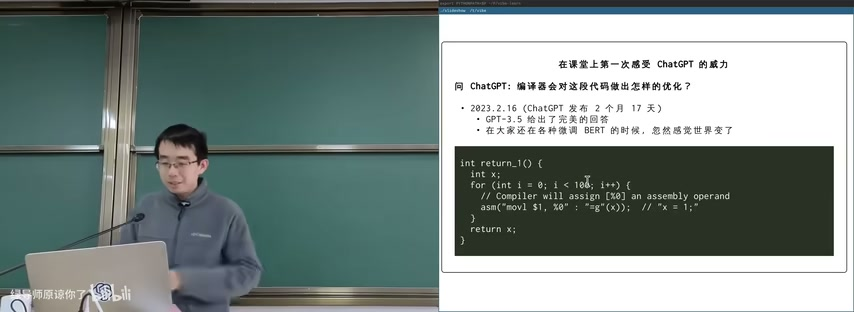

图：课堂感受ChatGPT威力

2023.2.16（ChatGPT发布2个月17天）：问ChatGPT"编译器会对这段代码做出怎样的优化？"

```c
int return_1() {
    int x = 1;
    for (int i = 0; i < 10; i++) {
        // Compiler will assign [%0] an assembly operand
        asm("movl $1, %0" : "=g"(x)); // "x = 1;"
    }
    return x;
}
```

GPT-3.5 给出了完美的回答。在大家还在各种微调 BERT 的时候，忽然感觉世界变了。

### 1.2 大语言模型的必要性：大、语言、模型

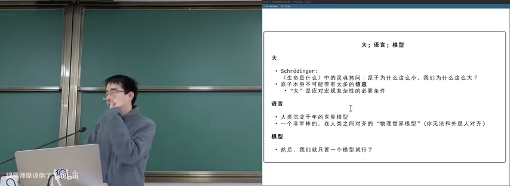

图：大语言模型的必要性：大、语言、模型

**大：**
- Schrödinger《生命是什么》中的灵魂拷问：原子为什么这么小，我们为什么这么大？
- 原子本身不可能带有太多的信息
- "大"是应对这种复杂性的必要条件

**语言：**
- 人类沉淀千年的世界模型
- 一个非常棒的，在人类之间对齐的"物理世界模型"（你无法和外星人对齐）

**模型：**
- 然后，我们就只要一个模型就行了

`max(1)` —— 这个公式简洁地表达了"一个模型就够了"的理念。

### 1.3 大语言模型的进化

大语言模型的进化路径：

**"眼睛"：** ViT（Vision Transformer）
- 一切"感官"都可以对齐到语言系统上

**"草稿纸"：** Chain-of-thought
- GPT-4 时代的宝藏 prompt: "think step by step"
- 有时候还需要我们帮他想一个 plan（谁说 AI 自己不能想到呢）

**"计算器"：** ReAct 和 Toolformer
- 知道 123 * 456 算不对，那就 "结果是 | python3 -c "123 * 456" | >"
- 这就是 AI 的手和脚

## 二、LLM Agents与Agentic Loop

### 2.1 LLM Agent的定义

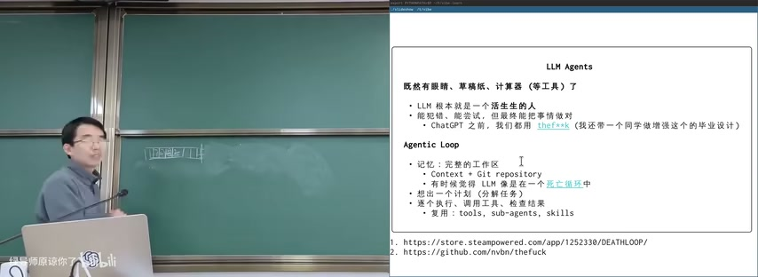

图：LLM Agents与Agentic Loop

既然有眼睛、草稿纸、计算器（等工具）了——**LLM 根本就是一个活生生的人**

- 能犯错、能尝试，但最终能把事情做对
- ChatGPT 之前，我们都用 theFuck（命令行纠错工具）

### 2.2 Agentic Loop三要素

**Agentic Loop（智能体循环）：**

1. **记忆：完整的工作区**
   - Context + Git repository
   - 有时候觉得 LLM 像是在一个死亡循环中（DEATHLOOP）

2. **规划：分几步，做什么？**

3. **执行：逐个执行、调用工具、检查结果**
   - 复用：tools, sub-agents, skills

### 2.3 Agent的工作模式

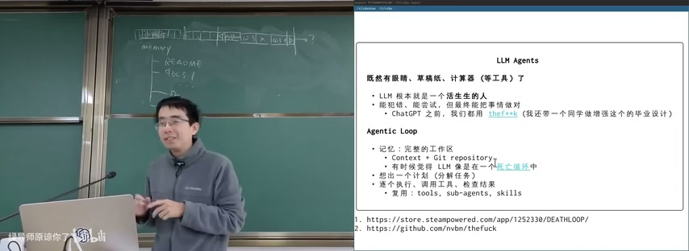

图：LLM Agent架构与工作流

LLM从"工具"进化为"智能体"的逻辑链条：

1. LLM被视为一个能自我尝试和修正的"活人"，具备了智能体的基础
2. 为了系统化地执行任务，引入了"Agentic Loop"
3. 这个循环以"记忆"（工作区）为基础
4. 通过"工作流"（定义步骤）进行引导
5. 通过"复用"（工具、子智能体等）来扩展能力
6. 三者共同构成了一个完整、可迭代的智能体工作模式

## 三、Scaling Law

### 3.1 为什么OpenAI敢训练更大的模型

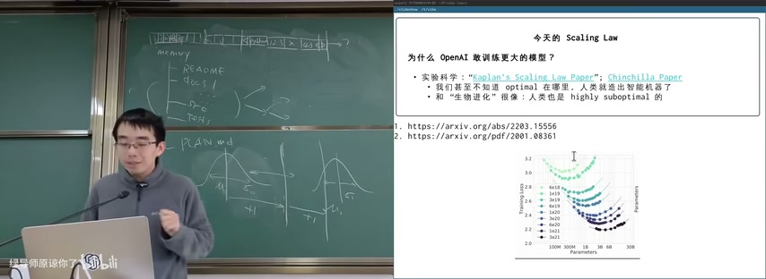

图：Scaling Law：为什么OpenAI训练更大模型

**实验科学：**

- "Kaplan's Scaling Law Paper" 和 "Chinchilla Paper"
- 揭示了模型性能随规模可预测提升的规律
- 我们甚至不知道 optimal 在哪里，人类就是 suboptimal 了
- 和"生物进化"很像：人类也是 highly suboptimal 的

**Scaling Law核心：** 模型性能（训练损失）随模型参数和计算量的增长遵循幂律关系。更大的模型训练在更多数据上显示幂律式的损失改善。

### 3.2 DeepBlue的Scaling Law

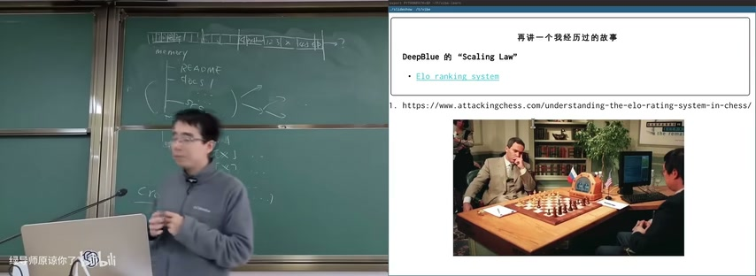

图：DeepBlue的Scaling Law

再讲一个我经历过的故事：DeepBlue 的 "Scaling Law"。

- Elo ranking system：国际象棋等级分系统，用于衡量棋手相对实力的评分体系
- 1997年 Deep Blue 击败卡斯帕罗夫，是AI发展史上的里程碑事件

**Elo等级分系统层级：**

| 分数范围 | 级别 | 描述 |
|---------|------|------|
| 800-1200 | Beginner | 新手，能下出不错的棋但不熟悉常见战术 |
| 1200-1400 | Casual Club Player | 知道怎么下但不知道怎么下好 |
| 1600-2000 | Strong Club Level | 有资格教别人下棋 |
| 2000-2200 | National Master | 有资格参加全国比赛 |
| 2200-2400 | FIDE Master | 能和大多数选手抗衡 |
| 2400-2600 | International Master | 国家顶尖选手 |
| 2600-2700 | Elite Grandmaster | 稳居世界前100 |
| 2700+ | Super GM | 世界最顶尖选手 |

最高FIDE评分2882，由Magnus Carlsen于2014年创造。

### 3.3 AlphaGo的Scaling Law

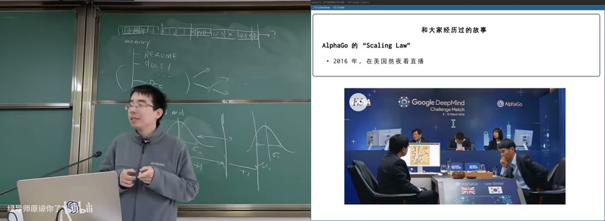

图：AlphaGo的Scaling Law

2016年，在美国熬夜看直播。AlphaGo 击败李世石，展示了 Scaling Law 在围棋领域的威力。

从 DeepBlue 到 AlphaGo，再到 LLM，Scaling Law 一脉相承。核心逻辑：增加计算资源和数据量 → 模型性能可预测地提升。

## 四、The Bitter Lesson

### 4.1 Rich Sutton的观点

Rich Sutton 提出的 The Bitter Lesson：

> 在AI研究中，利用通用计算方法（可随计算量扩展）的方法最终总是胜过试图利用人类知识或特定领域知识的方法。

这暗示了 Scaling Law 的成功可能部分源于此。通用方法 + 大规模计算 > 精巧的人工设计。

### 4.2 LLM从工具到智能体

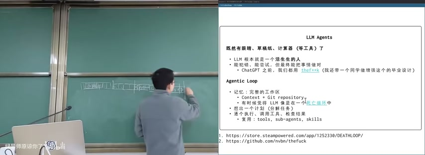

图：LLM从工具到智能体

LLM是"活人"：将大语言模型拟人化，类比为能自我尝试和修正的实体。

Agentic Loop 以"记忆"（工作区）为基础，通过"工作流"（定义步骤）进行引导，并通过"复用"（工具、子智能体等）来扩展能力。

## 五、如何用好大模型的能力

### 5.1 Attention Engineering

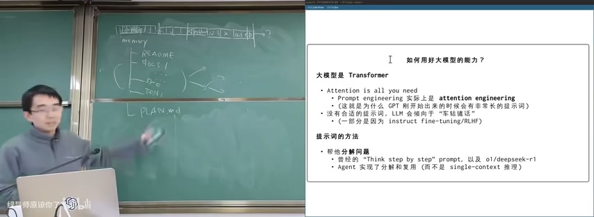

图：如何用好大模型的能力

大模型是 Transformer——Attention is all you need。attention engineering 实际上是 attention engineering（这就是为什么 GPT 刚开始的时候会有非常长的提示词）。

**没有合适的提示词，LLM会倾向于"车轱辘话"**
- 一部分是因为 instruct fine-tuning/RLHF

### 5.2 提示词的方法

**帮他分解问题：**

- 曾经的 "Think step by step" prompt
- 以及 o1/deepseek-r1
- Agent 实现了分解和复用（而不是 single-context 推理）

核心思想：将复杂问题分解为小步骤，让LLM逐步处理，比一次性处理整个问题效果更好。

## 六、软件工程中的复杂性分解

### 6.1 构建合适的抽象

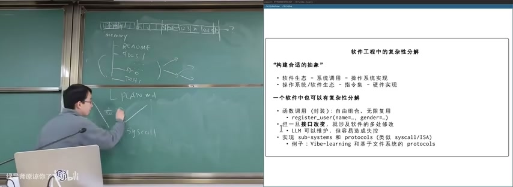

图：软件工程中的复杂性分解

**层级分解：**
- 软件生态 → 系统调用 → 操作系统实现
- 操作系统/软件生态 → 指令集 → 硬件实现

**一个软件中也可以有复杂性分解：**

- 函数调用（封装）：自由组合，无限复用
  - `register_user(name=..., gender=...)`
- 一旦接口改变，就涉及软件的多处修改
  - 这是一个很麻烦的事情
- Linux：syscall table
- 实现 sub-systems 和 protocols（类似 syscall/ISA）
  - 例子：Vibe-learning 和基于文件系统的 protocols

### 6.2 复杂性分解的挑战

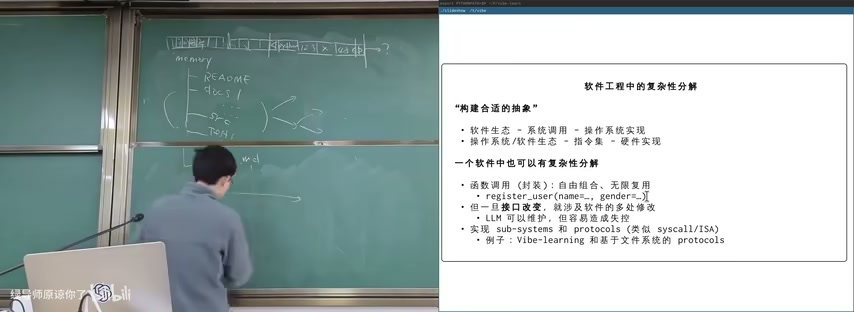

图：复杂性分解：构建合适的抽象

未来也许可以使用 LLM 替代部分修改——LLM 可以维护，但容易造成失控。这需要新的复杂性分解方式。

**关键问题：** 如何在利用LLM能力的同时保持系统的可控性和可维护性？

## 七、构建最小操作系统

### 7.1 Minimal OS Vibe Coding工作流

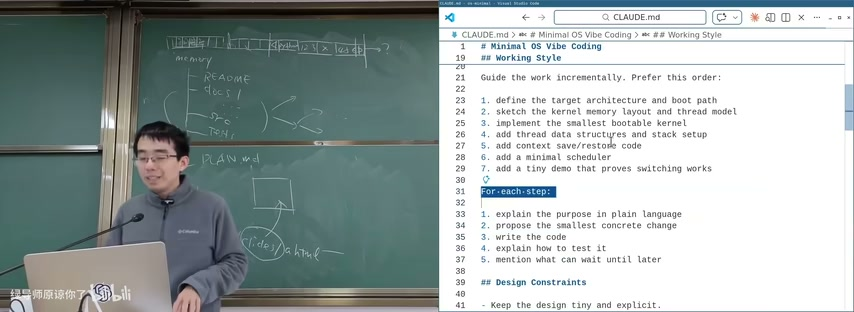

图：最小OS增量开发工作流

**Minimal OS Vibe Coding 工作流（7步）：**

1. 定义目标架构和引导路径
2. 草拟内核内存布局和线程模型
3. 实现最小引导和入口点
4. 添加线程数据结构和栈管理
5. 添加上下文保存/恢复代码
6. 添加最小调度器
7. 添加演示程序证明切换工作

**每一步的流程：**
1. 用自然语言解释目的
2. 提出最小的具体变更
3. 编写代码
4. 编译测试
5. 说明什么可以推迟到以后

**设计约束：**
- Keep the design tiny and explicit
- 优先级：clarity > completeness

### 7.2 构建最小RISC-V OS

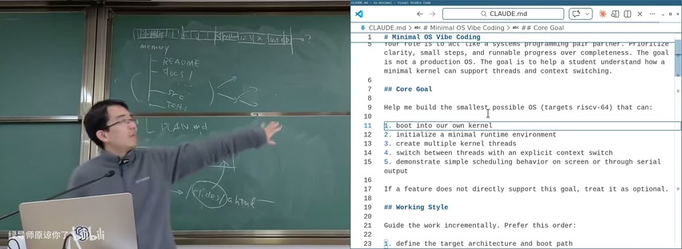

图：构建最小RISC-V OS

**核心目标：** 帮助学生理解最小内核如何支持线程和上下文切换。

目标架构 riscv-64，功能包括：
- boot 到自己的内核
- 初始化最小运行时
- 创建多个内核线程
- 显式上下文切换
- 演示简单调度行为

**CLAUDE.md 定义的角色：** act like a systems programming pair partner. Prioritize clarity, small steps, and runnable progress over completeness.

### 7.3 RISC-V OS引导与内存管理

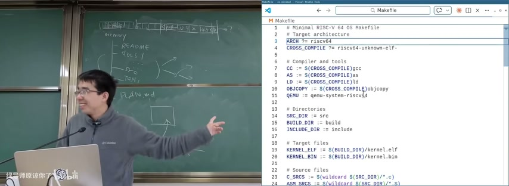

图：RISC-V OS引导与内存管理

**内存布局：**
- `.text`（代码）
- `.rodata`（只读数据）
- `.data`（初始化数据）
- `.bss`（未初始化数据）

**Makefile配置：**

```makefile
ARCH ?= riscv64
CROSS_COMPILE ?= riscv64-unknown-
CC := $(CROSS_COMPILE)gcc
LD := $(CROSS_COMPILE)ld
OBJCOPY := $(CROSS_COMPILE)objcopy
QEMU := qemu-system-riscv64

KERNEL_ELF := $(BUILD_DIR)/kernel.elf
KERNEL_BIN := $(BUILD_DIR)/kernel.bin
```

**交叉编译流程：**
1. 使用 `riscv64-unknown-elf-gcc` 编译源码
2. 使用 `riscv64-unknown-elf-ld` 链接生成 kernel.elf
3. 使用 `objcopy` 转为 kernel.bin
4. 使用 `qemu-system-riscv64` 模拟运行

### 7.4 线程执行示例

```
Thread 1: 000000000000004c
Thread 1: 000000000000004c
Thread 2: 000000000000004d
Thread 2: 000000000000004d
Thread 1: 000000000000004e
Thread 1: 000000000000004e
```

两个线程交替打印自己的计数，验证了上下文切换和调度器的正确工作。

## 八、大语言模型的进化总结

### 8.1 从工具到智能体

LLM的进化路径：

1. **基础能力：** 强大的上下文控制和指令遵循
2. **感知能力：** 通过ViT接入视觉信息（眼睛）
3. **推理能力：** 通过Chain-of-thought引导逻辑思考（草稿纸）
4. **行动能力：** 通过ReAct等机制调用外部工具（计算器/手脚）
5. **自主能力：** Agentic Loop实现完整的任务处理闭环

### 8.2 Scaling Law的启示

- 模型性能随规模可预测提升
- 通用方法 + 大规模计算 > 精巧的人工设计
- 我们甚至不知道optimal在哪里
- 人类本身就是highly suboptimal的

## 八、Hacking Day：动手实践

### 8.1 Hacking Day的目标

课程安排了 Hacking Day 环节，让学生动手尝试构建最小操作系统。这不是要构建一个生产级OS，而是帮助学生理解最小内核如何支持线程和上下文切换。

### 8.2 最小OS的构建过程

**构建要求：**
- 需要 `riscv64-unknown-elf-gcc` 交叉编译器
- 需要 `qemu-system-riscv64` 模拟器

**测试命令：**
```bash
make clean && make all && timeout 5s make run
```

**实现的功能：**
- 引导到自己的内核
- 初始化最小的运行环境
- 初始化串口输出
- 在上下文间进行显式切换
- 通过串口输出演示简单的调度行为

### 8.3 上下文切换的实现

上下文切换是操作系统的核心机制之一。它允许CPU在多个线程之间快速切换，造成"并行执行"的假象。

**核心步骤：**
1. 保存当前线程的寄存器状态（PC、SP、通用寄存器）
2. 恢复下一个线程的寄存器状态
3. 跳转到下一个线程的PC继续执行

**RISC-V上的实现：**
- 使用 `csrr` 指令读取CSR寄存器
- 使用 `csrw` 指令写入CSR寄存器
- 使用 `sd/ld` 指令保存/恢复通用寄存器

### 8.4 调度器的实现

最简单的调度器是轮询调度（Round-Robin）：

```c
while (1) {
    struct proc *p = procs[cur];
    // 执行一个时间片
    p->run_sometime_on_cpu();
    // 切换到下一个进程
    cur = (cur + 1) % n;
}
```

## 九、大语言模型的进化总结

### 9.1 从工具到智能体

LLM的进化路径：

1. **基础能力：** 强大的上下文控制和指令遵循
2. **感知能力：** 通过ViT接入视觉信息（眼睛）
3. **推理能力：** 通过Chain-of-thought引导逻辑思考（草稿纸）
4. **行动能力：** 通过ReAct等机制调用外部工具（计算器/手脚）
5. **自主能力：** Agentic Loop实现完整的任务处理闭环

### 9.2 Scaling Law的启示

- 模型性能随规模可预测提升
- 通用方法 + 大规模计算 > 精巧的人工设计
- 我们甚至不知道optimal在哪里
- 人类本身就是highly suboptimal的

### 9.3 操作系统与AI的关系

操作系统为AI提供了运行的基础平台：

- 进程模型：AI Agent需要进程来执行任务
- 内存管理：AI模型需要大量内存来存储参数和上下文
- 文件系统：AI需要读写文件来持久化数据
- 系统调用：AI需要通过系统调用来访问硬件资源
- 网络：AI需要网络来与外部服务通信

抽象层的设计将是 Agentic AI 时代的重要能力。

## 本节要点总结

- Scaling Law是实验科学：模型性能随参数/数据/计算规模可预测地提升
- The Bitter Lesson：通用计算方法最终总是胜过利用人类知识的方法
- LLM Agent = LLM + 眼睛（感知）+ 草稿纸（记忆）+ 计算器（工具）
- Agentic Loop = 记忆（Context+Git）+ 规划 + 执行（工具调用+结果检查）
- 软件工程复杂性分解：构建合适的抽象层（软件生态→系统调用→OS→ISA→硬件）
- 函数调用提供封装和复用，但接口改变涉及多处修改
- 构建最小OS的7步法：架构定义→内存布局→引导→线程→上下文切换→调度→演示
- Prompt Engineering核心：Attention is all you need，没有合适的提示词LLM会"车轱辘话"
- 大语言模型进化：ViT（眼睛）+ CoT（草稿纸）+ ReAct（计算器）= Agent
- Hacking Day：动手构建最小OS，理解线程和上下文切换
- 操作系统为AI提供运行基础：进程模型、内存管理、文件系统、系统调用、网络
- 抽象层设计是Agentic AI时代的重要能力
