# 第二讲 应用视角的操作系统

来源：南京大学 2026春季学期 操作系统原理

## 一、操作系统上的程序

### 1.1 OSTEP对操作系统的定义

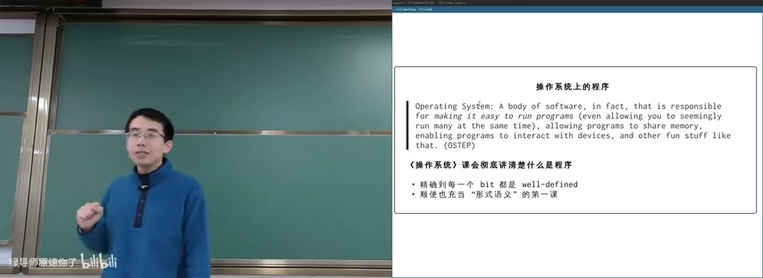

图：OSTEP对操作系统的定义

Operating System: A body of software, in fact, that is responsible for making it easy to run programs (even allowing you to seemingly run many programs at the same time), allowing programs to share memory, enabling programs to interact with devices, and other fun stuff like that. (OSTEP)

《操作系统》课会彻底讲清楚什么是程序——精确到每一个 bit 都是 well-defined。顺便充当"形式语义"的第一课。

### 1.2 理解计算机程序：C → SimpleC 转译

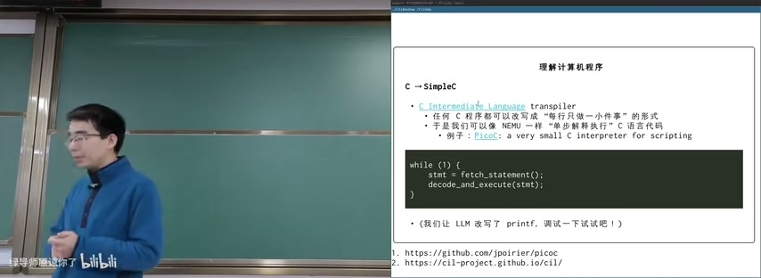

图：理解计算机程序：C→SimpleC转译

C Intermediate Language transpiler 可以将任何C程序改写成"每行只做一小件事"的形式。于是我们可以像 NEMU 一样"逐条解释执行"C语言代码。

**核心思路：**

```c
while (1) {
    stmt = fetch_statement();
    decode_and_execute(stmt);
}
```

例子：PicoC（a very small C interpreter for scripting）。我们让 LLM 改写了 printf，调试一下试试吧！

## 二、C语言基础实现

### 2.1 字符串和数字打印函数

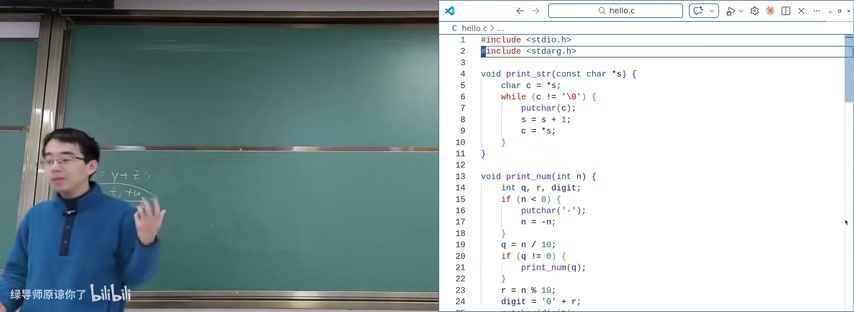

图：C语言字符串和数字打印函数

**print_str 函数：** 遍历字符串直到 null terminator。通过指针算术（`s = s + 1`）逐字符移动。

```c
void print_str(const char *s) {
    char c = *s;
    while (c != '\0') {
        putchar(c);
        s = s + 1;
        c = *s;
    }
}
```

核心逻辑：`while(c != '\0') { putchar(c); s = s + 1; c = *s; }`

**print_num 函数：** 递归打印整数。先处理负号（if n < 0），再递归处理高位数字（q = n/10），最后打印当前位（r = n%10）。`digit = '0' + r` 将数字转为ASCII字符。

```c
void print_num(int n) {
    int q, r, digit;
    if (n < 0) {
        putchar('-');
        n = -n;
    }
    q = n / 10;
    if (q != 0) {
        print_num(q);
    }
    r = n % 10;
    digit = '0' + r;
    putchar(digit);
}
```

**关键点：**
- `q = n / 10`：整数除法获取除最后一位外的所有位
- `r = n % 10`：取模获取最后一位
- 递归调用 `print_num(q)` 处理高位，return后打印当前位
- 这确保了数字从最高位到最低位的正确打印顺序

### 2.2 自定义 myprintf 函数

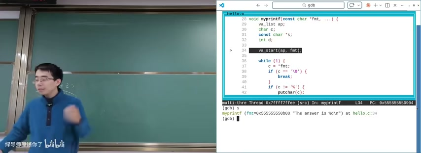

图：自定义myprintf函数

myprintf使用C的变参机制（variadic arguments）：

```c
void myprintf(const char *fmt, ...) {
    va_list ap;
    char c;
    const char *s;
    int d;

    va_start(ap, fmt);

    while (1) {
        c = *fmt;
        if (c == '\0') {
            break;
        }
        if (c != '%') {
            putchar(c);
        } else {
            // 处理格式说明符
            fmt++;
            c = *fmt;
            if (c == 'd') {
                d = va_arg(ap, int);
                print_num(d);
            } else if (c == 's') {
                s = va_arg(ap, const char *);
                print_str(s);
            }
        }
        fmt++;
    }
    va_end(ap);
}
```

**核心机制：**
- `va_list ap`：声明参数列表
- `va_start(ap, fmt)`：开始解析
- 循环遍历格式字符串：遇到 `%` 提取格式说明符，其他字符直接 putchar 输出
- GDB调试展示了myprintf的内部执行流程

## 三、程序执行跟踪

### 3.1 GDB自动程序状态追踪

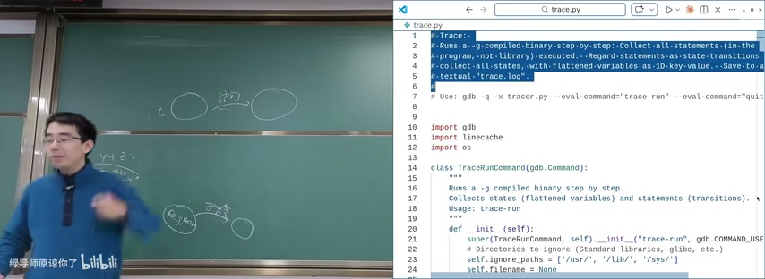

图：GDB自动程序状态追踪

使用GDB编写Python脚本（TraceRunCommand）自动追踪程序执行。

```python
import gdb
import linecache
import os

class TraceRunCommand(gdb.Command):
    """
    Runs a -g compiled binary step by step.
    Collects states (flattened variables) and statements (transitions).
    Usage: trace-run
    """
    def __init__(self):
        super(TraceRunCommand, self).__init__("trace-run", gdb.COMMAND_USER)
        # Ignore gdb internal commands & ignore [standard libraries, glibc, etc.]
        self.ignore_paths = ['/usr/', '/lib/', '/sys/']
        self.filename = None
```

**核心逻辑：**
- 逐条执行 `-g` 编译的二进制文件
- 将语句视为状态迁移
- 收集所有状态（展平的变量ID-键值对）
- 保存到 trace.log 文件

### 3.2 执行跟踪示例

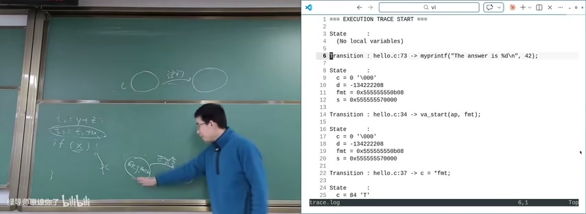

图：程序执行跟踪与状态迁移

```
=== EXECUTION TRACE START ===
State
(No local variables)
Transition: hello.c:73 -> myprintf("The answer is %d\n", 42);
State
c = 0 '\000'
d = -134222288
fmt = 0x555555557008
s = 0x555555557000
Transition: hello.c:34 -> va_start(ap, fmt);
State
c = 0 '\000'
d = -134222288
fmt = 0x555555557008
s = 0x555555557000
Transition: hello.c:37 -> c = *fmt;
State
c = 84 'T'
```

这展示了程序状态如何随每条语句执行而变化。每条Transition代表一个状态迁移，每次State是迁移后的新状态。

## 四、理解函数调用：汉诺塔问题

### 4.1 递归的困惑

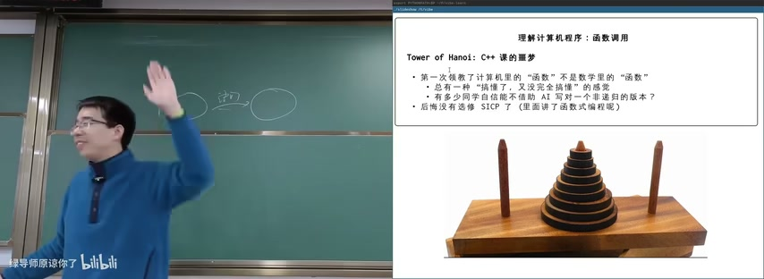

图：理解函数调用：汉诺塔问题

Tower of Hanoi 是 C++ 课的噩梦：

- 第一次领教了计算机的"函数"不是数学里的"函数"
- 总觉得"搞懂了"但又"没完全搞懂"的感觉
- 至少懂递归了？但不是书本里那精简优雅的版本
- 后悔没有选修 SICP 了（里面讲了函数式编程嘛）

### 4.2 汉诺塔递归实现

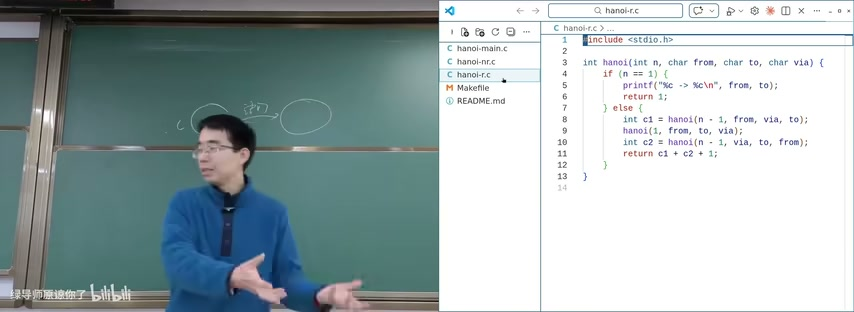

图：汉诺塔递归实现完整代码

```c
#include <stdio.h>

int hanoi(int n, char from, char to, char via) {
    if (n == 1) {
        printf("%c -> %c\n", from, to);
        return 1;
    } else {
        int c1 = hanoi(n - 1, from, via, to);
        hanoi(1, from, to, via);
        int c2 = hanoi(n - 1, via, to, from);
        return c1 + c2 + 1;
    }
}
```

**时间复杂度：** T(n) = 2T(n-1) + 1 = 2^n - 1

**算法分解：**
1. 递归移动 n-1 个盘从 source 到 auxiliary（借助 target）
2. 移动最大盘从 source 到 target
3. 递归移动 n-1 个盘从 auxiliary 到 target（借助 source）

**核心思想：** 分而治之——将移动n个盘子的问题分解为三个子步骤。

### 4.3 AI模型对递归的理解测试

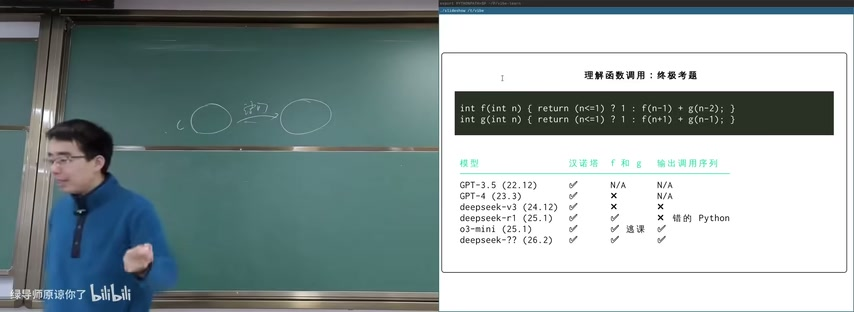

图：AI模型测试递归函数理解

**终极考题：**

```c
int f(int n) { return (n<=1) ? 1 : f(n+1) + g(n-1); }
int g(int n) { return (n<=1) ? 1 : f(n+1) - g(n-1); }
```

| 模型 | 汉诺塔 | f和g | 输出调用序列 |
|------|--------|------|-------------|
| GPT-3.5 (22,12) | ✔ | N/A | N/A |
| GPT-4 (23,3) | ✔ | X | N/A |
| deepseek-v3 (24,12) | ✔ | X | X |
| deepseek-v3-0324 (25,1) | ✔ | ✔ | ✔ |
| o3-mini (25,1) | ✔ | 选课 | ✔ 错的 Python |
| deepseek-?? (26,2) | ✔ | ✔ | ✔ |

**结论：** AI在递归理解上的能力在逐步提升，但即便是最新的模型也难以完美处理汉诺塔问题。这说明递归思维的复杂性——即使是"简单"的递归，对AI来说也是挑战。

## 五、程序状态机模型

### 5.1 状态机的定义

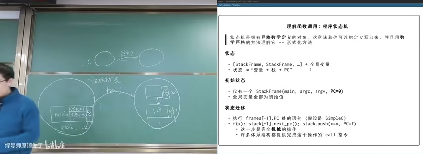

图：理解函数调用：程序状态机

状态机是拥有严格数学定义的对象。这意味着你可以把定义写出来，并且用数学严格的方法理解它——形式化方法。

**状态 = 变量 + 栈 + PC（程序计数器）**

- 初始状态：仅有一个 StackFrame(main, argc, argv, PC=0)，全局变量全部为初始值
- 状态迁移：执行 frame[-1].PC 处的语句（假设是 SimpleC）
  - 如果是函数调用：`f(x) : stack[-1].pc == call(f); stack.push(x=xx, PC=f)`
  - 这一步是完全机械的
  - 许多体系结构都提供完成这个操作的 call 指令

### 5.2 函数调用的机械本质

函数调用是程序状态机的状态迁移。执行调用语句（如 call 指令）会机械地改变程序状态（即栈和PC），进入一个新函数。当该函数执行返回时，状态（栈和PC）又会恢复，形成一个完整的调用-返回循环。

### 5.3 C宏实现函数调用栈

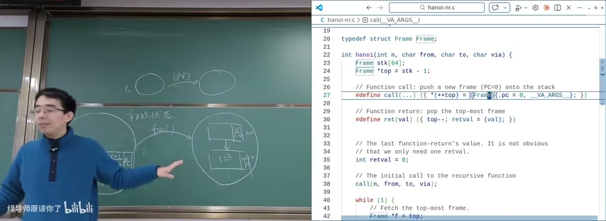

图：C宏实现函数调用栈

```c
typedef struct Frame Frame;

// Function call: push a new frame (PC=0) onto the stack.
#define call(...) ((*(++top)) = (Frame){ .pc = 0, __VA_ARGS__ })

// Function return: pop the top-most frame.
#define ret(val) ((top--), (retval = (val)))

// The last function-return's value.
int retval = 0;
```

用显式栈和宏模拟递归：这样可以在不使用系统调用栈的情况下模拟递归调用，避免栈溢出并提高效率。

### 5.4 汉诺塔的栈模拟实现

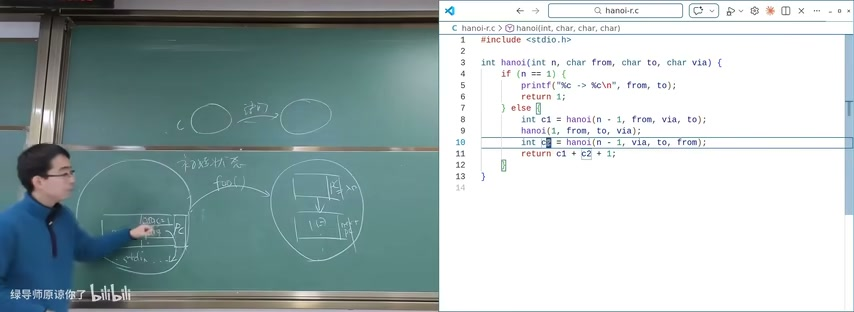

图：汉诺塔递归实现：完整代码

```c
int hanoi(int n, char from, char to, char via) {
    Frame stk[64];
    Frame *top = stk - 1;
    int retval = 0;
    
    call(n, from, to, via);
    
    while (1) {
        Frame *f = top;
        if (top < stk) {
            break;  // No more frames; we're done
        }
        
        int next_pc = f->pc + 1;
        int n = f->n, from = f->from, to = f->to, via = f->via;
        
        switch(f->pc) {
            case 0:
                if (n == 1) {
                    printf("%c -> %c\n", from, to);
                    ret(1);
                } else {
                    call(n - 1, from, via, to);
                }
                break;
            case 1: f->c1 = retval; call(1, from, to, via); break;
            case 2: call(n - 1, via, to, from); break;
            case 3: f->c2 = retval; ret(f->c1 + f->c2 + 1); break;
        }
        f->pc = next_pc;
    }
}
```

完整的栈模拟递归实现：
- 定义 Frame 结构体存储 PC 和参数
- 用 call 宏 push 新帧
- 用 ret 宏 pop 帧并保存返回值
- while(1) 循环不断 fetch 最顶层帧，单步执行

这展示了递归的底层机械本质——递归不过是栈帧的push和pop操作。

## 六、编译后的程序

### 6.1 什么是"编译后"的程序？

程序最终还是在计算机上执行的。

```c
struct CPUState {
    uint32_t regs[32], csrs[CSR_COUNT];
    uint8_t *mem;
    uint32_t mem_offset, mem_size;
};
```

**无情的、执行指令的状态机：**

- 取指令、译码、执行——
- SimpleC 到机器指令几乎可以"原样翻译"

### 6.2 C语言程序内存布局

黑板展示了C语言程序的内存结构：

- **程序 (Program)**
  - `main` → 栈 (stack)：局部变量
  - 堆 (heap)：动态分配
  - 静态 (static) → 全局变量
  - 代码 (code)：指令

### 6.3 编译流程

C语言程序的构建流程：

```
预处理 → 编译 → 汇编 → 链接 → 输出 a.out
```

编译步骤：
- `gcc -E`：预处理（展开宏、处理#include）
- `gcc -S`：编译生成汇编
- `gcc -c`：汇编生成目标文件
- `gcc -o`：链接生成可执行文件

### 6.4 编译器优化示例

```c
int f1() {
    int x = 2 * 3 * 4;
    if (0) return x;
    return x + 1;
}

int f2(int a, int b) {
    int x = a*b + a*b;
    return x;
}

int f3(int *p, int n) {
    int s = 0;
    for (int i = 0; i < n; i++) s += p[i];
    return s;
}
```

编译器优化分析：
- `f1()`：常量折叠（2*3*4=24）+ 死代码消除（if(0)永远不执行）
- `f2()`：强度削减（a*b+a*b → 2*a*b）
- `f3()`：循环优化、向量化

## 七、操作系统上的应用世界

### 7.1 从一开始就获得机器的控制权

操作系统从CPU Reset开始就获得控制权。固件（Firmware）初始化硬件后，将控制权交给操作系统。

### 7.2 退出程序

程序可以通过 `_exit()` 或 `exit()` 退出。操作系统负责回收进程资源。

### 7.3 系统调用指令

系统调用是用户态程序请求内核服务的唯一合法通道。

```
APP → write(fd, ...) → syscall → kernel → 返回结果
```

### 7.4 操作系统上的文件

操作系统通过文件系统抽象管理存储设备。文件描述符（file descriptor）是进程访问文件的句柄。

## 本节要点总结

- 操作系统 = 对象 + API，是帮程序运行的软件
- C程序可转译为SimpleC（每行一个原子操作），实现逐条解释执行
- `print_str` 用指针遍历字符串，`print_num` 用递归打印数字
- `myprintf` 通过 `va_list` 实现变参函数，解析格式字符串
- 函数调用 ≠ 数学函数：汉诺塔是理解递归的经典问题
- 递归的核心：分解子问题 + 基准情况 + 调用栈
- 程序状态机 = 状态（变量+栈+PC）+ 初始状态 + 状态迁移
- 函数调用是机械的状态迁移：push新栈帧，设置PC到函数入口
- 可以用显式栈和宏模拟递归，避免系统调用栈开销
- AI模型在递归理解上的进化：从GPT-3.5的失败到deepseek的通过
- 编译后的程序是无情的指令执行状态机：取指→译码→执行
- C程序内存布局：代码段、数据段、BSS段、堆、栈
- 编译流程：预处理→编译→汇编→链接
