# 第一讲 操作系统概述：绪论

来源：南京大学 2026春季学期 操作系统原理

## 一、课程概述与个人简介

### 1.1 讲师简介

蒋炎岩，南京大学计算机学院副教授。教操作系统，做PL（编程语言）的软工人。身体里还有1/4 Theory的芯（ICPC World Finalist），但早已锈迹斑斑。发表5篇CCF-A类Paper Awards，对于现在的AI时代来说，已经都入土了。计算机学院教学委员会成员，南京大学"我最喜爱的老师"。授课：操作系统，程序设计。

本学期主线按照3学分建设，剩下的课时讲OS相关的课外内容。

### 1.2 课程简介

操作系统原理（2026春季学期）。

- 课时：周二 10:00-12:00，周四 19:00-16:00；仙 II-403；直播间；视频回看
- 成绩：期末考试 (50%)，期中测验 (10%)，实验 1|4 (40%)
- Office Hour：每周四下午 16:30-17:30
- 助教：刘瀚之 (hanzhiliu@smail.nju.edu.cn)

### 1.3 课程讲义结构

1. 绪论 课程概述 / 应用视角的操作系统
2. 绪论 硬件视角的操作系统 / (TBB)
3. 虚拟化 程序和进程 / 进程的地址空间
4. 虚拟化 操作系统中的对象 / (TBB)

### 1.4 成绩组成

- 期末考试 50%：以课堂内容为主
- 随堂期中测验 10%：放轻松，跟上课堂示例代码即可
- 实验 40%：MiniLab Only，尽量有趣的编程实验（注意AIGC Policy）

### 1.5 意见与反馈

- 邮件：jyy@nju.edu.cn，保证邮件100%回复（太久不回可以戳我）
- QQ群：选课名单确定后，群发邮件，未必能及时回复
- 批评总归是有原因的，会试图考虑背后的逻辑/改动的必要

## 二、(Why) 为什么学习操作系统

### 2.1 从ChatGPT到AI时代

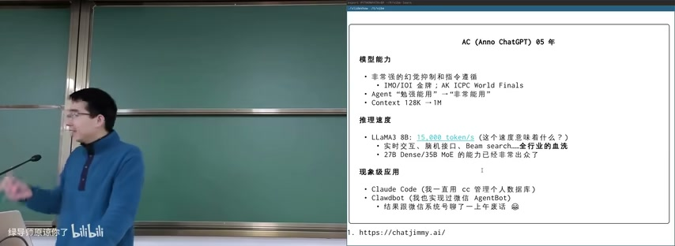

图：AI模型能力介绍：AC(Anno ChatGPT)

课程以2025年的AI能力为切入点。AC(Anno ChatGPT) 05年的模型能力：

**模型能力：**
- 非常强的上下文控制和指令遵循
- IMO/IOI 金牌；AI ICPC World Finals
- Agent "勉强能用" → "非常能用"
- Context 128K → 1M

**推理速度：**
- LLaMA3 8B: 15,000 tokens/s（这个速度意味着什么？）
- 实时交互、随机接口、Beam search——全行业的血洗
- 27B Dense/35B MoE 的能力已经非常出众了

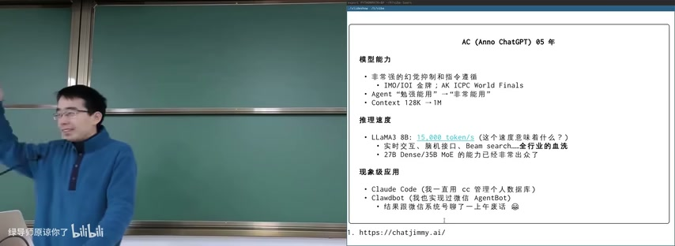

图：推理速度与现象级应用

**现象级应用：**
- Claude Code（一直用cc管理个人数据库）
- ClawBot（也实现过微信AgentBot）
- 结束跟微信仿友聊聊了一下午话

### 2.2 从算法时代到AI时代：反思

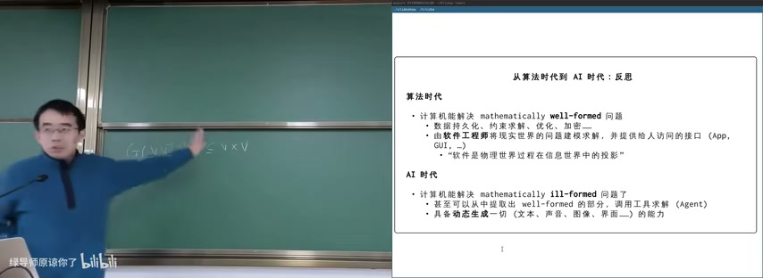

图：从算法时代到AI时代：反思

**算法时代：**
- 计算机能解决 mathematically well-formed 问题
- 有精确的公式、约束条件、边界条件 ...
- 由软件工程师将现实世界的问题建模求解，并提供给人访问的接口（App, GUI, ...）
- "软件是物理世界过程在信息世界中的投影"

**AI 时代：**
- 计算机能解决 mathematically ill-formed 问题了
- 甚至可以从中间取出 well-formed 的部分，调用工具求解（Agent）
- 具备动态生成一切（文本、声音、图像、界面....）的能力

**关键转变：** well-formed → ill-formed，这意味着AI可以处理模糊、非结构化的问题，标志着更接近人类智能处理现实世界问题能力的新阶段。从"投影工具"演变为"问题解决者"和"内容生成者"。

### 2.3 学CS还有意义吗？

"软件已死，而图当立"

- 残酷的事实：PhD Student 还不如 AI 好用
- AI 技术已经使顶峰的"人类劳动力"逐渐失去价值
- （也许共产主义真的就要实现了？）

**但是！复杂系统的实现仍然需要抽象：**

- 抽象是分解和隔离复杂性的途径
- （操作系统）传递的 takeaway message 是抽象层的设计与实现
- Claude Code 就是一个 CLI "用户"，需要一个进程模型和复用机制
- 操作系统（和上面的应用生态）赋予 AI 手和脚
  - 提供了显示界面，发包给网络，隔离虚拟环境……的底层能力
  - 安全，可靠，高效，有保障

## 三、(What) 什么是操作系统

### 3.1 操作系统：定义

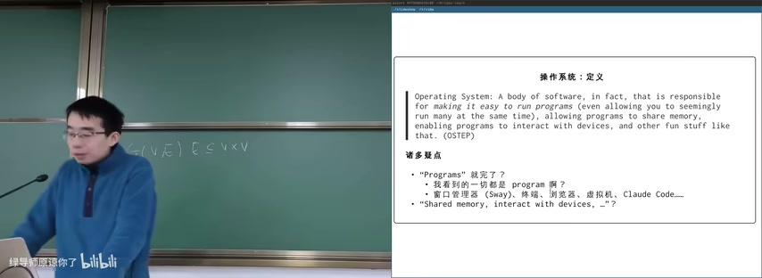

图：操作系统定义：OSTEP教材

**OSTEP定义：** Operating System: A body of software, in fact, that is responsible for making it easy to run programs (even allowing you to seemingly run many at the same time), allowing programs to share memory, enabling programs to interact with devices, and other fun stuff like that.

**诸多疑点：**
- "Programs" 就完了？
- 我看到的一切都是 program 例？窗口管理器 (Sway), 终端, 浏览器, 虚拟机, Claude Code...
- "Shared memory, interact with devices, ..."?

### 3.2 操作系统：不需要定义

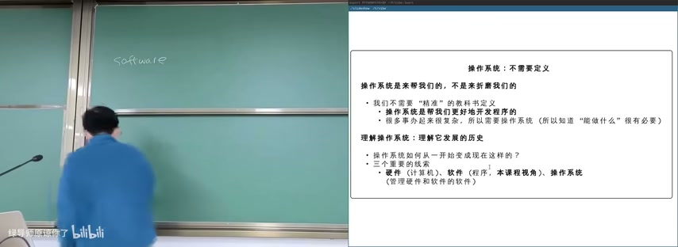

图：操作系统：不需要定义

操作系统是来帮我们的，不是来折腾我们的。

- 我们不需要"精准"的教科书定义
- 操作系统是帮我们更好地开发程序的
- 如果你来当程序员，你就要操作系统（所以知道"能做什么"很有必要）

**理解操作系统：理解它发展的历史**

操作系统如何从一开始变成现在这样的？三个重要的线索：
- 硬件（计算机）
- 软件（程序，本课程视角）
- 操作系统（管理硬件和软件的软件）

### 3.3 硬件、软件和操作系统

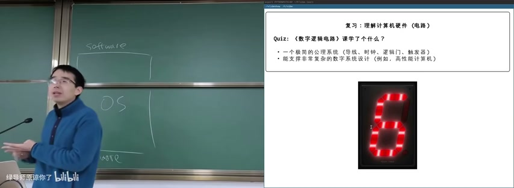

图：复习：理解计算机硬件（电路）

**数字逻辑电路课程学了什么？**

一个极简的公理系统（导线、时钟、逻辑门、触发器），能支撑非常复杂的数字系统设计（例如，高性能计算机）。这体现了抽象的力量：从简单原语构建复杂系统。

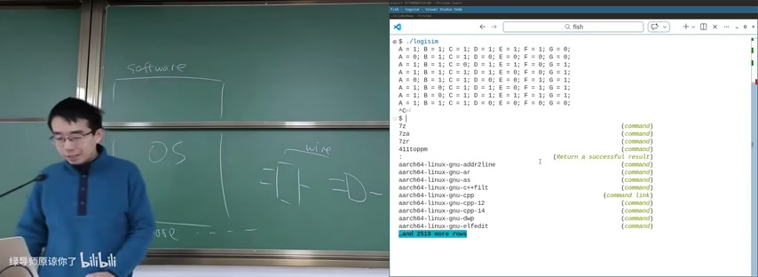

图：Linux命令行基础与软件栈层次

**软件栈层次：** Software → OS → Kernel

Linux终端演示展示了命令行的基本操作，包括Tab补全功能。命令如 `aarch64-linux-gnu-*` 系列工具展示了交叉编译工具链。

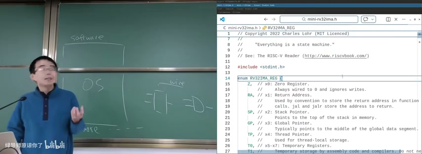

图：Software→OS→Hardware层次与RISC-V寄存器

**计算机系统层次：** Software依赖OS，OS运行在Hardware之上。

mini-rv32ima.h文件展示了RISC-V寄存器定义：

| 寄存器 | 名称 | 作用 |
|--------|------|------|
| x0 | ZER | 零寄存器，始终为0 |
| x1 | RA | 返回地址 |
| x2 | SP | 栈指针 |
| x3 | GP | 全局指针 |
| x4 | TP | 线程指针 |
| x5-x7 | T0-T2 | 临时寄存器 |

### 3.4 理解计算机软件（程序）

复习：理解计算机软件（程序）

Quiz：《计算机系统基础》课学了什么？

- 高级语言代码 → 指令序列 → 二进制文件 → 处理器执行
- Everything is a state machine

### 3.5 1940s 的操作系统

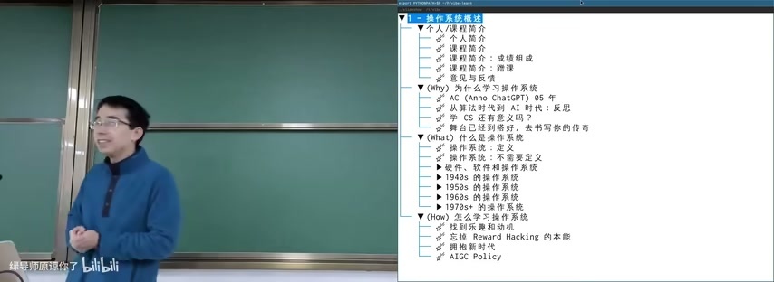

图：1940s计算机硬件实现

**1940s的计算机硬件：**
- 逻辑门：真空电子管
- 存储器：水银延迟线 (delay lines)
- 输入/输出：打孔纸带 / 指示灯

**1940s的操作系统：没有操作系统**

- 甚至连编程语言都没有
- 大家还在画流程图、写机器代码、纸带
- 能把程序跑起来就很了不起了
- 程序直接用指令操作硬件
- 不需要画蛇添足的程序来管理它
- 就像今天 Agents, MCP, Skills 所处的时代

### 3.6 1950s-1960s 的操作系统

**1950s-1960s的计算机硬件：**

硬件改进了，逻辑门-存储-I/O 的基本格局没有变。

- 晶体管、磁芯内存、丰富的 I/O 设备
- I/O 设备的速度严重低于处理器的速度，中断机制出现 (1953)

**1950s-1960s的计算机软件：**

更复杂的通用的数值计算。

- 高级语言和 API 诞生 (Fortran, 1957)：一行代码，一张卡片
- 80 行的规范沿用至今

**1950s-1960s 的操作系统：**

库函数 + 管理程序排队运行的调度代码。

- 写程序（穿纸带），跑程序都是非常费事的
- 计算机成本巨大：$50,000~$1,000,000，通常一个学校只有一台
- 算力成为服务，操作系统概念形成
- 多用户轮流共享计算机，operator 负责操作程序切换
- Operating System（操作系统/作业系统）
- （今天算力又成为服务了）

### 3.7 到底什么是操作系统？

本课程讨论狭义的操作系统。

- 硬件和软件的中间层
- 对硬件的管理和抽象，作出抽象
- 支持应用程序生态的平稳运行
- 这个概念可以推广到"Systems"
  - 对多台计算机抽象（分布式系统）
  - 对存储设备的抽象（存储系统）

**理解操作系统：** 理解硬件（计算机）和软件（程序）的发展历史。夹在中间的就是操作系统。

### 3.8 操作系统的作用

《操作系统》 是你的最后一门编程课。

- 能写知道程序都做什么、为什么能做
- 为什么要创建进程？
- 为什么 Ctrl-C 有时不能退出程序？
- StackOverflow helped 1,000,000 developers exit Vim (2017.5)
- StackOverflow is dying... (2026.1)
- Code Agent 里面是什么？
- 怎么把服务器的 CPU 和 GPU 都用满？
- 每天都在用的东西，能实现出来？
  - 浏览器、编译器、IDE、游戏/外挂、杀毒软件、病毒......

**AI 时代赋予了每个人追寻童年梦想的能力**

Code is cheap, show me the talk——当然，你需要首先能掌控代码。

## 四、(How) 怎么学习操作系统

### 4.1 找到并恢复本能

### 4.2 唤醒 Reward Hacking 的本能

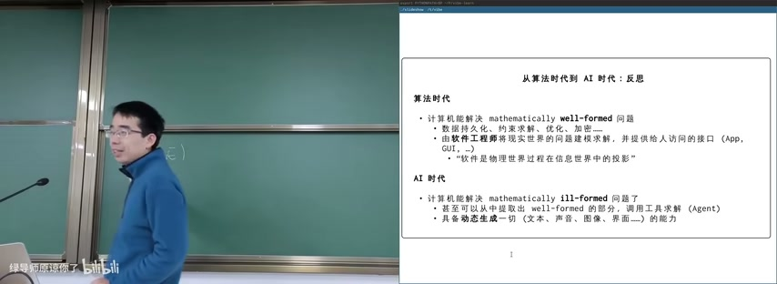

图：从算法时代到AI时代的反思

学习方法的核心是找到并恢复本能，摆脱Reward Hacking的本能，拥抱新时代。

### 4.3 拥抱新时代

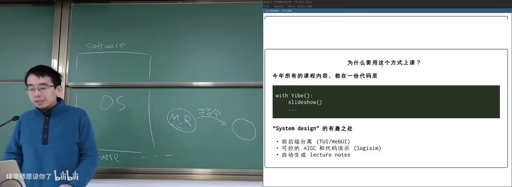

图：代码驱动教学方式

为什么用这个方式上课？今年所有的课程内容都在一份代码里。

```
with Vibe():
    slideshow()
```

"System design"的有趣之处：
- 前后端分离 (TUI/WebUI)
- 可控的 AIGC 和 代码 演示 (logisim)
- 自动生成 lecture notes

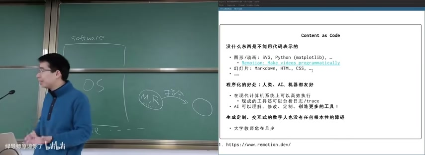

图：Content as Code概念

**Content as Code：** 没什么东西是不能用代码表示的。

- 图形/动画: SVG, Python (matplotlib), ...
- 幻灯片: Markdown, HTML, CSS, ...

**程序化的好处: 人类、AI、机器都友好**

- 在现代计算机系统上可以高效执行
- 有开放的工具还可以分析
- AI 可以直接读懂，编辑，创造更多的工具！

生成定制、交互式的数字人也没有任何根本性的障碍——大学教师危在旦夕。

### 4.4 AIGC Policy

### 4.5 课程实践导向

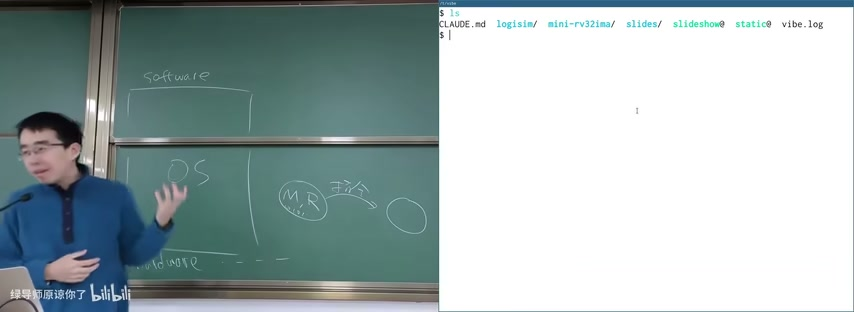

图：计算机系统架构层次与项目文件

项目目录结构包含：
- `mini-rv32ima/`（RISC-V模拟器）
- `logisim/`（数字逻辑电路模拟器）
- `slides/`（幻灯片）
- `slideshow@`（演示工具）

这体现了课程的实践导向：通过实际代码理解操作系统概念。

### 4.6 学习方法

大家都明白应该下载运行示例代码，但就是焦虑啊，看一眼就不想下了。Don't panic! 现在已经是"intelligence is cheap"的时代了。

**一个改变世界的 prompt：**

> 我做X，如果你是一个专家，你会怎么做？

- 被动：学习 Coding Agent 你做的"正确的事"
- 主动：让 Copilot 不停地追问，并实时给出建议
- 都可以帮你建立正确的概念
- 不限于代码，你可以在任何领域应用

## 五、硬件模拟与教学演示

### 5.1 硬件模拟

访问特定内存地址时模拟硬件设备。

- 定时器 (0x7f004000/0x10B40)
- 中断控制 (0x100000, 支持关机/重启)

**教学意义：** 通过这个模拟器，学生可以理解：
- CPU 指令执行的底层机制
- 决定系统切换的计算机系统
- 操作系统如何控制硬件

### 5.2 RISC-V CSR寄存器

CSR（控制状态寄存器）是 RISC-V 中用于控制和监控处理器状态的专用寄存器。

**核心寄存器：**

| CSR | 作用 |
|-----|------|
| PC | 程序计数器，存储当前指令的地址 |
| MSTATUS | 机器模式状态寄存器，控制中断使能、特权模式等 |
| MTVEC | 陷阱向量基地址，中断/异常处理程序的入口地址 |
| MIE | 机器中断使能，配置哪些中断被允许 |
| MIP | 机器中断挂起，哪些中断正在等待处理 |
| MEPC | 异常程序计数器，异常返回后恢复的地址 |
| MCAUSE | 异常原因，记录最后发生的陷阱/中断类型 |

**辅助寄存器：**

| CSR | 作用 |
|-----|------|
| CYCLE/H | 周期计数器，记录处理器执行周期数 |
| MSCRATCH | 临时寄存器，陷阱处理程序用于保存状态 |
| EXTRAFLAGS | 处理器内部状态（非标准 RISC-V 规范） |

**中断流程示例：**

1. 设置 TIMERMATCH → 定时器到期
2. MIE.mtie = 1 → 被置位
3. MIE.mie && MSTATUS.mie = 1 → 触发中断
4. 保存 PC 到 MEPC，设置 MCAUSE
5. 跳转到 MTVEC 处理程序
6. MRET 恢复到 MEPC 继续执行

## 本节要点总结

- 课程按 Why→What→How 组织：为什么学OS、什么是OS、怎么学OS
- 从算法时代到AI时代的核心变化：计算机从解决 well-formed 问题到 ill-formed 问题
- 操作系统是帮我们更好地开发程序的，不需要死记教科书定义
- 计算机系统三层抽象：Software → OS → Hardware
- OS理解需从历史发展角度：硬件→软件→操作系统（管理硬件和软件的软件）
- 1940s没有操作系统，程序直接操作硬件；1950s-60s算力成为服务，OS概念形成
- Content as Code：用代码表示一切内容，对人类、AI、机器都友好
- 课程用代码驱动所有内容，包含logisim和RISC-V模拟器
- AI时代学习方法：intelligence is cheap，善用AI工具辅助学习
- 抽象是分解和隔离复杂性的途径，操作系统传递的takeaway message是抽象层的设计与实现
