# 第三讲 硬件视角的操作系统

来源：南京大学 2026春季学期 操作系统原理

## 一、硬件视角的核心观点

### 1.1 硬件根本不知道有没有操作系统

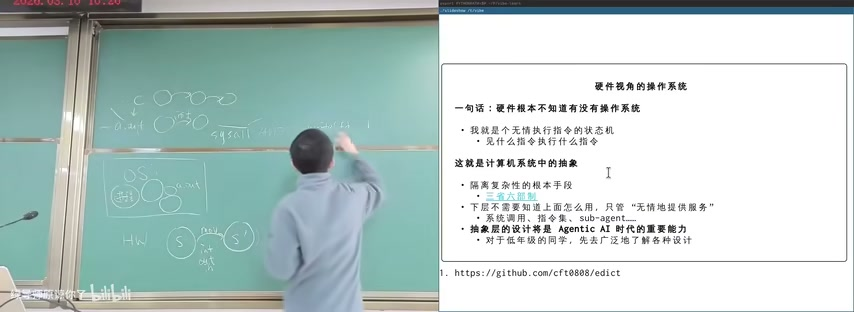

图：硬件视角的操作系统：核心观点

一句话：**硬件根本不知道有没有操作系统。**

我就是一个无情执行指令的状态机——见什么指令执行什么指令。这就是计算机系统中的抽象——隔离复杂性的根本手段。

**抽象层设计原则：**
- 下层不需要知道上面怎么用，只要"无情地提供服务"
- 例：硬件 → 操作系统 → sub-agents ...
- 抽象层的设计将是 Agentic AI 时代的重要能力
- 对于低年级的同学，先去广泛地了解各种设计

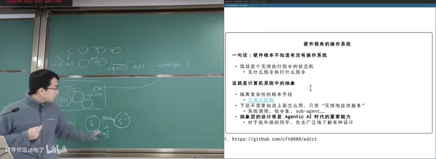

图：硬件视角：抽象层设计

**三生六世原则：** 下层无需知道上层如何使用，按约定的 sub-agent 接口直接提供服务。想要什么就按约定接口直接取。

## 二、计算机系统的状态机模型

### 2.1 计算机系统：状态

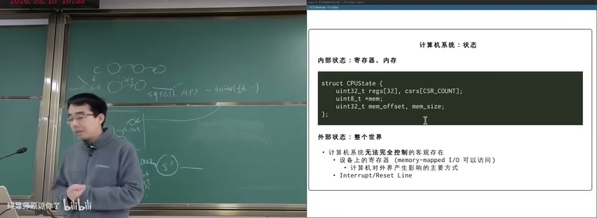

图：计算机系统：内部状态与外部状态

**内部状态：寄存器、内存（CPU可完全控制）**

```c
struct CPUState {
    uint32_t regs[32], csrs[CSR_COUNT];
    uint8_t *mmap;
    uint32_t mem_offset, mem_size;
};
```

**外部状态：整个世界（计算机系统无法完全控制的客观存在）**

- 设备上的寄存器（memory-mapped I/O 可以访问）
  - 计算机对外界产生影响的主要方式
- Interrupt/Reset Line
  - 外部事件触发CPU响应

### 2.2 计算机系统：初始状态

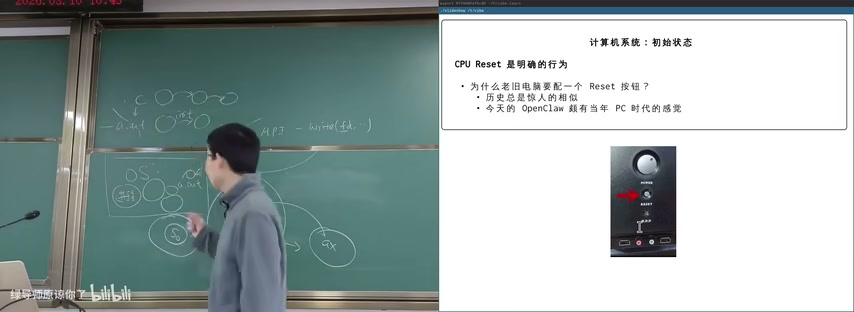

图：计算机系统初始状态与CPU Reset

CPU Reset 是明确的行为。为什么老旧电脑要配一个 Reset 按钮？

- 历史总是惊人的相似
- 今天的 OpenClaw 很有当年 PC 时代的感觉

### 2.3 计算机系统：状态迁移

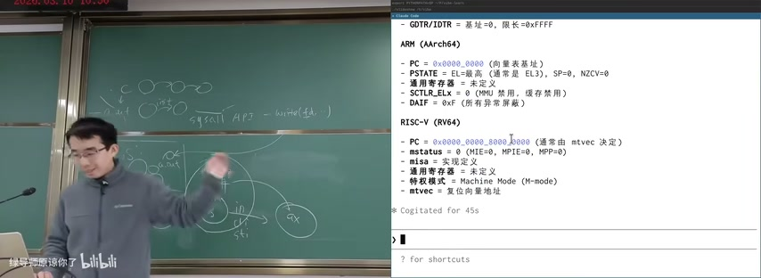

图：计算机系统状态迁移

**状态迁移的三种方式：**

1. **执行指令**
   - 如果有多处理器？
   - 可以想象成"每次选一个处理器执行一条指令"
   - 在并发部分会回到这个问题

2. **响应中断**
   - `if (intr) goto vec;`
   - 这是一个条件跳转指令，处理硬件中断

3. **输入输出**
   - 与"计算机系统外"交换数据
   - 读取信号 (input) 或发送信号传递给设备 (output)

## 三、CPU Reset：三种架构的复位状态

### 3.1 x86 CPU Reset 状态

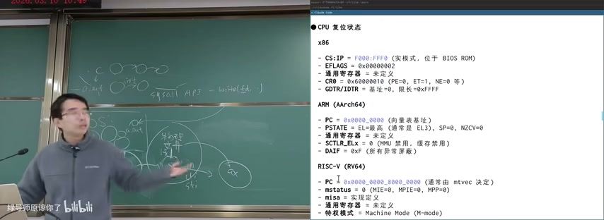

图：CPU Reset状态与特权级转换

```
x86:
- CS:IP = F000:FFF0 (实模式，位于 BIOS ROM)
- EFLAGS = 0x00000002
- 通用寄存器 = 未定义
- CR0 = 60000010 (PE=0, ET=1, NE=0 等)
- GDTR/IDTR = 基址=0, 限长=0xFFFF
```

### 3.2 ARM (AArch64) Reset 状态

```
ARM (AArch64):
- PC = 0x0000_0000 (向量表基址)
- PSTATE: EL=最高 (通常是 EL3), SP=0, N,Z,C,V=0
- 通用寄存器: 未定义
- SCTLR_EL1 = 0 (MMU 禁用, 缓存禁用)
- DAIF = 0xF (所有异常屏蔽)
```

### 3.3 RISC-V (RV64) Reset 状态

```
RISC-V (RV64):
- PC = 0x0000_0000_8000_0000 (通常由 mtvec 决定)
- mstatus = 0 (MIE=0, MPIE=0, MPP=0)
- misa: 实现定义
- 通用寄存器: 未定义
- 特权模式: Machine Mode (M-mode)
- mepc = 未定义
- mtvec: 复位向量基地址
```

### 3.4 关键点

所有架构的 CPU Reset 都从一个预定义的固定地址开始执行，以确保确定性启动。通用寄存器在 Reset 后通常是未定义的，需要显式初始化。

**RISC-V 寄存器初始化状态：**

| 寄存器 | 值 |
|--------|-----|
| stval | 0000000000000000 |
| htval | 0000000000000000 |
| mtval | 0000000000000000 |
| mscratch | 0000000000000000 |
| sscratch | 0000000000000000 |
| satp | 0000000000000000 |
| x0/zero | 0000000000000000 |
| x1/ra | 0000000000000000 |
| x2/sp | 00000... |

## 四、探索CPU Reset

### 4.1 实际的 CPU Reset

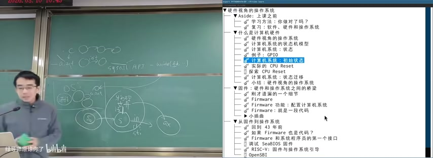

图：探索CPU Reset和初始执行

我们都知道完整的计算机系统是从 CPU Reset 开始的。这里提供了三个架构的"最小代码"演示，展示 CPU Reset 后立即执行"结束"代码的短程序，并打印出执行的指令序列和寄存器变化。

运行程序，我们可以明确地看到 CPU Reset 后的寄存器状态，以及执行指令的结果：**计算机世界没有任何魔法。**

### 4.2 CPU Reset后的代码执行

CPU = 无情执行指令的机器。

- 从 Cold Reset 开始执行
- 从 Mem[PC] 取得指令
- 译码、执行，如此往复

**这里必须得是合法的代码。那到底执行了什么代码呢？代码是谁放在这里的呢？**

**答案：系统厂商的代码**

把一个特殊的存储器 memory-map 到 CPU Reset 后的代码。这段代码"出生"就拥有完整的控制权。

## 五、固件：硬件和操作系统之间的桥梁

### 5.1 固件定义

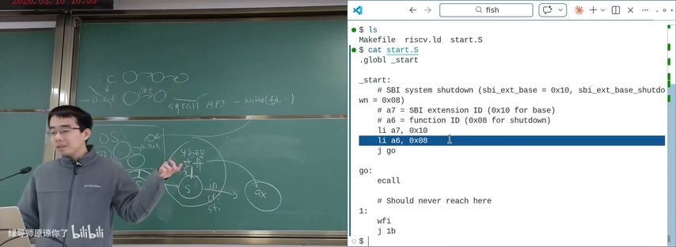

图：固件定义及BIOS与UEFI的演进

**Firmware = "固件"**

- 厂商"固定"在计算机系统里的代码
- 早期：固件 = ROM（都升级？换芯片！）
- 今天可以直接升级固件了

**Firmware 的功能：**

- 完成硬件扫描、初始化和配置
  - （这些配置要生效可能需要重启计算机）
- 不可或缺的一环：加载操作系统
  - QEMU：可以通过 Firmware 直接加载操作系统 (Manual)

### 5.2 Legacy BIOS vs UEFI

**Legacy BIOS (Basic I/O System):**

- IBM PC 所有设备/BIOS 中断是有 specification 的
- 16-bit DOS 时代 BIOS 常驻内存，提供 I/O 等功能
- 成就了百花齐放的"兼容机"时代：AMI 和 Phoenix BIOS 等都活到了今天！

**UEFI (Unified Extensible Firmware Interface):**

- 提供更丰富的支持（例如设备驱动程序）
- 键盘锁、山寨网卡上的 PXE 网络启动、USB 蓝牙转接器连接的蓝牙键盘……

### 5.3 固件启动操作系统

固件初始化硬件后，将控制权交给操作系统内核。SeaBIOS 固件与操作系统引导：OpenSBI 是 RISC-V 的固件实现。

## 六、系统调用：用户态到内核态

### 6.1 系统调用机制

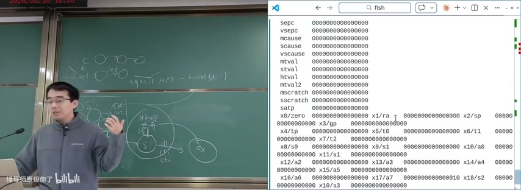

图：系统调用流程：user→kernel

系统调用是用户态程序请求内核服务的唯一合法通道。

**流程：**
1. 用户程序执行 `syscall/ecall/svc` 指令
2. 触发 trap → CPU 切换到内核态
3. OS 处理请求
4. 返回结果 → 切换回用户态

这是操作系统实现保护的关键机制：用户程序不能直接访问硬件，必须通过系统调用请求OS代为操作。

### 6.2 RISC-V SBI接口


图：RISC-V SBI接口与系统调用机制

RISC-V 的 SBI（Supervisor Binary Interface）定义了固件和OS之间的接口。

```asm
.globl _start
_start:
    # SBI system shutdown (sbi_ext_base = 0x10, sbi_ext_base_shutdown = 0x08)
    # a7 = SBI extension ID (0x10 for base)
    # a6 = function ID (0x08 for shutdown)
    li a7, 0x10
    li a6, 0x08  # Function ID for shutdown
    j go

go:
    ecall
    # Should never reach here
1:
    wfi
    j 1b
```

**ECALL 指令：** 从低特权级（如 User）陷入高特权级（如 Supervisor/M-mode），触发环境调用异常。

### 6.3 Linux系统调用列表

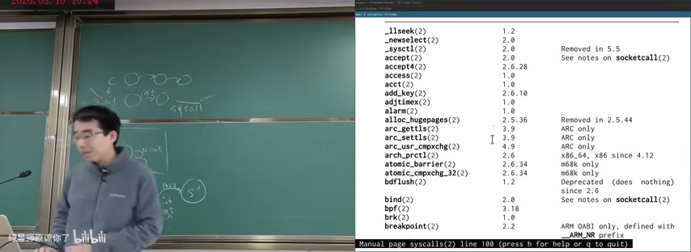

图：Linux系统调用列表

Linux 系统调用数量庞大，从最基础的 `read/write` 到复杂的 `mmap/clone` 等。每个系统调用都有版本号，记录何时加入内核。这体现了操作系统API的演进过程。

部分系统调用示例：

| 系统调用 | 引入版本 | 说明 |
|---------|---------|------|
| access(2) | 1.0 | 文件访问检查 |
| alarm(2) | 1.0 | 定时器 |
| brk(2) | 1.0 | 内存管理 |
| bpf(2) | 3.18 | eBPF |
| clone(2) | 1.0 | 进程创建 |

## 七、复习：软件、硬件和操作系统

### 7.1 三个视角的对比

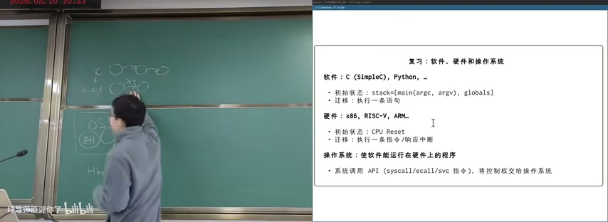

图：复习：软件、硬件和操作系统

**软件：**
- C (SimpleC), Python, ...
- 初始状态：`stack=[main(argc, argv), globals]`
- 迁移：执行一条语句

**硬件：**
- x86, RISC-V, ARM, ...
- 初始状态：CPU Reset
- 迁移：执行一条指令/响应中断

**操作系统：**
- 使软件能运行在硬件上的程序
- 系统调用 API (syscall/ecall/svc 指令)
- 将控制权交给操作系统

### 7.2 硬件视角的小结

一句话：硬件根本不知道有没有操作系统。

- 就是个无情的执行指令的状态机
  - 拿什么指令执行什么指令
- 操作系统提供实现了许多机制（中断、I/O、...）

**操作系统就是一个普通的（二进制）程序：**

- 接收了中断、I/O、...访问
  - 应用程序不能直接访问
- 操作系统也在CPU上运行一会儿
  - 中断（系统调用）后，操作系统又开始执行
  - （操作系统启动后，操作系统就变成了一个中断处理程序）

## 八、学习方法

### 8.1 你做对了吗？

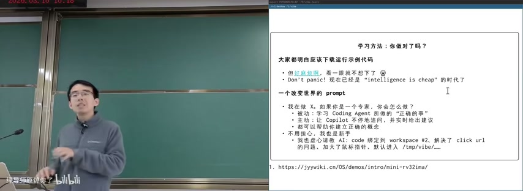

图：学习方法：你做对了吗？

大家都明白应该下载运行示例代码，但就是焦虑啊，看一眼就不想下了。Don't panic! 现在已经是"intelligence is cheap"的时代了。

**一个改变世界的 prompt：**

> 我做X，如果你是一个专家，你会怎么做？

- 被动：学习 Coding Agent 你做的"正确的事"
- 主动：让 Copilot 不停地追问，并实时给出建议
- 都可以帮你建立正确的概念
- 不限于代码，你可以在任何领域应用

### 8.2 实际的 CPU Reset

x86, ARM, RISC-V：

- 它们的 CPU Reset 是什么？
- 体现了怎样的设计理念？
- 你只需要有正确的概念，剩下的可以交给 AI

**对比：预训练过程**

去 The Friendly Manual 里大肆抄计，学习 Systems Programming 时的圣经：

- CPU Reset (Intel® 64 and IA-32 Architectures Software Developer's Manual, Volume 3A, Chapter 9, ~400 页)
- Volume 3A, ~400 页
- 但是这的确帮我建立了正确的概念

### 8.3 使用AI辅助学习


图：使用AI辅助查询GPIO信息

```bash
> Can you see what GPIO port do I have in this system?
● Bash(gpioinfo 2>/dev/null || echo "gpioinfo not available")
gpiochip0 - 54 lines
line 0: "ID_SDA" input
line 1: "ID_SCL" input
```

AI coding assistant可以查询系统信息、解释代码、辅助调试。关键是问对问题，建立正确的概念。

### 8.4 GPIO编程概念

```c
gpio_set_value(GPIO_23, 1); // in Linux kernel
```

大家只要有"PIO"的概念，剩下的都可以用聊天解决。扫描系统中的 GPIO，询问可以做什么。

## 九、CIH病毒案例分析

### 9.1 病毒触发条件


图：CIH病毒触发条件与BIOS破坏机制

```c
void CheckKillDateTrigger() {
    if (day == 0x26) {  // 4月26日
        // 破坏行动1: 替换 BIOS (Flash EEPROM)
        OutPortByte(0xCF8, 0x8000384C); // 向 PCI 控制器发
        // 解锁后，直接通过物理内存地址覆盖 BIOS 数据
        volatile char* biosMemory = (volatile char*)0xE0000;
        for (int i = 0; i < 0x20000; i++) {
            biosMemory[i] = 0x66; // 彻底破坏 BIOS
        }
    }
}
```

### 9.2 病毒提权机制


图：CIH病毒IDT劫持与Ring-0提权

```c
void MyVirusStart() {
    __try {  // SEH 拦截崩溃
        void* idtBase = GetIDTBaseAddress();
        void* interruptVector = (void**)((char*)idtBase + (2 * sizeof(void*) * 3));
        void* oldVector = *interruptVector;
        *interruptVector = MyExceptionHook;  // 劫持 IDT
        // ... Ring-0 操作
    }
}
```

**Ring 3 → Ring 0 提权：** 在 Win9x 中，IDT 存放于固定的内存区域且所有程序可写。通过 `sidt` 指令获取基址，修改中断向量指向病毒代码，从而获得最高特权级。

### 9.3 教学意义

通过分析真实病毒代码，理解：
- 操作系统的特权级保护机制（Ring 0 vs Ring 3）
- 系统调用如何实现特权级切换
- 硬件中断处理机制
- 操作系统安全的重要性

## 本节要点总结

- 硬件根本不知道有没有操作系统——它是无情执行指令的状态机
- 抽象层设计是隔离复杂性的根本手段，下层不需要知道上层怎么用
- 计算机系统 = 内部状态（寄存器+内存）+ 外部状态（整个世界）
- CPU Reset是明确的初始化行为，决定了系统从何处开始执行
- x86/ARM/RISC-V三种架构的CPU Reset状态各不相同
- 系统调用（syscall/ecall/svc）是用户态进入内核态的唯一合法通道
- 固件（Firmware）是硬件和操作系统之间的桥梁
- 学习方法：先建立正确概念，剩下的可以交给AI
- CIH病毒案例：展示了特权级保护、IDT劫持、Ring-0提权等底层机制
