# 第五讲 程序和进程；fork, execve, exit

来源：南京大学 2026春季学期 操作系统原理

## 一、内容回顾

### 1.1 应用视角 vs 硬件视角的OS

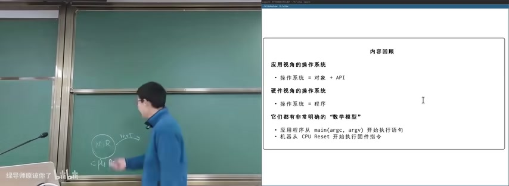

图：应用视角vs硬件视角的OS

**应用视角的操作系统：**
- 操作系统 = 对象 + API
- 应用程序从 `main(argc, argv)` 开始执行语句

**硬件视角的操作系统：**
- 操作系统 = 程序
- 机器从 CPU Reset 开始执行固件指令

它们都有非常明确的"数字模型"。

## 二、虚拟化：一个疯狂的想法

### 2.1 虚拟化的本质

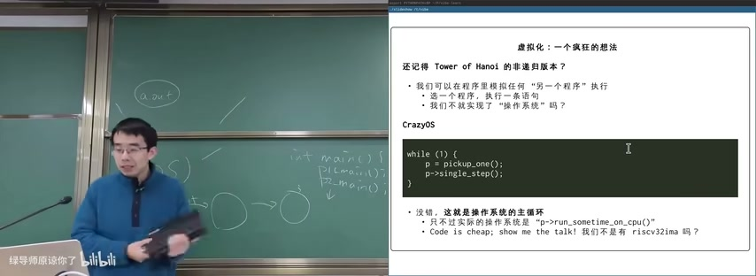

图：虚拟化：一个疯狂的想法

还记得 Tower of Hanoi 的递归版本？**我们可以在程序里模拟任何"另一个程序"执行。**

- 是一个程序，执行一系列语句
- 我们不就实现了"操作系统"吗？

**CrazyOS 主循环：**

```c
while (1) {
    p = pickup_one();
    p->single_step();
}
```

没错，这就是操作系统的主循环——只不过实际的操作系统是 `"p->run_sometime_on_cpu()"`。

Code is cheap, show me the talk! 我们不是有 riscv32ima 吗？

### 2.2 虚拟化的意义

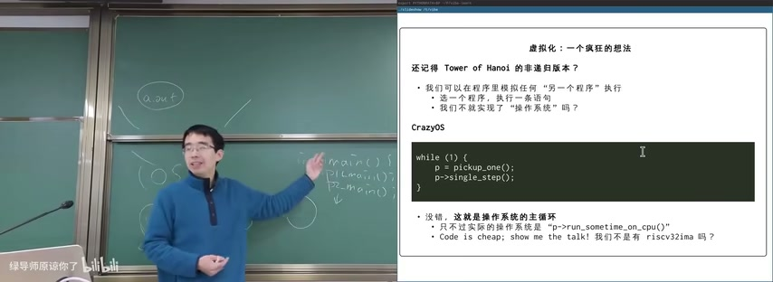

图：虚拟化与操作系统执行模型

虚拟化是将物理计算机"抽象"成"虚拟计算机"，让程序好像独占计算机运行。这使得多个进程可以并发执行，每个进程都认为自己独占了整个CPU。

**核心抽象：**
- One of the most fundamental abstractions that the OS provides to users: the process
- 把物理计算机"抽象"成"虚拟计算机"
- 程序好像独占计算机运行

进入"每一讲都实现一点什么"的模式——每次课都感到编程"能力边界"的扩展。

## 三、CrazyOS实现

### 3.1 系统调用底层实现

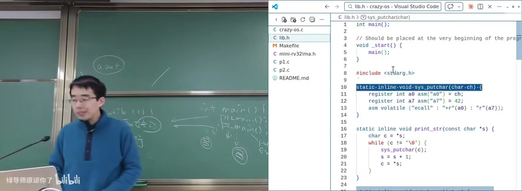

图：C语言底层系统调用实现

```c
// lib.h
int main();

// Should be placed at the very beginning of the program
void _start() {
    main();
}

#include <stdioarg.h>

static inline void sys_putchar(char ch) {
    register int a0 asm("a0") = ch;
    register int a7 asm("a7") = 42;
    asm volatile ("ecall" : "+r"(a0) : "r"(a7));
}

static inline void print_str(const char *s) {
    char c = *s;
    while (c != '\0') {
        sys_putchar(c);
        s = s + 1;
        c = *s;
    }
}
```

**关键点：**
- `_start()` 是程序入口，调用 `main()`
- `sys_putchar` 通过内联汇编触发 `ecall` 指令
- `a0` 寄存器传递字符，`a7` 寄存器传递系统调用号（42）
- `ecall` 从用户态陷入内核态

### 3.2 进程初始化与系统调用处理

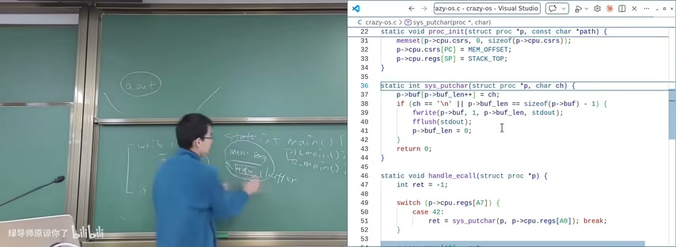

图：OS进程初始化与系统调用机制

```c
static void proc_init(struct proc *p, const char *path) {
    memset(p->cpu.csrs, 0, sizeof(p->cpu.csrs));
    p->cpu.csrs[PC] = HEAD_OFFSET;
    p->cpu.regs[SP] = STACK_TOP;
}

static int sys_putchar(struct proc *p, char ch) {
    p->buf[p->buf_len++] = ch;
    if (ch == '\n' || p->buf_len == sizeof(p->buf) - 1) {
        fwrite(p->buf, 1, p->buf_len, stdout);
        fflush(stdout);
        p->buf_len = 0;
    }
    return 0;
}

static void handle_ecall(struct proc *p) {
    int ret = -1;
    switch (p->cpu.regs[A7]) {
        case 42:
            ret = sys_putchar(p, p->cpu.regs[A0]); break;
    }
}
```

**`proc_init` 初始化进程：**
- `memset` 清零 CSRs
- 设置 `PC = HEAD_OFFSET`（程序起始地址）
- 设置 `SP = STACK_TOP`（栈顶）

**`sys_putchar` 缓冲输出：**
- 将字符缓冲到 `buf`
- 遇到换行或缓冲区满时 flush 到 stdout
- 这提高了I/O效率

**`handle_ecall` 系统调用分发：**
- 根据 `a7` 寄存器的值分发系统调用
- 系统调用号42对应 `sys_putchar`

### 3.3 RISC-V OS构建配置

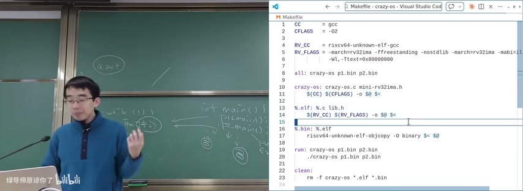

图：RISC-V OS Makefile构建配置

```makefile
CC = gcc
CFLAGS = -O2
RV_CC = riscv64-unknown-elf-gcc
RV_FLAGS = -march=rv32ima -ffreestanding -nostdlib -march=rv32ima -mabi=ilp32 \
           -Wl,-Ttext=0x80000000

all: crazy-os p1.bin p2.bin

crazy-os: crazy-os.c mini-rv32ima.h
    $(CC) $(CFLAGS) -o $@ $<

%.elf: %.c lib.h
    $(RV_CC) $(RV_FLAGS) -o $@ $<

%.bin: %.elf
    riscv64-unknown-elf-objcopy -O binary $@ $<

run: crazy-os p1.bin p2.bin
    ./crazy-os p1.bin p2.bin
```

**编译参数解析：**
- `-march=rv32ima`：指定 RISC-V ISA
- `-ffreestanding -nostdlib`：不依赖标准库
- `-Wl,-Ttext=0x80000000`：设置代码段起始地址
- `objcopy -O binary`：将ELF转为原始二进制

## 四、程序 v.s. 进程

### 4.1 程序与进程的区别

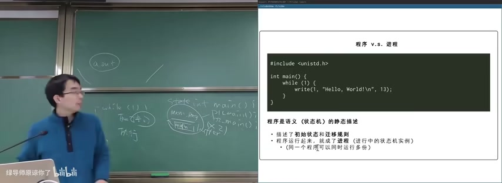

图：程序v.s.进程

**程序是语义（状态机）的静态描述：**
- 描述了初始状态和迁移规则
- 存放在磁盘上的可执行文件（如 a.out）

**进程是程序的运行时实例：**
- 程序运行起来，就成了进程（进行中的状态机实例）
- 同一个程序可以同时运行多份

```c
#include <unistd.h>
int main() {
    while (1) {
        write(1, "Hello, World!\n", 13);
    }
}
```

这个程序一旦运行，就创建了一个不断输出 Hello World 的进程。

### 4.2 无限循环分析

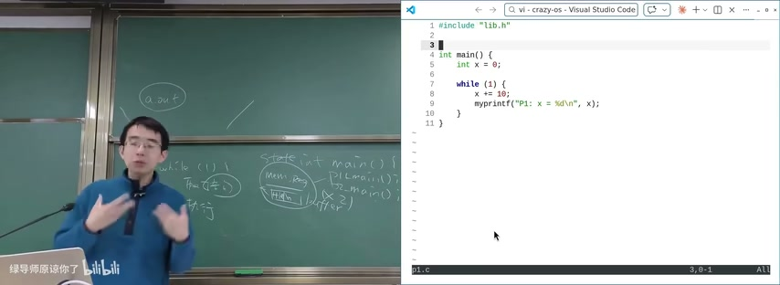

图：C程序无限循环分析

```c
int main() {
    int x = 0;
    while (1) {
        x += 10;
        myprintf("P1: x = %d\n", x);
    }
}
```

这是一个无限循环：
- `while(1)` 条件永远为真（1是非零值）
- `x` 不断增加并打印
- 没有 `break` 条件或退出机制
- 程序将永远运行

### 4.3 进程的运行时状态

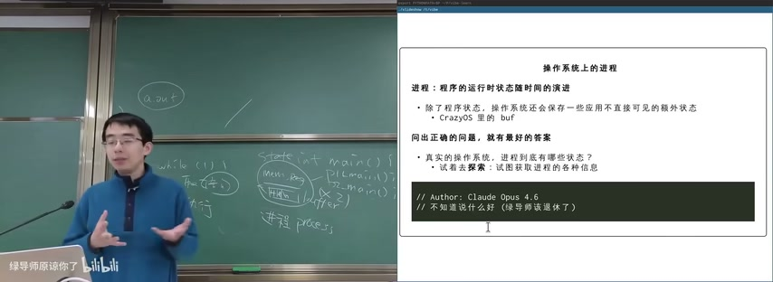

图：操作系统中进程的运行时状态

**进程：程序的运行时状态随时间的演进**

除了程序状态，操作系统还会保存一些应用不直接可见的额外状态：
- CrazyOS 里的 `buf` 缓冲区
- 进程的 ppid、文件描述符、信号处理等

**问出正确的问题，就有最好的答案：** 真实的操作系统，进程到底有哪些状态？试着去观察：试着获取进程的各种信息。

## 五、进程信息观察

### 5.1 Linux进程信息

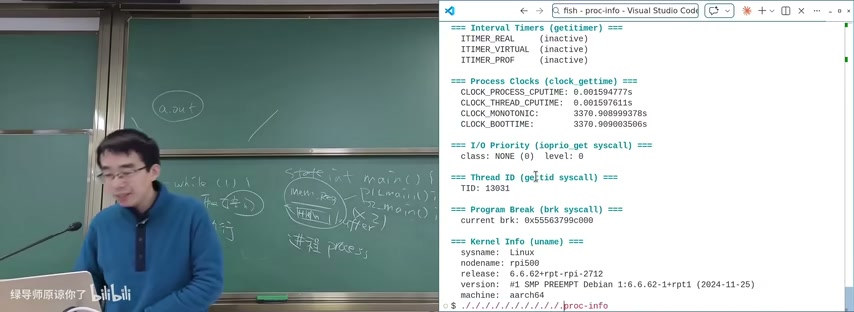

图：Linux进程信息与系统调用

```bash
=== Interval Timers (getitimer) ===
ITIMER_REAL: (inactive)
ITIMER_VIRTUAL: (inactive)
ITIMER_PROF: (inactive)

=== High Resolution Clocks (gettime) ===
CLOCK_PROCESS_CPUTIME_ID: 0.001594775s
CLOCK_THREAD_CPUTIME_ID: 0.001597611s
CLOCK_MONOTONIC: 3370.98999378s
CLOCK_BOOTTIME: 3370.989993586s

=== Thread ID (gettid syscall) ===
TID: 13931

=== Program Break (brk syscall) ===
current brk: 0x555567990c000

=== Kernel Info (uname) ===
sysname: Linux
release: 6.6.2+rpt-rpi-2712
machine: aarch64
```

### 5.2 进程状态详情

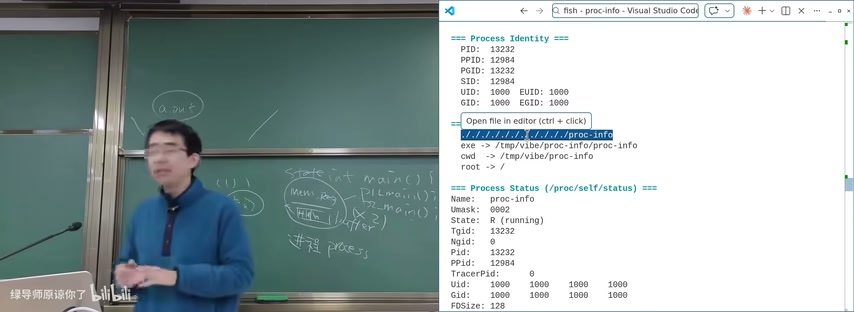

图：Linux进程信息与进程间通信

**Process Identity（进程标识）：**

| 属性 | 值 |
|------|-----|
| PID | 13232 |
| PPID | 12984 |
| PGID | 13232 |
| SID | 12984 |
| UID | 1000 |
| GID | 1000 |

**Process Status（/proc/self/status）：**

| 属性 | 值 |
|------|-----|
| Name | proc-info |
| State | R (running) |
| Tgid | 13232 |
| Pid | 13232 |
| PPid | 12984 |
| FDSize | 128 |

`/proc/self/status` 展示了进程的详细状态。这些信息可以通过系统调用获取，是理解进程运行时状态的重要途径。

## 六、进程管理：创建、执行、销毁

### 6.1 进程管理的本质

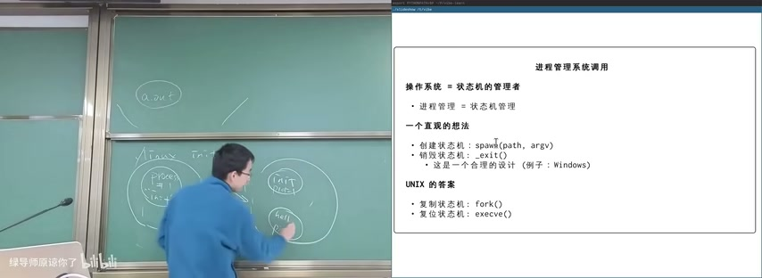

图：操作系统进程管理与系统调用

**操作系统 = 状态机的管理者**
**进程管理 = 状态机管理**

**一个直观的想法：**
- 创建状态机：`spawn(path, argv)`
- 销毁状态机：`_exit()`
- 这是一个合理的设计（例如：Windows）

**UNIX的答案：**
- 复制状态机：`fork()`
- 复位状态机：`execve()`
- 销毁状态机：`_exit()`

UNIX 将进程创建分为两步：`fork()` 复制当前进程的完整状态机（内存、寄存器现场），然后 `execve()` 用新程序替换（复位）这个状态机。这比单一的 `spawn` 更灵活——fork后可以先做些准备工作再exec。

### 6.2 fork()系统调用

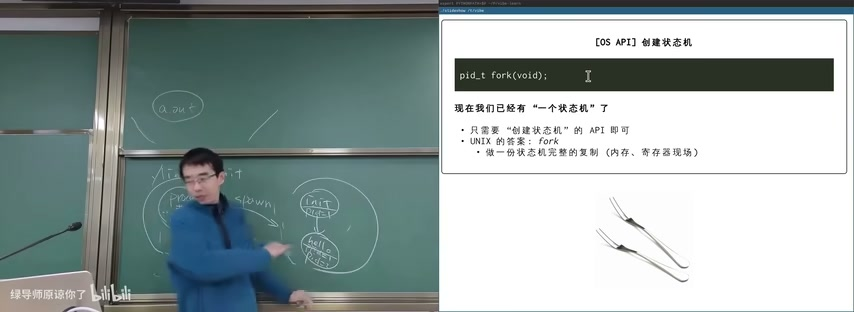

图：OS API：通过fork()创建状态机

```c
pid_t fork(void);
```

现在我们已经有"一个状态机"了，只需要"创建状态机"的API即可。UNIX的答案：`fork()` 做一份状态机完整的复制（内存、寄存器现场）。

### 6.3 fork()的行为

**立即复制状态机：**
- 包括所有状态的完整拷贝
- 数千字节 & 几个字节的内存
- Caveat: 进程在操作系统里也有状态：ppid, 文件, 信号, ...
- 小心这些状态的复制行为
- 复制失败返回 -1
- errno 会返回错误原因 (man fork)

**如何区分两个状态机？**
- 新创建进程返回 0
- 执行 fork 的进程返回子进程的进程号——"父子关系"

```c
pid_t pid = fork();
// Two copies
if (pid == 0) {
    // child
} else {
    // parent
}
```

### 6.4 进程执行与调度

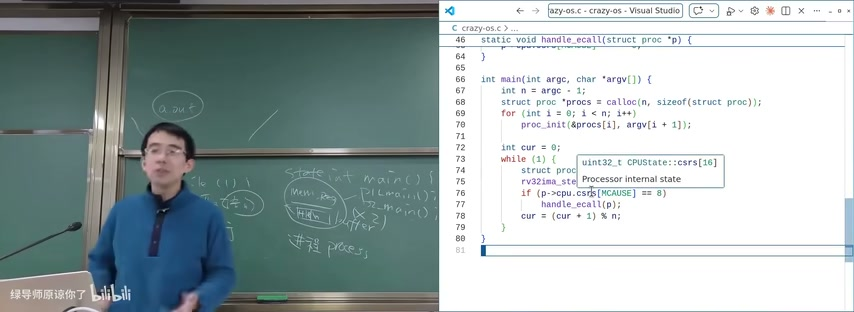

图：进程执行与ecall处理

```c
int main(int argc, char *argv[]) {
    int n = argc - 1;
    struct proc **procs = calloc(n, sizeof(struct proc));
    for (int i = 0; i < n; i++) {
        proc_init(&procs[i], argv[i + 1]);
    }

    int cur = 0;
    while (1) {
        struct proc *p = procs[cur];
        uint32_t cpuState = p->cpu_state.csr[MCAUSE];
        rv32ima_state *rv = &p->cpu_state;
        if (rv->mcause == 8) {
            handle_ecall(p);
        }
        cur = (cur + 1) % n;
    }
}
```

**CrazyOS 的调度逻辑：**
1. 初始化进程数组
2. 进入 while(1) 循环
3. 检查当前进程的 `mcause` 寄存器
4. 如果是 8（ecall），则调用 `handle_ecall` 处理
5. 切换到下一个进程：`cur = (cur + 1) % n`

这就是最简单的轮询调度（Round-Robin Scheduling）。

### 6.5 进程结构定义

```c
#define MEM_OFFSET 0x80000000u
#define STACK_TOP (MEM_OFFSET + MEM_SIZE)
#define MAX_PROCS 16

struct proc {
    //--- Process "virtual-machine" state:
    //--- Register & memory
    struct CPUState cpu;
    uint8_t mem[MEM_SIZE];
    
    //--- Operating-system internal state
    char buf[256];
    int buf_len;
    int used; // 1 if this slot is in use
};

static struct proc procs[MAX_PROCS];
static int num_procs = 0;
```

**进程结构体设计：**
- `struct CPUState cpu`：CPU寄存器状态
- `uint8_t mem[MEM_SIZE]`：进程的完整内存空间
- `char buf[256]`：OS内部缓冲区
- `int used`：标记该进程槽位是否被使用

## 七、fork()的实现与应用

### 7.1 fork()的实现

```c
static int sys_fork(struct proc *caller) {
    // Find a free slot
    for (int i = 0; i < MAX_PROCS; i++) {
        if (!procs[i].used) {
            struct proc *child = &procs[i];
            // Copy the entire process state
            memcpy(child, caller, sizeof(struct proc));
            // Fix the memory pointer: child's mem should point to its own
            child->cpu.mem = child->mem;
            // ... set up return values
            return i;  // return child pid
        }
    }
    return -1;  // no free slot
}
```

**fork() 的核心逻辑：**
1. 在进程表中找到空闲槽位
2. 使用 `memcpy` 复制整个进程结构体
3. 修复内存指针：子进程的 `cpu.mem` 应指向自己的 `mem` 数组
4. 返回子进程PID给父进程，返回0给子进程

### 7.2 fork炸弹


图：Fork炸弹：指数级进程增长

**刚才的示例程序：**
- 1变2，2变4，指数级增长
- "核裂变"使资源迅速消耗殆尽
- 曾经会使系统彻底卡死，但现在Linux有OOM保护

```bash
:(){ :|:& };:
# 或者
while(1) { fork(); }
```

**fork炸弹的原理：**
- 每个新创建的进程立即开始同样的复制代码
- 创建几何级数增长的进程（1 → 2 → 4 → 8...）
- 每个进程消耗系统资源（CPU、内存）
- 系统有限资源迅速耗尽，导致拒绝服务（DoS）

### 7.3 fork()的应用场景


图：fork()的全量内存快照应用

**fork() 的全量内存快照：应用**

1. **共享信息预处理**
   - 计算 prime_table，然后 fork 进程分段处理
   - 更酷的例子：Android Zygote Process，完成"冷启动"
   - 预加载框架后fork，子进程直接共享预加载结果

2. **并行搜索**
   - Depth-first search 中，为每个分支创建一个进程
   - 各分支并发执行，加速整体搜索

3. **沙箱隔离**
   - 定期做一个 checkpoint，如果程序 crash 了就从 checkpoint 恢复
   - 提高系统容错性

### 7.4 fork()在DFS中的应用

```c
void dfs(int x, int y, int steps) {
    // ...
    for (struct move *m = moves; m < moves + 4; m++) {
        int x1 = m->x, y1 = m->y;
        int pid = fork();
        assert(pid >= 0);
        if (pid == 0) {
            // Forked worker process
            map[x1][y1] = m->moves;
            if (map[x1][y1] == DEST || map[x1][y1] == EMPTY) {
                dfs(x1, y1, steps + 1);
            }
            exit(0);
        } else {
            nfork++;
            // If we wait here, the search will be serialized
            // waitpid(pid, NULL, 0);
        }
    }
}
```

**并行 vs 串行搜索：**
- 注释掉 `waitpid`：所有分支并发执行（并行）
- 保留 `waitpid`：逐个分支执行（串行）
- 并行搜索可以显著加速，但需要更多系统资源

## 八、进程的生命周期

### 8.1 进程创建

- `fork()`：复制当前进程
- `execve()`：用新程序替换当前进程映像
- `spawn()`：一步创建新进程（Windows风格）

### 8.2 进程执行

- 进程在CPU上执行指令
- 操作系统通过调度器决定哪个进程运行
- 上下文切换：保存当前进程状态，恢复下一个进程状态

### 8.3 进程销毁

- `_exit()`：终止当前进程
- `exit()`：终止进程并执行清理工作
- 操作系统回收进程资源（内存、文件描述符等）

### 8.4 进程间关系

- 父子关系：`fork()` 创建的子进程
- 进程组：多个相关进程的集合
- 会话：多个进程组的集合

## 本节要点总结

- 程序是语义（状态机）的静态描述：初始状态 + 迁移规则
- 进程是程序的运行时实例：进行中的状态机，同一程序可有多份进程
- 虚拟化：一个疯狂的想法——在程序里模拟另一个程序的执行
- CrazyOS主循环：`while(1) { p = pickup_one(); p->single_step(); }`
- 进程的额外状态：OS保存应用不直接可见的信息（如buf缓冲区）
- 系统调用ecall：用户态→内核态的唯一合法通道
- UNIX进程管理：fork()复制状态机 + execve()复位状态机 + _exit()销毁
- 操作系统 = 状态机的管理者，进程管理 = 状态机管理
- fork()立即复制完整状态机，包括内存和OS级元数据
- fork炸弹：指数级进程增长，消耗系统资源
- fork()应用：共享预处理、并行搜索、沙箱隔离
- 进程生命周期：创建(fork/execve) → 执行(调度) → 销毁(exit)
