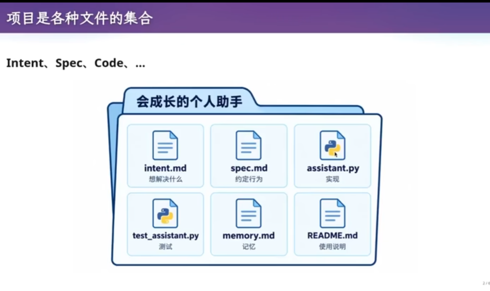
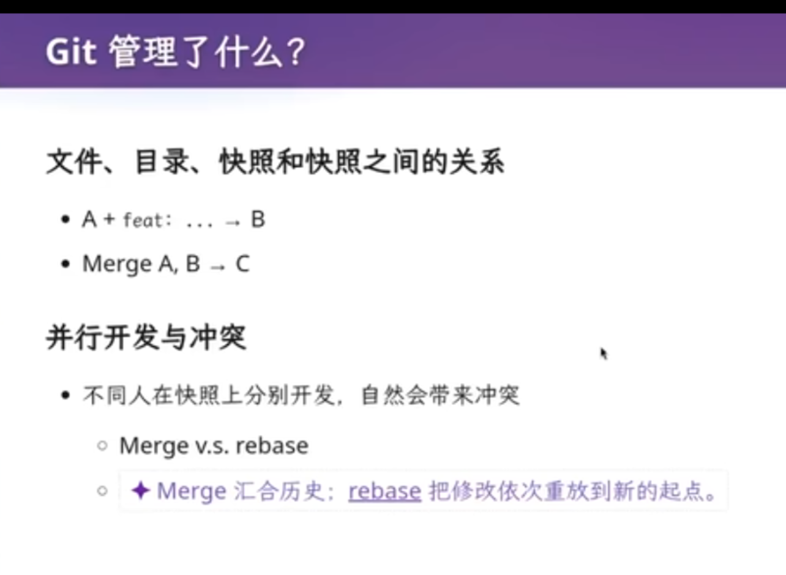

# **一、课程作业：会成长的个人助手**

## **1.1 要求：实现一个会成长的个人助手**

-  [要求详见老师个人网站](https://jyywiki.cn/GSE/2026/lab1.md])

## **1.2 为什么要布置这个实验**

- 当AI不了解你,它会陷入混乱,不知道你的习惯,想法.或许AI能干活,但是会消耗更多的token
- AI和用户的这种**交流坑**,一定需要去尝试踩一下


# **二、文件是需求的投影**

## **2.1回顾上节课**



- 项目是各种文件的集合 
- 老师提到,他不喜欢AI写的超长README,他喜欢简单精炼,只需从README体现自己的想法,初衷,产品最终效果
- 各种intent,spec,code的要求,都是属于项目的一部分
- 因此,需要学会管理这些项目

## **2.2 文件系统并不便利**

- 用文件系统来管理项目，其实是图方便。
- 在1950--60年代，操作系统能提供的存储抽象只有文件，关系型数据库还没有发明，程序员别无选择，只能把项目以文件的形式存进去。
老师进一步判断：文件系统可能不是组织项目的正确方式，因为它丢失了许多难以用文件表达的信息。
- 举例:一开始在文档里说明使用link list关联,但是在随后的开发中,却没有实现,随着开发向前,与文档的不一致只会越来越多,最后陷入了,技术维护的泥潭
- 让AI看,AI都不知道是文档说得对还是代码说得对,更别提自己了

- 文件系统的「将错就错」，由此引出软件工程里研究非常久的一个问题：traceability（可追溯性）。
- 一篇2014年的论文回顾了更早的工作，它的摘要指出：
  `软件可追溯性是软件密集系统中一种「被追求却又常常难以捉摸」的质量属性；在安全攸关系统中，它是美国联邦航空局（FAA）等认证机构强制要求的要素，是软件开发过程不可分割的一部分。`
- 核心问题还是前面那个：一个软件项目中各种各样的测试用例、文档，哪怕是文档里的一行代码，它们之间的关联是什么？能否在软件系统的演进过程中，始终维持这些关联？

## **3.3 未来设想：一个比git更强的管理工具与AI共同维护项目**

- 文件系统很糟糕,于是有了SVN，有了 Git。但在AI时代:下一个是什么？

- 老师的设想未来的软件把每个软件部件变成对象或实体，再用关系把它们连接起来
- 文档「实现了」某段代码，某条测试用例「验证」了某条文档，文档又和文档互相引用。这会形成一个带环的图（graph），而不再是文件系统能表达的树。
- 这样的东西可以放进一个数据库，叫repo.db
- 但人类是无法理解的,只能通过对AI训练,让AI去维护


- 但是至少初期,还是要小步向前,沿用过去软件工程的智慧

# **四、Git 的模型：change 为何不是一等公民**

## **4.1 Git 的初心与 merge、rebase 的缺点**

Git 管理的是快照（snapshot）：一次 commit，就是某个目录在该时刻的一张快照。开发要求「小步前进」，于是 A、B 两个开发者可以各自在快照上独立开发，再设法合并。

但真实开发并不会按照「一个 Commit 做完再下一个」的方式进行。这里有一个 Git 的典型痛点：**工作区处于「半成品状态」**。

假设现在有一个 hello.c，你正在修改它，而且已经改了一半。此时项目处于一个非常正常、但对 Git 来说比较尴尬的状态：

- 代码无法编译；
- 程序无法运行；
- 测试无法通过；
- 当前修改还没有完成；
- 但你又不能直接把它当成一个完整版本提交。

也就是说，开发者实际上长期处于「改到一半」的状态，这在真实开发中非常常见。

**高优先级任务会进一步放大这个问题。** 假设你正在修改 hello.c，突然导师打电话：**有一个非常高优先级的 Bug，客户马上要交付，先把这个 Bug 修掉。** 此时你不能简单地直接 commit------因为当前代码编译不过、测试不过、还没完成，本身并不是一个适合进入正式历史的状态。

于是 Git 提供了：**Stash（暂存当前工作状态）**。典型流程变成：把半成品收进 stash，工作区回到干净状态，先把 Bug 修掉，回头再 stash pop 出来继续。

**但 stash 解决问题，也引入了额外的管理成本------因为工作会被再次打断。** 假设你刚把第一个 Bug 修到一半，导师又打电话：「这个 Bug 先别修了，还有一个优先级更高的问题。」于是你又要 stash 一次。最终你的 stash 里可能积累：

- Stash A：项目功能修改到一半；
- Stash B：第一个 Bug 修改到一半；
- Stash C：第二个 Bug 修改到一半；
- ……

于是你开始需要管理：哪个 Stash 是什么、哪个 Stash 对应哪个任务、应该先恢复哪一个、恢复之后是否会产生冲突。因此原本只是「我现在正在改代码」，最后变成了「我得管理一堆 Git 状态对象」。

回到快照模型本身，合并也有类似的别扭：

- merge：创建一个有两个 parent
  的提交，同时继承两条线上的修改。它带来归属问题------merge 由 A
  执行，冲突 resolve 后产生的 change 就算 A 做的，于是 B
  写的代码，ownership 最后记到了 A 头上。

- rebase：把一条线上的提交逐个「搬」到另一条线之后，形成线性历史。风险在于每一步都可能冲突：把
  feature 搬过去要 resolve 一次，把 test 搬过去还可能再失败；而且每次
  rebase 都会创建一个新的 commit ID，历史随之被改写。

一旦冲突进入 rebase模式，人往往会瞬间不知道该怎么办------这正是老师要引出的问题。

## **4.2 真正想操作的是 change**

{width="7.5in"
height="2.406323272090989in"}

图：如果想重新设计版本管理系统：Git 用 commit 代理 change 的不和谐

Git 经常需要处理 commit 之间的 delta，也就是 change：cherry-pick、rebase
都是如此。但 Git 是用 commit 来「代理」change 的------change
本身不是一等公民，于是总让人感觉到一丝轻微的不和谐。

我们究竟想操作什么？「把这次修改挪到另一个版本上」------我们关心的其实是
change
本身。更进一步：这次修改换了一个起点，它还是不是「同一次修改」？这个语义问题，在
commit 模型里无法直接表达。

### **一个更自然的抽象：任何时候的编辑过程都是 Change**

不需要等到 commit 才承认「发生了修改」：只要你正在修改项目，这本身就是一个
change。hello.c 增加一行、删除一行、修改一个字符，这些都已经构成一次
change。因此软件开发过程中并不是「未修改 → 修改 → 完成」的线性阶段，而是开发者始终处于「修改某个东西」的状态。

**如果 Change 是一等公民，就不需要强迫它立刻成为正式 Commit。** 当前正在进行的修改，本身就是一个 Change 对象：

```
Base Snapshot
     ↓
Current Change
     ↓
Current Snapshot
```

无论当前修改是否编译成功、测试是否通过、功能是否完整，它都可以作为一个独立的
Change 被系统持续记录。

**极端一点：每次修改一个字节都立即记录。** 让 repository 始终处于某种「可记录状态」------每当发生一点变化，就立即生成新的底层 commit /
snapshot。但这里并不是要保留一条无限膨胀的 commit 历史，而是：当前状态始终对应一个最新版本，前一个代表当前 Change 的状态可以被替换。可以粗略理解成：**只保留「当前 Change 的最新快照」，而不是无限保存用户正在进行中的每一个瞬间。**

**Change 与 Snapshot 分工。** 在这种设计下，两个概念被明确区分开：

- Snapshot / Commit：表示某一个可记录的项目状态；
- Change：表示当前正在进行的修改。

于是工作过程中，当前 Change 不需要先变成传统意义上的「正式提交」，也可以一直存在。

**为什么这样可以消除 Staging Area。** 传统 Git 的三层模型可以被简化：

```
Working Tree          Base Snapshot
      ↓                     ↓
Staging Area    →        Change
      ↓                     ↓
Commit                Current Snapshot
```

之所以需要 Staging Area，是因为 Git 中「我当前正在修改什么」和「我准备提交什么」是两个不同状态，开发者需要手动告诉 Git：「这些修改现在属于这一次
Commit，其他修改不要提交。」而如果 Change 本身就是一个一等对象，系统就天然知道「这些内容就是当前这个 Change」，因此不再需要额外的 Staging Area
来充当「待提交修改」的中间层。

核心思想可以总结为：**当前的工作状态本身就是工作状态的正式抽象**，而不是把它当成 Git Commit 之前的「临时脏状态」。

### **一个设计原则可以不断向前推演**

老师强调，这只是其中一种可能的设计，并不是完整方案，但整个推导过程非常值得学习：

1. 发现：Git 用 commit 之间的差异间接表达 change；
2. 提出：change 应该成为 first-class citizen；
3. 进一步推导：当前编辑过程本身就可以是一个 change；
4. 继续推导：如果 change 被正式管理，就不再需要把未完成修改塞进 stash；
5. 再继续推导：如果当前 change 本身就是正式对象，那么 staging area 也可能不再需要。

这就是一个很典型的**从抽象概念重新设计工具**的过程。

## **4.3 Jujutsu：让 change 成为一等公民**

如果把 change 也作为 first-class
citizen，你会得到下一代更好用的版本控制系统------Jujutsu（jj，老师现场演示的正是它）。它和
Git 底层完全兼容，可以直接当 Git 用，但额外引入了 change 的概念：

- commit 在 rebase 时不应该变成一个 ID 不同的「新 commit」；以 change
  为单位，同一份修改可以保持身份。

- 不再需要 staging area（暂存区）：change 本身就是「当前正在进行的修改」，你一直在编辑，随时都在产生 change。

- 以 change 为单位，抽象层级变高，冲突的搬运与解决都更自然。

- 冲突可以显式记录、之后统一处理（老师称之为 killer feature）：rebase
  带下来的冲突不会立刻打断你，而是先记录，事后一次性 resolve。

# **五、Agent 时代的版本管理**

## **5.1 当前版本控制的使用者是人**

从 SVN 到
Git，所有版本控制系统都有一个共同假设：使用者是人。而人的关键特征是
single-threaded------只有一份 I/O
设备（一双眼睛、一张嘴、一双手），无法同时观察和修改世界。


## **5.2 Agent 打破了节奏,目前的git不适合AI**

在 Agent 时代，单个 Agent 生产 AI slop 的速度远快于人：它生成 slop
以分钟级为单位，甚至更快；在上下文热的时候，让它修一个东西可能只需几十秒甚至几秒。再乘上十倍、百倍规模的
Agent team，为一个「人」设计的 Git 模型就跟不上这个速度了。


## **5.3 workaround：给每个 Agent 一台机器**

{width="7.5in"
height="2.406323272090989in"}

图：Agent team 的 tmux 现场：两个 session 分别命名 slave-a / slave-b

今天的临时方案，是让 Agent 沿用人的模型------把 single-threaded 的人与
Agent 做严格的一一对应：每个 Agent
拥有自己的一台开发计算机（或容器），彼此物理隔离、看不到对方。老师现场开了两个
tmux session，把两个 Agent 分别命名为
slave-a、slave-b，各自在独立环境里工作。

它们可以合并到远端、拉取别人的提交；冲突了就自行修复，必要时给 master
agent 发消息汇报。主 Agent 负责协调、观察输出、总结报告并往里面 inject
prompt，一个多 Agent 系统就这样「跑起来」。

**老师：如果大家工作在同一个 Git
仓库上，就会有一些麻烦；如果工作在不同的 repo
上，就完全可以------你立即就能构建出一个多 Agent 系统。**

## **5.4 git worktree：更轻量的隔离**

{width="7.5in"
height="2.406323272090989in"}

图：git worktree：当前工作树、主仓库、提交历史与文件内容

git worktree
允许从一个仓库检出多个工作目录，每个工作目录独立工作在不同分支上，且共享同一个
.git 目录与提交历史------一个 worktree 的提交对其他 worktree
立即可见，无需互相 pull / push，因此在 AI 时代突然变得有用。

它的关键机制是对操作系统机制的复用：通常情况下 .git 是一个目录，里面有
HEAD、index、logs 与 objects 等；而在 worktree 里，.git
是一个普通文本文件，内容形如 gitdir:
\...，指向主仓库下为它保存的一个「微型 git 目录」（同样带
HEAD、index、logs）。也就是说，worktree 依然依附于原有的 .git 目录而生。

代价是：如果两个 worktree 同时修改同一文件，仍然需要 merge 或 rebase
才能合并，冲突无法避免。图中现场的状态是：当前工作树 slave-a，位于分支
slave-a，主仓库 /tmp/fancy-project/.git，另有一个 worktree
slave-b；提交历史只有 init 和「step: add 5000+ lines of generated filler
(slave-a)」两条。

# **六、重新设计协调：主 Agent 规划，子 Agent 上锁**

## **6.1 把协调提前：悲观并发控制**

{width="7.5in"
height="2.406323272090989in"}

图：主 Agent 规划，子 Agent 上锁开干：互斥锁与 MVCC 的协调策略

既然 Agent
的动作非常快，就应该采用更偏向悲观（pessimistic）的并发控制：主 Agent
负责规划，规划完立即把项目的某个部分「锁上」；子 Agent
只干一件事------上锁、干活、把屁股擦干净、解锁。

- Agent
  完全可以直接上互斥锁（mutex）：修改前先约定谁可以访问这份共享状态，把冲突变成等待。

- 可以在文件级加锁，从而避免两个 Agent
  同时往同一个测试或同一份配置里做修改。

- 因为有足够多的 Agent
  并行，即便每个线程都持有锁、即便转为悲观控制，整体项目的进度仍能高效往前推。

**WHY 解释：**

为什么「事后」协调不够？Git / Jujutsu
的模型更像事后的多版本并发控制（MVCC）：先各自修改，事后再做冲突检测，类似数据库里的乐观并发控制。乐观策略在冲突稀少时高效，但当
Agent 以秒级速度并行写作时，冲突概率显著上升，事后 resolve
的成本会拖垮整条流水线。悲观锁把冲突消灭在发生之前，用「等待」换「无冲突」，反而更适合快节奏的
Agent
集群。这与操作系统里的道理一致：锁的本质是退回串行、与多处理器并行有根本矛盾，但只要系统里有足够多互不冲突的任务在运行，锁就不会成为瓶颈，悲观控制依然高效。

## **6.2 为什么需要版本控制：回到人的限制**

要重新设计，先要想清楚「为什么需要版本管理」。答案同样指向人的限制：人多沟通慢，每天开工前要开会同步进度、划分
scope；即使如此，沟通成本依然很高------就像你很难给室友讲明白一道你自己会做的数学题。

软件系统变大、人变多、沟通效率下降，产出速度就跟着下降，团队无法无限变大。所以我们才需要快照、小步前进：改一个
title 也提交一次，每个小 commit
都可追溯。一旦出问题，可以回溯到那次提交对应的人与沟通记录，再用 git
bisect、git blame 找到当时的决策。

**老师：AI
时代的斩杀线以下的价值会全部归零------学习操作系统、编译器、软件工程这些经典课程的智慧，是为了让你形成自己的理解，而不是被
Agent 替代。**

# **七、版本控制留给我们的启发：First Principles**

## **7.1 项目不只是「当前状态」**

{width="7.5in"
height="2.406323272090989in"}

图：版本控制留给我们的启发：并行探索、汇合成果、First Principles

版本控制留下的第一个启发是：项目不仅可以是一个「当前状态」。它从初始版本出发，到达一个共同起点后，分叉为探索
A 与探索
B，最后再汇合为整合版本。这要求我们能够：看到开发的历史、记住教训、管理多个并行探索，并最终合并。

**WHY 解释：**

为什么说「技术会过时，First Principles 会留下」？SVN
的具体机制会过时，Git
也会。但「记住历史、并行探索、汇合成果」这些第一性原理不会过时。即便有一天
Git 被别的工具取代，「记住教训」这一职能也许会被 Agent Memory
替代，但「能看到历史、能并行探索、能最终合并」的需求始终存在。

## **7.2 从信任老师到形成自己的理解**

{width="7.5in"
height="2.406323272090989in"}

图：同学产生的疑问：从信任老师到形成自己的理解（first principles）

老师借一个同学提的问题展开：学生时代大多数人不会和他人共同合作、只是做作业，所以
rebase、merge
的使用场景很少------这个观察是对的。但如果你真的去外面的世界中走一走，会发现互联网开发者社区铺天盖地都是文档。

你总有一天会留意到别人的项目里有一个
CONTRIBUTING.md（贡献者指南），它通常回答「我怎么参与这个项目」，里面写着项目的总体结构、分支与提交信息、PR
的规范和流程。如果你发现里面的东西你都已经知道，很好；如果不知道，比如看到一个项目要求「必须
rebase、禁止分叉式 merge、保持线性历史」，你就会去搞懂 rebase
到底是干什么的。

这里引出一个问题：为什么「老师不教、考试不考」的东西就「不需要会」？这是典型的学生思维------老师教什么就学什么、考试考什么就学什么。为了升学的利益最大化，这在高中是正确的；但到了大学仍带着这套思维，就会出现「新人类」与「旧人类」之间的
gap。老师举「会计从业者」等低级智力劳动面临被 Agent 替代为例：在 AI
时代，斩杀线以下的价值会归零。

**学习的目的不是应付考试，而是形成自己的理解（first principles）。**

# **八、现场演示：intent 与 specification 之间的鸿沟**

## **8.1 直接把需求丢给 Agent 会发生什么**

{width="7.5in"
height="2.406323272090989in"}

图：现场演示：你的需求与项目实际实现的对比表

老师现场把 Lab1 的实验要求直接丢给一个 Agent，让它 web code
实现「会成长的个人助手」，事先完全没有准备。结果印证了前面的判断：它会做出很多看起来合理、却并不是你想要的决策。

对比「我真正想要的」与「项目实际实现的」：

  -----------------------------------------------------------------------------------------------------------------------
       **你的需求**                **项目目前实现的部分**                                **够不够**
  ----------------------- ---------------------------------------- ------------------------------------------------------
       收集外部信息                  snail/transport +                   网页有了，只搞了邮件，还需要 ROS2/Xr/Xrml
                           报告与研究，内外部之间的「外部接口层」  

         综合总结                      snail/reply.ts                       报错了，没有「大模型的总结报告功能」
                                的功能（tasks/confirmation）       

     根据我的进度学习       没有，只有 tasks/configuration.json     完全没有「知识管理、根据用户进度反馈、适配学习进度」
  -----------------------------------------------------------------------------------------------------------------------

**WHY 解释：**

为什么 Agent
会「过度遵循指令」？因为提示词里的每一句话、每一个词，self-attention
都会看到；而模型被训练成了「prompt
的舔狗」，有一种无法往外拉的、遵循指令的倾向。当需求本身是开放、讨论稿式的，它会过度照做，最终「确实满足了字面指令，却不是你真正想要的东西」。回头看
Lab1
的要求，真正的言外之意其实只有一句：实现一个持续为你工作的个人助手；其余都只是解读。这就是
intent 与 specification 之间巨大的 gap------你的 intent、你的
specification、你的 intention，彼此之间是有巨沟的。

## **8.2 教训：从 MVP 开始，而不是从大而全开始**

Agent 甚至没有初始化一个 Git
仓库------它觉得这是一个「用完就丢掉」的东西。但在真实的软件工程里，往往在写下第一行代码之前，就要讨论清楚项目怎么管、协作怎么做、每天什么时候开会。老师因此强调：项目的早期阶段不该用
multi-agent，而应该找一个你能用到的最强的 Agent，跟他做多轮对话。

开发方式大致有两种：

- 上来就是一个大的：好几大步把需求都实现完，然后拖着技术债不断往后加功能。

- 从最小的版本开始：得到一个个特别精巧的架构，逐步生长。

后者就是 MVP（minimum / minimal viable product，最小可行产品）范式。

**WHY 解释：**

为什么早期一定要 MVP？有一句话叫「the biggest risk in product
development is building something nobody
wants」------做出来的东西没人要，是产品开发中最大的风险。MVP
逼你想清楚「什么样的需求才是绝对要的」。以个人助手为例，最想要的是提升学习效率与提升工作效率两条能力；围绕它们，第一版甚至不需要任何数据库：等文件系统膨胀了，直接让
Agent 按当前的数据组织提炼出一个数据库即可。

**WHY 解释：**

为什么早期用文件系统而不是数据库？一旦引入数据库，每次重构都要让 Agent
做 database
迁移；而文件系统你可以自己在文件管理器里调整目录结构，逐步梳理到舒服的结构上。调文件与调
database schema
的心智负担完全不同------人类从小学上电脑课起就习惯了文件目录，而对未知的
schema
还需要强做一次「概念翻译」（我脑袋里是这样的概念，要翻译到数据库里是这样的）。在你面对一个未知的东西时，不如先用一个你已经适应、熟悉的
system。

## **8.3 以不变应万变**

老师自己处理邮件的 Agent 流水线至今没有用任何数据库：Agent 收邮件，把
email ID
写到（共享云盘同步的）一个地方；那里还保存它解析出的邮件分类、是否垃圾邮件、回复草稿等；再由下一级流水线去处理。关键不是用哪种存储，而是想清楚系统里有哪几级流水线、它们之间如何协作、哪些东西通过云盘交换。

**WHY 解释：**

软件工程最独特的地方，是对未来需求变化的应对。当 AI
助教从文字变成图像、从有交互变成无交互，各种需求不断变化时，你的架构能不能以最小的变化去应对？好的架构，是在需求发生根本性变化时，改动依然可控，而不是摧毁性的、不会背上沉重技术债。操作系统课、数据库课告诉你「今天的东西为什么长这样」，而软件工程要回答的是------未来变了，你怎么办。

最后，老师用一句话收束两节版本管理课：版本管理做的三件事是------记住现在、记住历史、记住教训。这三件事在古法编程时代和
Agent 时代都成立。

