来源：南京大学 生成式软件工程 [07-Raw] · BV1JGap6LE74 · 时长 1:39:41


---

## 一、从「一个能跑的架构」到「一片可生长的解空间」

上一讲从教务系统的需求泥潭出发，看了几个规模差别极大的程序：十行左右的汉诺塔、不断长大的二维码生成工具 QRGen，以及服务整个学校的教务系统。它们都有架构问题，而且问题并不因为程序小而消失。这一讲接着追问两件事：**好的架构究竟替我们做了什么？当需求还在变化、未来还没有到来时，我们又能设计什么？**

### 1.1 Intent → Spec → Impl 不是一条唯一的翻译路径

从意图（Intent）到规约（Spec），再到实现（Impl），中间没有任何一步是被唯一确定的。「让学生方便地选课」这句意图，可以对应先到先得、志愿排序、抽签等完全不同的规约；即使选定了先到先得这一种规约，也仍然有大量数据结构、模块划分和交互方式可供选择。每一次选择都是一个决定，而每一个没有被确认的决定，都可能让最终的系统偏离最初的意图。

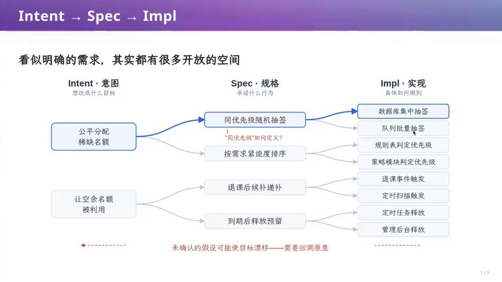

因此，需求与架构并不是两件事。所谓「需求已经明确」，通常只是说 Intent Space 被收缩到了可讨论的范围，而 Spec Space 与 Impl Space 仍然敞开。

### 1.2 三个规模，同一种问题

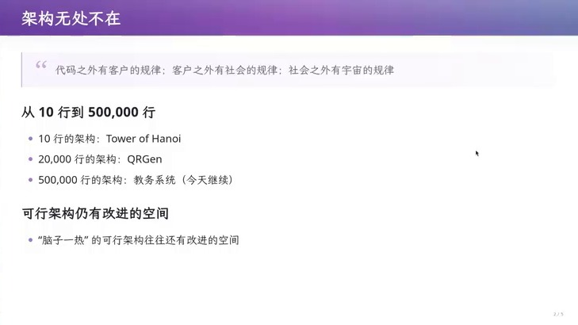

**架构不是大规模系统才需要的奢侈品，而是「决定与决定之间的依赖」本身的产物**。

十行的程序照样可以问：这一段是在处理「游戏规则」还是在处理「输入输出」？两者混在一起时，改动规则就得碰到输入输出。真正随规模增长的，是**一个决定的传播范围**，而不是问题的种类。

**「代码之外有客户的规律；客户之外有社会的规律；社会之外有宇宙的规律」**。这句话指向一种反复出现的现象：一个「脑子一热」想出来、确实能够工作的架构，往往还有很大的改进空间——因为总可以跳到更高一层的规律上去，重新组织问题本身。

做完任何设计的那一刻起，你就背上了一定程度的技术债，而且会一直背下去。因此，当你在实验中「第一反应说可以这样设计数据库」时，正确的习惯是回过头多想一步：也许还有更好的方案,技术债并非禁忌

### 1.3 引申

Intent、Spec、Impl 三段空间之间存在大量未决定的选择；架构的困难从十行程序就开始出现，只是规模越大，一个决定的传播范围越广。于是由此引申出第一个问题：既然每一步都在作决定，那么**复杂性究竟从哪里来，又应该由谁承担**？

---

## 二、复杂性的两种来源：本质的与附带的

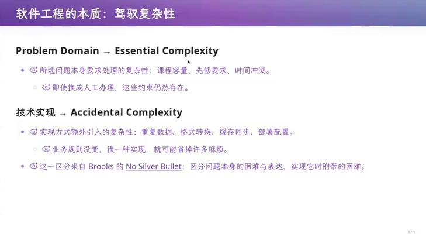


### 2.1 本质复杂性：换成纸笔也依然存在

本质复杂性（essential complexity）来自问题领域本身。一门课有容量上限，学生要满足先修条件，两门课的上课时间不能冲突，转专业之后还要认定已经修过的课程。这些约束不是因为用了计算机才出现的：**即使完全不用计算机、改成教务员拿纸笔办理，这些约束依然存在**。它决定了「这个问题最少要处理多少东西」。

### 2.2 附带复杂性：由我们组织软件的方式制造

附带复杂性（accidental complexity）来自实现方式本身。同一个学生的信息在系统里保存了五份，改一份就要同步另外四份；几个模块各自使用不同的日期格式，连接起来就要不断转换；一条容量规则被复制到多个页面，修改时总会漏掉一处。这些麻烦并非客户的工作天然要求，而是我们组织软件的方式制造出来的。

**用文件系统管理数据**：方便、想 hack 也很容易，但性能可能远远不如数据库，而且有并发控制的问题——文件系统本身不提供原子事务（all-or-nothing）：一次读写多个数据、并且整个过程看起来是原子的，这个保证需要自己实现。

**用数据库**：事务由系统提供，但每次调试都要经过一个中间层；你想像使用文件系统那样、把所有 UNIX 工具组合起来检查数据就不那么直接了。即使理论上可以把 SQL 查询与其他工具接起来，这个过程也会引入一层额外的转换。两种选型都不「错」，但每一个都会带来自己的附带复杂性。
**背景知识：Brooks 的区分**

「本质/附带」这组区分来自 Fred Brooks 的[《No Silver Bullet》](https://www.cs.unc.edu/techreports/86-020.pdf)。它的用途是提供一个判断方向，而不是给复杂性贴标签：**一项工作是「问题本身的困难」，还是「表达与实现它时附带的困难」**？后者可以通过更好的组织方式显著减少，前者不能靠工具凭空消掉。

这个区分立刻给出了两条不同的工作路线：**需求工程直面本质复杂性，架构设计把本质复杂性分解开来、同时减少附带复杂性**。两者的手段不同，不能互相替代。

### 2.3 需求工程：收缩 Intent Space，但每条承诺都有代价

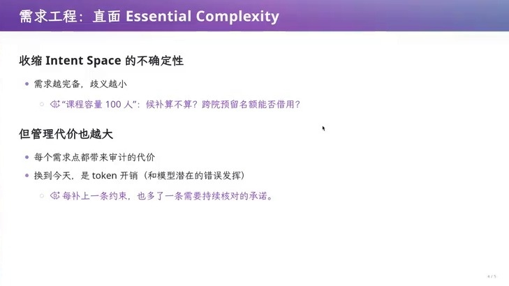


需求工程的工作是收缩 Intent Space 的不确定性。

例如:只说「课程容量为 100 人」是不够的：候补学生算不算在内？跨院预留的名额能不能借用？特殊批准能不能突破上限?

每补上一条这样的条件，实现者需要自行猜测的空间就少一点。

但需求不是越长越好。**每个需求点都带来审计的代价**，而「换到今天，是 token 开销（和模型潜在的错误发挥）」。每写下一句承诺，就多了一条需要检查、维护、并在需求变化时重新审视的约束。在生成式软件工程里，这条代价有了更具体的形态：约束写进上下文，就要占上下文长度；约束越多，模型在复杂约束下出错的机会越大。

老师在课上用一个很小的需求把这件事讲透了：**「我只要一个登录」**。看起来是一个需求点，往下追一步就变成一片：注册用户要用户名密码，第一次输入要做 password confirmation；用户一定会忘记密码，所以要有忘记密码；忘记密码要么发短信、要么发邮件、于是又要决定用什么发邮件；如果换成微信、支付宝登录，虽然体验更好，但要交钱、要公司实体才能注册。**仅仅登录这一件事，细节就无穷多**；更麻烦的是，一旦按「所有人都做用户名密码登录」的默认设定进了这个泥潭，后面再想退出来就很难。

所以需求工作需要在两种走法之间取得平衡：

用 MVP（最小可用产品）**深度优先**地快速验证「最重要的需求点到底满足了没有、满足到什么程度」，

用**广度优先**的方式把登录方式、界面布局、首页展现这些决策都扫一遍。

**「把需求写全」是一个方向，不是一个终点**

常见误解是「只要需求写得足够细，实现就不会走偏」。

这里的机制是反的：约束的收益与它的核对成本同时增长，而模型（或人）在长约束下的可靠性会下降。需求工程的目标是**把不确定性收缩到「可以开始动手」的那条线**，不是消灭全部不确定性。

### 2.4 架构设计：分解本质复杂性，减少附带复杂性

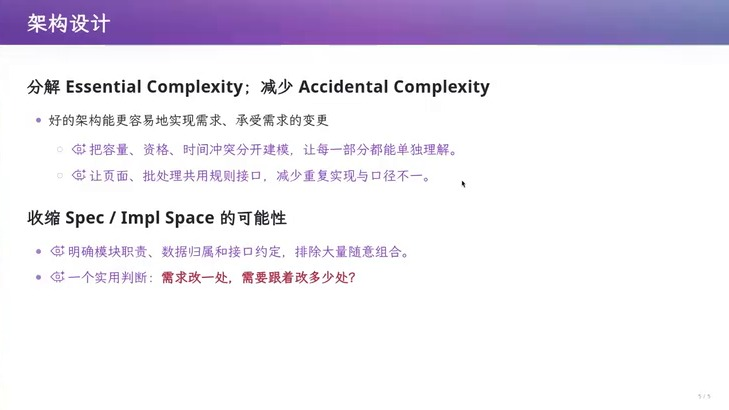

架构设计承担另一项工作。它**不能**让先修要求凭空消失——那不是架构能做的；但它可以把资格、容量、时间冲突分开建模，让每一部分都能被单独理解，调用同一套规则接口。模块职责、数据归属和接口约定一旦明确，规约与实现中大量随意组合的可能性就被排除了。

「数据库」为一个非常好的架构设计：把数据放进数据库之后，你就再也不必关心它到底怎么存储；云厂商甚至会对备份给出承诺，于是数据的可靠性与访问的原子性都不必自己操心，可以把注意力放回业务需求上。

这正是「分解本质复杂性、减少附带复杂性」的典型形态——不是让问题变简单，而是让某一类问题**有一个明确的归属**。

反过来，学校里统一身份认证打通花了很长时间，而财务系统至今没有与其他系统完全连通，也是同一个道理的两面：财务系统本身带有大量领域知识与审计要求，这份复杂性不能被随手抹掉，只能被妥善地隔离。

于是得到一个非常朴素的判据，它在本讲后面反复出现：

**核心结论：判断一个架构是否有帮助**

**需求改了一处，系统里需要跟着改多少处？**

「能在脑子里追踪十个状态，不意味着能用同样的办法追踪一万个状态。」这个判据把「好架构」从审美判断变成了可以数的东西：改动一处需求，需要同步修改的位置越多，附带复杂性越高，架构替我们承担的就越少。


复杂性有两个来源：

问题本身的本质复杂性，和我们组织软件方式带来的附带复杂性。


需求工程收缩意图空间、减少猜测，但每条承诺都有核对成本；架构设计分解本质复杂性、减少附带复杂性，其效果可以用「需求改一处要跟着改多少处」来度量。接下来的问题自然是：**具体靠什么手段把一个决定的影响范围收住**？

---

## 三、尊重自己的「小脑袋」：枚举、归纳、抽象与珍珠项链

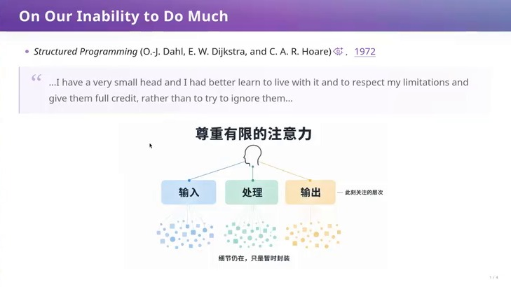

### 3.1 三个思维辅助：枚举、归纳、抽象

Dahl、Dijkstra、Hoare 在 1972 年的[《Structured Programming》](https://seriouscomputerist.atariverse.com/media/pdf/book/Structured%20Programming.pdf)里讨论的许多程序，今天看来都很小；但它们面对的问题一点也不过时：**人能同时精确理解的东西非常有限，怎样让这种有限的能力足以构造和检查一个大程序**？Dijkstra 在第一部分用了很直白的自述——我的脑袋很小，最好学会和它相处、尊重这个限制，而不是假装它不存在。

> ... I have a very small head and I had better learn to live with it and to respect my limitations and give them full credit, rather than to try to ignore them ...

书中给出的三种思维辅助是**枚举、归纳、抽象**：

- 枚举用来检查有限的分支（把所有情况列出来逐个确认）；
- 归纳用来理解循环与递归（从一个情形推广到一般情形）；
- 抽象则让我们在使用一个操作时，只依赖它承诺的效果，不必每次都把内部过程重新展开一遍。


老师在这里插入了自己的例子，把「抽象」为什么能救人讲得非常具体：

同样是写程序，**模拟题**调起来往往比**动态规划**容易得多。原因不在代码行数，而在可分层性：

模拟题里的几个大块可以各自封装成一个类，单独测试、单独调试，而且它的中间状态能映射到一个有物理含义、你能理解的状态上；

两三百行动态规划里的 `dp[i][j][k]` 则是一个纯粹的数学表示，一个下标弄错就全错，而且它不一定 crash——它只是安静地算出一个错的值。


老师的解法是：**把思考时用过的那层抽象重新放回代码里**。

当我们在想 `dp[i][j][k]` 的时候，心里其实有一个优化问题、一个状态空间上的有向无环图，只是写代码的时候把这层抽象扔掉了。如果把「状态」这个概念放回来——比如实现一个返回某个状态全部可能迁移的接口，甚至把它可视化或打印出来——程序就又变得可调试了；调通之后再改写成等价的、更高效的形式。这就是一次小规模的架构设计：先用能理解的概念写对，再向性能推演。

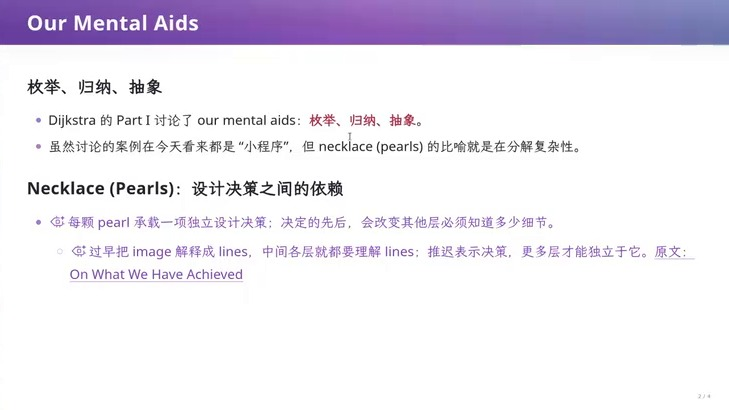


### 3.2 珍珠项链：重要的不只是切了几块，而是决定的先后

书里的「珍珠项链」（necklace of pearls）比喻把程序看成一串相互衔接的抽象层。每一颗珍珠承担一项独立的设计决定，上层使用下层提供的概念。如果两种实现提供相同的接口，就有机会替换其中一颗而保留其余部分。

老师特别强调了容易被忽略的另一半：**重要的不只是切出了多少块，还包括决定的先后**。幻灯片给出的例子是表示（representation）的决定：如果过早把一幅「图像」解释成一行一行的表示，那么中间各层就都被迫理解「行」；把表示的决定推迟，更多层才能继续用「图像」来思考。表示细节传播得越远，将来修改时牵动的地方就越多。

**注意：过早决定表示，等于替所有上层作了决定**

「先定义好数据结构再写代码」听起来像好习惯，但它的代价常常被低估：

一旦把某个表示定为接口的一部分，所有依赖它的层次都被锁进了这个表示。**如果这个表示要改，有多少层需要跟着改**？

### 3.3 层级、对象与协程：把「谁服从谁」也解耦掉

《Structured Programming》第三部分把这些想法落实到 SIMULA 的语言机制里。类（class）描述一组相关对象的结构与行为，对象保存自己的状态；于是可以先用业务概念思考，再把概念逐层落到机器能执行的操作上。对象抽象解决的是「哪一份数据和哪些操作属于同一个概念」；**协程（coroutine）解决的则是另一种耦合：几个程序片段之间，谁必须服从谁的控制流**。

子程序的基本关系是「调用—返回」：主程序调用它，它做完返回。协程可以在执行中暂停，保留自己的局部状态和执行位置，之后从暂停处恢复。书中用两个下棋程序互相对弈来说明这个区别：双方都要计算自己的下一步、交给对方、等待回应，再继续。如果强行把其中一方改写成另一方的子程序，原本对等的合作关系就会被扭曲成主从关系；把它们看作交替恢复的协程，双方各自的程序结构都能保留下来。

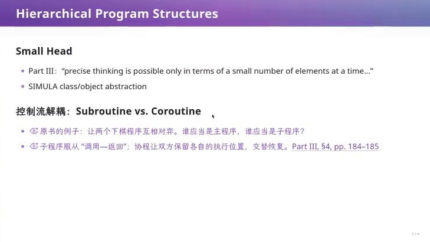


### 3.4 Concept Hierarchies：每向上一层，就多一套词汇

第三部分第七节「Concept Hierarchies」值得顺着读一次。它先有 `TWLIST` 提供双向链表操作，再在其上构造离散事件模拟机制 `MINISIM`，最后用这些机制描述车间里的订单和机器。底层负责链表连接，中层负责模拟时间、等待和唤醒，上层则可以表达「请求一台机器，加工一段时间，再释放机器」。**每向上一层，使用者就获得一套更贴近问题的词汇，也能暂时忘掉一批已经被处理好的细节**。

老师用自己课堂上的三个观察把「分层抽象」落到了今天的语言里：

- **协程的含义已经变了**。你们可能在操作系统课上第一次听说协程，而在今天的语境下它更多是一个为了性能而实现的轻量级线程（比如 Go 的协程模型），切换与 bookkeeping 开销都很小。但回到它被设计的那个时间点，它应对的是软件世界里的复杂性：几个程序片段之间谁服从谁的控制流。
- **合适的抽象让「模拟时间」变得可能**。如果要模拟并行，你可以强行写一个状态机直接模拟，也可以做出 `hold`、`wait`、`activate`、`simulate` 这几个操作，把「仿真时间」与「真实计算时间」区分开来。后者与「直接上手写一个模拟」的差别非常大。
- **抽象要能被观测**。这也是前面动态规划例子的教训：把状态、迁移这些概念回代码里，它们才能被单独测试、被单独调试。

### 3.5 让 AI 带我们读经典，但提问要落到原文

老师把书的目录与正文交给模型，让它逐层梳理，但把提问限定在可以核对的地方：**这一层新引入了什么概念？调用者因此不再需要关心什么？哪些操作会破坏底层的假设？**然后要求模型指出对应代码和页码，再去核对原文。这比让它概括「这本书很经典」有用得多——因为前者产出的是可验证的判断，后者产出的只是话术。

读原文,也可以:让模型先翻译、再删掉自己觉得不必要的部分；对不明白的一层就地停下、继续追问；用带联网检索的模型去「从一千篇论文里找最符合这个抽象的例子」；甚至开一个实时语音会话，把论文丢进去，一边问简单问题（立即得到回答），一边让它想一个「符合现代软件前端的比方」。老师原话说得很直接：**产出完全取决于提示词，取决于你的想象力到什么程度**。他试出来的对应很有意思：让模型找「与本讲抽象想法对应的当代系统」时，它给出了 UNIX、关系数据库、以及 Interface/TCP-IP——恰好就是本节课要讲的三个案例。

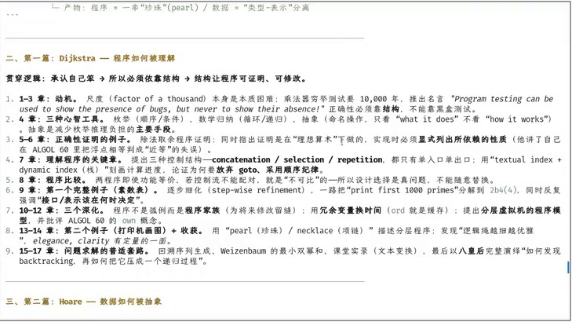

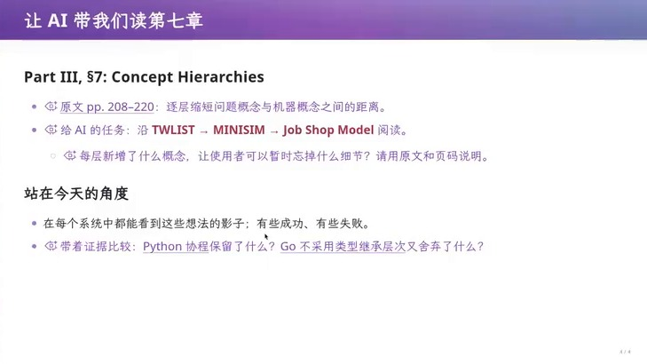


需要说明的是，AI 在这里扮演的是**阅读助手**：它负责把散落在几百页里的线索整理成可追问的结构，判断的责任仍在人身上。老师并没有要求照搬几十年前的全部设计，要理解的是那些设计如何帮助有限的头脑掌控更大的系统。

---

## 四、好的架构，设计的是一片解空间

### 4.1 命名是一种思维工具

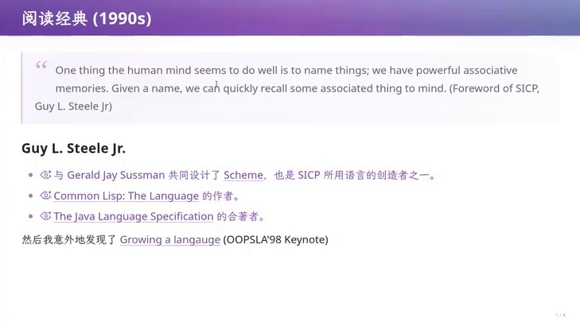

上一节的材料是 1972 年。老师接着问：如果要看 1980 年、1990 年的时候大家怎么想同一件事，该读什么？于是他找到了一个很有意思的 talk——演讲者既是 Scheme 的设计者，也是 Java 语言规范的合作者，并在 1998 年的 OOPSLA（面向对象领域的顶级会议）上做了一次主题演讲。

> One thing the human mind seems to do well is to name things; we have powerful associative memories. Given a name, we can quickly recall some associated thing to mind.
> —— Guy L. Steele Jr., Foreword of SICP

Guy L. Steele Jr. 在 SICP 的前言里说：人类做得好的一件事是给东西命名，我们有很强的联想记忆，看到一个名字就能迅速把相关的东西召回心里。对程序员来说，这句话有直接的工程含义：**一个好名字可以承载已经理解过的知识**。于是可以用「事务」「队列」「选课资格」来思考，而不必每次都回到它们的全部实现细节。

### 4.2 Growing a Language：设计「能继续生长」的模式

1998 年的 OOPSLA 主题演讲[《Growing a Language》](https://ranger.uta.edu/~weems/steele.pdf)里，Steele 让听众亲身经历了一次语言的生长：演讲从单音节词开始，凡是要用多音节的词，必须先把词定义出来，或者用已经说明过的构词规则生成。听众于是体会到：**先建立共同词汇，才能表达复杂思想**。

这场演讲的关键观点是：设计一个东西固然很好，**设计一种允许后来者继续创造的模式，可能更有价值，也更困难**。模式规定各部分怎样配合，同时留下可以以后填入的空位。哪些选择现在固定、哪些选择交给未来的使用者，本身就是设计的一部分。语言设计因而不仅是在决定今天有哪些功能，也是在设计人们以后怎样扩充这门语言。

例如
- [brainf**k语言](https://brainfuck.org/),仅仅有8个原语,计算能力几乎没损失，但表达能力和可维护性严重下降。

- 对于C,在使用上没有运算符重载的功能,导致一个常见功能如队列入队需要设计并反复调用复杂的函数,却不能将该功能重载到运算符上
- 但C在拓展性和精简性上取得了成功的平衡:可拓展,可抑制,与机器语言相对应

这篇演讲表达了一条架构原则：**扩展必须是一等公民，而且扩展之间可以组合**——这才叫「可生长的架构」（growability）。它给出的反面例子很有针对性：把一份需求清单逐条实现，需求对完就算「正确」。老师顺势批评了长期刷 OJ 题造成的习惯：「做 OJ 是不需要任何扩展的，这个题对了，代码是不需要维护的」，于是人容易形成「用后即扔」的倾向，而扩展性方面的思考就变少了。正确的做法是**给原语与组合机制，而不是给需求清单**：把需求分解成能跳出问题看问题的几个概念，再让这些概念变成领域里可组合的东西。

AI 阅读会话把这句话与软件架构的既有词汇对上了号：Steele 说的「留到以后再作的选择」，正是框架设计里经典的 frozen spots 与 hot spots——哪些现在是冻结的、哪些是预留给使用者填入的。这也就是本讲反复出现的那个问题：**固定什么、开放什么**。

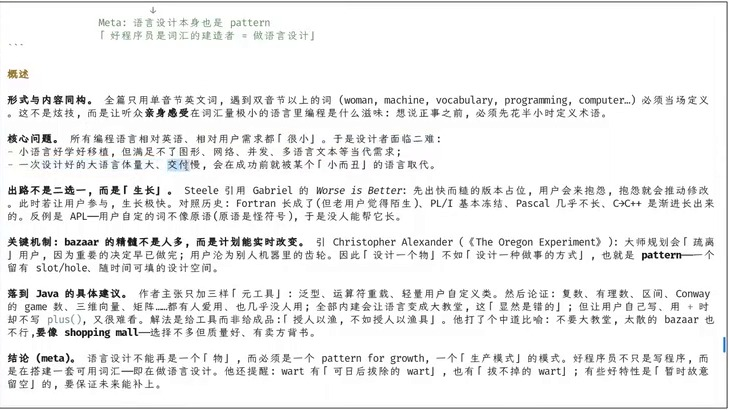


Christopher Alexander 的《俄勒冈实验》指出，预先定死的总体规划会夺走使用者塑造未来的机会。把它翻译成软件的语言就是——**哪些选择留给后来的人，也是一项设计**。

### 4.3 核心命题

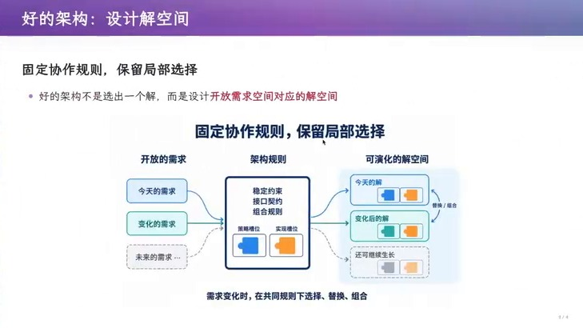

**核心结论：**

**好的架构不是只选出一个解，而是设计开放需求空间所对应的解空间。**

今天可以确定数据交换的规则，未来仍然允许增加新的处理步骤；今天可以确定业务对象的接口，未来仍然允许更换实现。我们不可能提前猜中所有需求，但可以让**一类未来变化有合理的落脚点**。

这句话解释了两个此前不易理解的现象。第一，为什么「能跑的架构」往往还有很大改进空间：它选出了一个解，却没有为「下一类需求变化」预留位置。第二，为什么经典值得读：海量教程、拼凑的经验和 AI Slop 会让人习惯于「这样能跑就行」，而经典中的设计是顶级工程师在长期工作中反复碰壁后留下的判断，读它们可以建立品味——**看到一个系统时，能辨认它固定了什么、开放了什么，以及这些决定会把使用者带向哪里**。

老师给出一条经验性的判断：在操作系统、程序语言、软件工程这几个领域，**1980 年到 2010 年可能是一个 golden age**——那时很多系统还不存在，人们有很多天马行空的想法，而此后做的东西「越做越小、越做越窄」。


老师描述的阅读路径值得一并记下：
- 读经典是**从你已经知道的知识往外推**，因此刚上大二大三时读这些材料一定非常慢，在建立起计算机科学的核心知识之前会经历一段「不理解为什么」的痛苦过程；
- 好消息是这个阶段可以借助 AI 提问。
- 有太多宝藏被埋在这个快速发展的时代里，而人们的品味正在被海量的人类产物与 AI slop（包括 CSDN ,防自学教科书）持续污染。

老师给出的具体追问方式是：「拿自己的系统追问：作者把哪些判断交还给了使用者？这些选择，需要什么共同规则才能彼此兼容？」这两个问题把「读经典」变成了一次可操作的架构审计。

---

## 五、案例一：UNIX——组合规则比现成用途更有力量

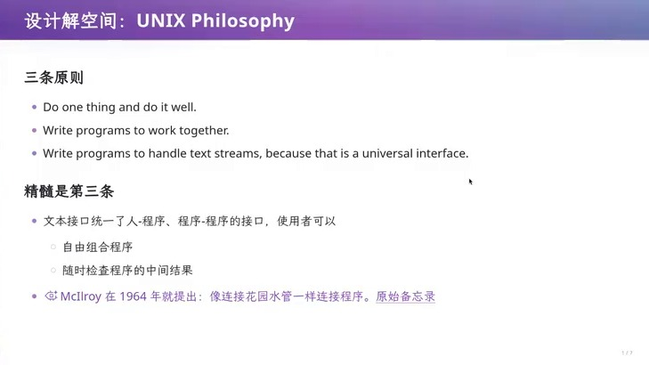


### 5.1 三条原则里，真正的落点在第三条

UNIX 哲学常被概括为三句话：
- 每个程序做好一件事
- 让程序能够协作
- 让程序处理文本流，因为文本是一种通用的接口。

前两条容易赞同，但**真正让它们落地的关键是第三条**。如果工具之间没有共同接口，「各自做好一件事」的结果仍可能是一堆无法连接的孤岛。

**文本流让人与程序、程序与程序使用同一种接口**。
- 一个工具的输出，既可以显示给人看，也可以存成文件，或者直接交给下一个工具
- 流水线出了问题，还能在中间截取结果，检查前一步究竟产生了什么。
  
因此,**自由组合程序，随时检查程序的中间结果**。McIlroy 在 1964 年就提出要「像连接花园水管一样连接程序」，这一想法后来变成了管道。

- 例子：为什么人喜欢文本接口？因为**人做任何事都希望得到一个「立即」的东西**，而不习惯层层 indirect。

这也是用数据库时总觉得「隔了一层纱」的原因：每次查东西都要先写一句 SQL。有趣的是，模型可以毫无怨言地遵循这种指令，但让人长期执行这种约定就会很痛苦。文本接口把人和程序、程序和程序统一到同一种表示上，这一点与「可组合」是同源的。

但如果没有这种组合性，一个常见需求就会卡死：
- 你的软件需要一个「打开文件」的菜单，如果既不想自己实现、又不满意操作系统的那个，在闭源 GUI 里你无计可施；
- 而在 UNIX 里，你可以用现成工具拼一个自己的菜单出来。这也是老师说：**你在使用 UNIX 的那一刻起就已经是一个程序员**——每一条命令都是一个小程序，你的工作是把这些「做好一件事」的工具组合起来。

### 5.2 「都是文本」还不够：约定才是接口

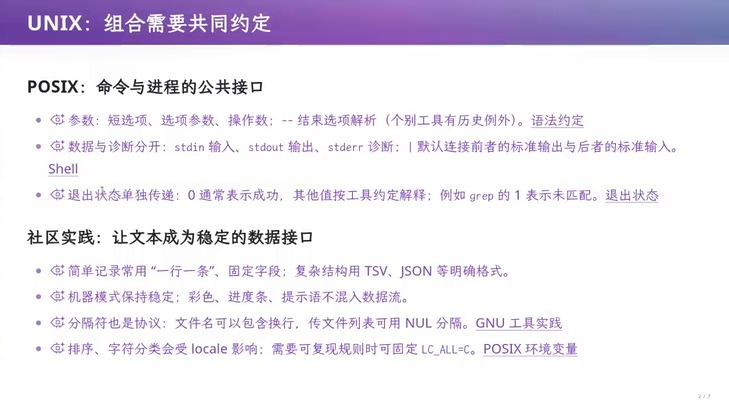

「都是文本」并不足以保证协作。命令行参数怎样区分选项与操作数，数据从哪里输入，诊断信息输出到哪里，成功与失败怎样报告，都需要共同的约定。这一层可拆成两类：**POSIX 规定的公共接口**与**社区长期形成的实践**。

**POSIX：命令与进程的公共接口**

- 参数：短选项、选项参数、操作数；`--` 结束选项解析（个别工具有历史例外）。
- 数据与诊断分开：标准输入 `stdin`、标准输出 `stdout`、标准错误 `stderr`；管道 `|` 默认把前者的标准输出接到后者的标准输入。
- 退出状态单独传递：`0` 通常表示成功，其他值按工具约定解释；例如 `grep` 的 `1` 表示未匹配。

**社区实践：让文本成为稳定的数据接口**

- 简单记录常用「一行一条、固定字段」；复杂结构用 TSV、JSON 等明确格式。
- 机器模式保持稳定：彩色、进度条、提示语不要混进数据流。
- 分隔符也是协议：文件名可以包含换行，传文件列表可用 NUL 分隔。
- 排序、字符分类会受 locale 影响；需要可复现规则时可以固定 `LC_ALL=C`。

这些约定看起来琐碎，但它们保护的正是组合的可靠性。老师在这里的判断值得记住：**分隔符、退出码、输出通道这些「细节」，实际上是接口的一部分**；一旦把它们当作实现细节随意处理，工具之间的组合就会在真实文件名、真实语言环境下失效。


### 5.3 使用者创造设计者没有想到的用途


现代工具继续扩展这种组合能力。因此诞生了
- `jq` 能把 JSON 中需要的字段提取成文本流，于是 API 响应也能进入流水线；
- `fzf` 从标准输入读候选项，让人交互选择，再把结果写回标准输出——**人的判断也成为流水线里可组合的一步**；
- 面向 X11 的 `xdotool` 把窗口搜索、键盘与鼠标操作变成命令接口。把三者接起来，使用者就能拼出一个自己想要的窗口切换器或书目工具。

**核心结论：UNIX 留下的不是命令，而是组合规则**

这些工具的作者不必提前设计好每一种书目管理或窗口管理需求。**设计者提供组合的规则，使用者便可以创造设计者没有想到的用途**——这正是「设计解空间」在系统软件上的第一个实例。

---

## 六、案例二：关系数据库——把「理解数据」与「存放数据」分开

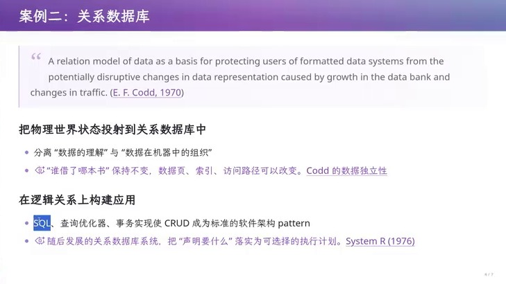


### 6.1 Codd 的问题意识：保护使用者

E. F. Codd 在 1970 年的论文[《A Relational Model of Data for Large Shared Data Banks》](https://dl.acm.org/doi/epdf/10.1145/362384.362685)中提出的目标很具体：

**保护数据系统的使用者**，使他们不必因为数据表示方式、数据规模或访问需求的变化，就跟着重写对数据的使用方式。关键的一步是把**「数据在逻辑上意味着什么」和「数据在机器里怎样组织」分开**。

### 6.2 同一份数据，支持不同的问题

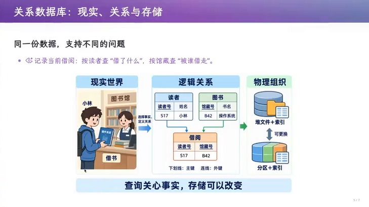


以图书馆为例，现实里发生了「某位读者借走某册书」这件事。系统可以用读者、馆藏和借阅关系来表达这个事实，于是**同一份数据能回答不同的问题**：按读者查「借了什么」，按馆藏查「被谁借走」。这两个问题建立在同一组逻辑关系上，而不需要为每个问题复制一份数据。

底层究竟采用哪种索引、记录放在哪个数据页、执行查询时先扫描哪张表，则属于另一个层次。**查询关心事实，存储可以改变**——这就是 Codd 所说的数据独立性。

### 6.3 在逻辑关系之上构建应用

在关系这一抽象之上，SQL 用声明式查询描述「要得到什么结果」，查询优化器选择具体执行方案，事务机制组织需要作为一个整体处理的读写。由此，创建、读取、更新、删除（CRUD）成为大量业务系统的共同骨架。

Codd 的论文可描述为**对世界建立了一个模型**：

- 世界里的数据可以用二维表、以及表与表之间的操作（典型的如 join）来表示，而数据怎么管、怎么存、可靠不可靠，则全部交给底层的数据库系统实现。

- 于是二维表成为「当前世界的一个状态」，一次事务把状态带到下一个状态；视图则是用一个查询描述「我此刻对这个世界的一种理解」。

- 这套抽象还有一个关键的工程后果：它给了数据近乎无限扩展（scale）的能力——也正因为如此，图书馆的书、学籍、财务、商城订单才能一起被塞进同一类系统里。

**核心结论：这个案例固定了什么、开放了什么**

**固定的**：关系、约束与查询的表达规则。

**开放的**：存储结构、索引选择、执行计划、上层的报表与统计需求。数据库设计者没有提前列出全世界的图书馆报表、商城查询和教务统计，但使用者可以在其上提出新的问题，底层也可以改进存储与执行方式——**逻辑关系稳定下来，两边就获得了独立演化的能力**。


---

## 七、案例三：Internet——在持续变化中保持协作

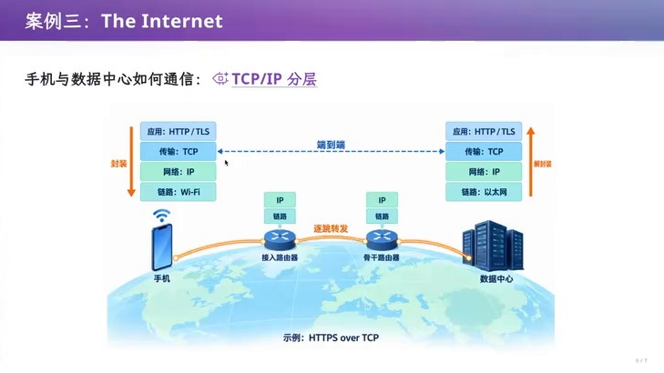

### 7.1 分层：让「局部替换」与「整体延续」同时发生

以手机通过 TCP 访问 HTTPS 服务为例：应用提出请求，安全与传输协议处理相应的数据，IP 层组织跨网络传递，链路层负责相邻设备之间的传送；请求经过多个网络到达数据中心，接收端再逐层处理。**应用不必知道途中每一段链路使用什么硬件**，也不必因为某一次物理路径变化就重新设计业务逻辑。

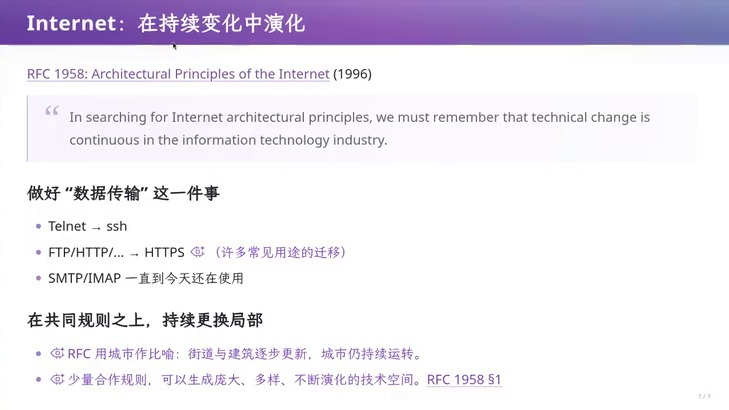


> In searching for Internet architectural principles, we must remember that technical change is continuous in the information technology industry.
> —— RFC 1958 (1996)

1996 年的 RFC 1958[《Architectural Principles of the Internet》](https://datatracker.ietf.org/doc/html/rfc1958)开篇就强调：在寻找 Internet 的架构原则时，必须记住信息产业的技术变化是持续的。文中用城市作类比——**街道和建筑不断改建，城市仍然继续运转**。共同的协作规则，使局部替换和整体延续能够同时发生。

### 7.2 做好「数据传输」这一件事
**当今的变化**
- 远程登录逐渐从 Telnet 转向 SSH；
- 许多文件传输和信息访问场景转向 HTTPS；
- 电子邮件则延续了 SMTP、IMAP 等协议体系。

**应用在变化，安全要求在变化，而承载它们的基础通信能力仍然可以继续服务**


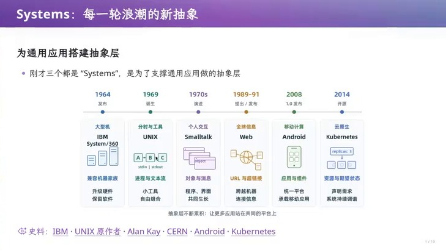

UNIX、关系数据库和 Internet 都属于支撑通用应用的系统。它们的价值不仅是自己解决了多大的问题，还在于**它们让多少别的问题变得可以解决**。幻灯片给出了一条时间线（IBM、UNIX 原作者、Alan Kay、CERN、Android、Kubernetes），说明每一轮计算浪潮都伴随新的抽象层。

这里可以看清「只做一件事」到底是什么意思：网络只负责高效的 connectivity，上面会出现什么应用它不管；但拥塞控制、连接的建立与中断判定这些细节仍然属于架构必须包含的设计，因为它们决定了上层能不能放心地用。

---

## 八、从「一个页面一段 SQL」到 MVC

### 8.1 最直接的想法，以及它留下的问题

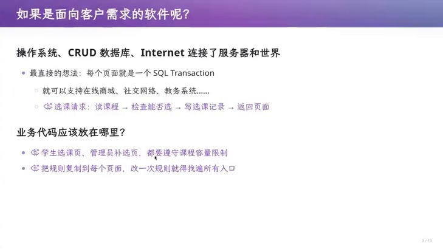

设想你回到 1998 年或者 2000 年，要为学校或企业设计软件系统。手上已经有了互联网、数据库和操作系统这些抽象层，最直接的思路就是：一个页面对应一段请求处理，背后执行一组数据库操作。学生点击选课，服务器读课程信息、检查条件、写入选课记录，再返回页面；把其中需要保持一致性的读写放进一个事务，一个朴素的业务流程就能工作起来。在线商城、社交网络、教务系统都可以这样写。

问题出现在业务代码的归属上。学生选课页要检查课程容量，管理员补选页也要检查课程容量，批量导入还要再检查一次。**把规则复制到每个页面，改一次规则就得找遍所有入口**；只要漏掉一个，页面看起来都正常，业务口径却已经开始自相矛盾。

**注意：规则复制的隐蔽性**

规则复制不会立刻报错，它只让系统里同时存在多个「版本」的业务判断。这与本节开头那条判据直接相关：**需求（容量规则）改一处，需要跟着改的地方有几处？**如果答案是「所有入口」，那么这部分复杂性完全没有被架构吸收。

### 8.2 Java Web 浪潮：让 HTML 留在 HTML 里

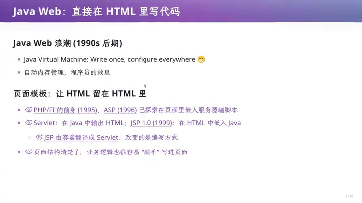

20 世纪 90 年代后期的 Java Web 浪潮（1998 年前后，Java 如日中天）让这类应用开发普及开来。虚拟机提供了跨平台的运行基础，自动内存管理解救了许多需要手工管理内存的程序员；当然，部署配置又贡献了新的复杂性，于是「Write once, run anywhere」被调侃成「Write once, configure everywhere」。

「模板」到底好在哪里：
- 如果你自己写过 AI 应用，多半需要定制 prompt，最直接的写法是`prompt = A + B + C` 拼接字符串，一旦要改结构就很难维护；
- 更好的办法是用一个模板语言（例如 Jinja2），写一段带变量的母版，渲染时把 `instructions`、今天的日期这些值传进去。**模板把「结构」与「填入的内容」分开了**，自己也就成了一个可扩展的语言。

页面生成还有一个很实际的问题：如果在 Java 代码里一行行输出 HTML，页面结构很快就会淹没在字符串拼接里。JSP 把这个关系反了过来——**允许在 HTML 模板里嵌入服务器端代码**，容器再把页面翻译成 Servlet 执行。幻灯片指出，早在 PHP/FI（1995）和 ASP（1996）时期就已经在探索这种写法，JSP 1.0（1999）把它带进了 Java 世界。老师还提醒了一个常被忽略的设计前提：HTML 本身把结构与样式分开了（DOM 与 CSS），所以模板只需生成结构，界面形态由样式表决定。正是这一点，让「一个页面一段 SQL 事务、抽出数据、投射成页面」的做法能快速支撑起图书管理、学籍管理这类信息系统——也正是这个模式，直接引出了后面的 MVC。

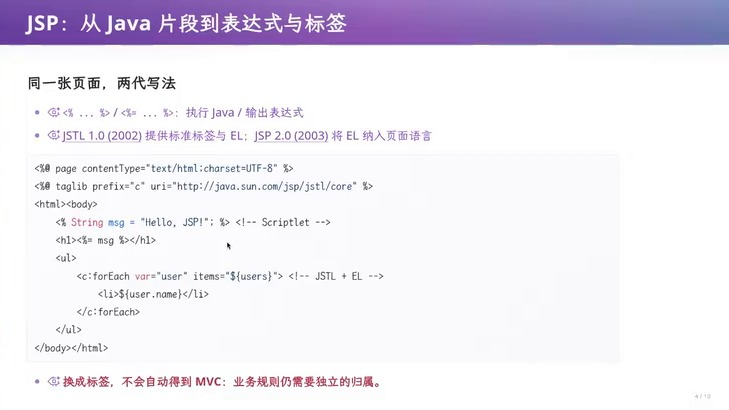


### 8.3 JSP 的两代写法

JSP 的早期写法使用脚本片段与表达式；之后又引入表达式语言（EL）与标准标签（JSTL 1.0，2002），JSP 2.0（2003）进一步把 EL 纳入页面语言。这些改动让「循环展示一份用户列表」之类的工作更接近模板描述，而不是在页面里手写 Java 控制流。幻灯片上的对照代码很典型：

**代码：幻灯片给出的 JSP 页面：脚本片段与 JSTL 标签两种写法并存**

```html
<%@ page contentType="text/html;charset=UTF-8" %>
<%@ taglib prefix="c" uri="http://java.sun.com/jsp/jstl/core" %>
<html><body>
  <% String msg = "Hello, JSP!"; %>          <!-- Scriptlet：执行 Java -->
  <h1><%= msg %></h1>                         <!-- Expression：输出表达式 -->
  <ul>
    <c:forEach var="user" items="${users}">   <!-- JSTL + EL -->
      <li>${user.name}</li>
    </c:forEach>
  </ul>
</body></html>
```

这在当时是非常直接、实用的改进：页面仍然长得像页面。但「能直接写进去」也意味着**业务规则很容易被顺手塞进页面**。把脚本改成标签，只是改变了编写方式，不会自动解决职责混杂的问题——幻灯片的结论只有一句：「换成标签，不会自动得到 MVC：业务规则仍需要独立的归属。」

### 8.4 MVC：让不同的变化各有归属

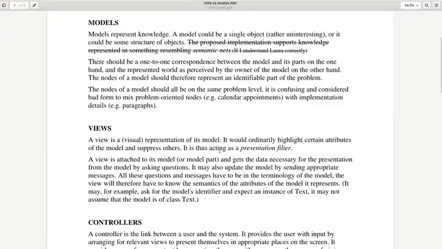


MVC（Model–View–Controller）提供了关注点分离的思路。它在 1979 年的早期设计文档中面向交互式界面提出，后来在 Web 应用中形成了不同的具体组织方式。幻灯片建议用三个问题来理解它：**系统知道什么？怎样展示这些知识？怎样接收和解释用户的操作？**

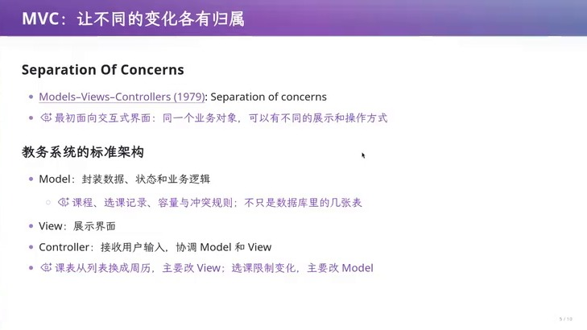

图：MVC 的三个角色与教务系统中的对应关系：Model 封装数据、状态和业务逻辑，View 展示界面，Controller 接收输入并协调前两者

| **角色** | **职责** | **在教务系统中的对应** |
|---|---|---|
| Model | 封装数据、状态与业务规则 | 课程、选课记录，以及容量与时间冲突规则；不只是数据库里的几张表 |
| View | 展示界面 | 课表列表、周历视图、选课结果页 |
| Controller | 接收用户输入，协调 Model 与 View | 把一次「选课」请求转交给相应的业务操作 |

**核心结论：Model 不等于「数据库表的另一个名字」**

Model 封装的是**数据、状态和业务逻辑**。如果 Model 只是表的映射，容量与冲突规则就又会散落到各个 Controller 和页面里，MVC 带来的分离立刻失效。

这样，变化就有了归属：课表从列表换成周历，主要牵涉 View；选课限制变化，主要牵涉 Model；新增管理员补选入口，则应复用已有的业务能力，并显式表达它与普通选课不同的授权规则。真正重要的是**同一项业务决定无需散落在每个页面里**，理解界面时也不必同时展开所有数据库和业务细节。

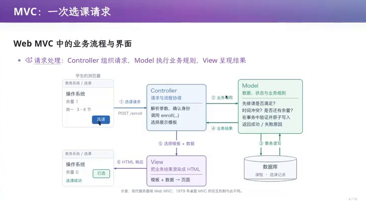

---

## 九、界面状态也是状态：ViewState、MVVM 与 React

### 9.1 把 ViewState 也当成 Model

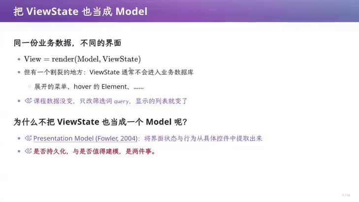

仅有业务数据，还不足以决定用户看到的界面。同一份课程列表，搜索框里的关键词不同，显示的课程就不同；展开哪个菜单、选中哪一行、鼠标停在哪个元素上，也会改变界面。这些信息通常不进入业务数据库，却仍然是程序需要管理的状态——把这一层关系写成一个公式：

**View = render(Model, ViewState)**

其中各符号的含义是：

- View：最终呈现给用户的界面；
- Model：业务数据与业务状态，例如课程列表；
- ViewState：界面自身的状态，例如筛选词、展开的菜单、悬停的元素；
- render：把前两者映射为界面的纯函数式描述。

**核心结论：「是否持久化」与「是否值得建模」是两件事**

ViewState 通常不会进入业务数据库，但这不等于它可以被忽略。如果把这部分信息藏在各个控件和事件回调里，程序员仍然要记住「点这里之后，要顺手改那三个地方」——附带复杂性又回来了。

### 9.2 MVVM：把派生关系写出来，让框架去追踪

MVVM（Model–View–ViewModel）把面向展示的状态和行为进一步组织成 ViewModel。用课程筛选来理解它最直观：原始课程数据是一部分状态，筛选词 `query` 是另一部分，当前可见课程 `visibleCourses` 则由两者共同决定。关键在于**描述这个依赖关系，让框架维护展示结果**，而不是在每个输入事件里手工同步一份可见列表。

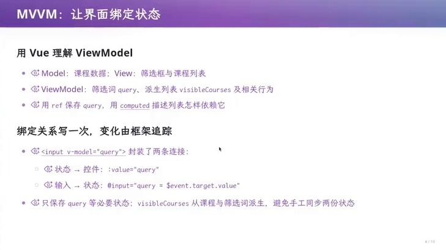

图：「MVVM：让界面绑定状态」——用 Vue 理解 ViewModel：ref 保存 query，computed 描述派生列表，绑定关系只写一次

**代码：幻灯片给出的 Vue 写法：用 ref 保存筛选词，用 computed 描述可见课程如何依赖它**

```javascript
const query = ref('')                       // 唯一需要保存的状态
const visibleCourses = computed(() =>       // 派生结果：不另存一份
  courses.value.filter(c => c.name.includes(query.value))
)
// <input v-model="query"> 封装了两条连接：
//   状态 -> 控件： :value="query"
//   输入 -> 状态： @input="query = $event.target.value"
```

幻灯片特别澄清了「双向绑定」这个词：`v-model` 把两条连接包装起来，落实到这里就是**明确的值传递和输入事件处理**，并不意味着所有数据都可以随意双向流动。真正被绑定的只有绑定点，Vue 的组件 Props 与 React 的组件数据流都是从父到子。

### 9.3 React：用状态快照描述界面

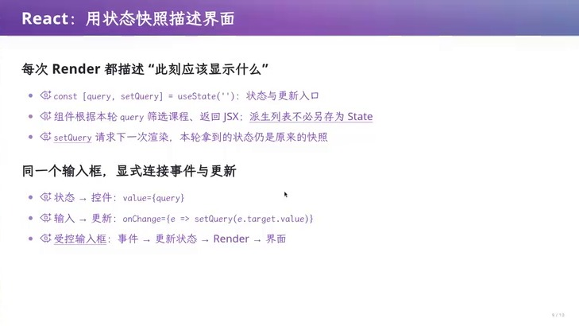

图：「React：用状态快照描述界面」：每次 Render 都描述此刻应该显示什么；派生列表不必另存为 State

React 采用另一种表达方式：组件根据当前的属性与状态描述界面，用户事件通过状态更新函数请求下一次渲染。同样的筛选功能可以用 `useState` 保存 `query`，在渲染时从课程列表与 `query` 计算出可见课程；既然列表能从现有数据算出来，就没有必要再给它安排一份独立的 State。

**代码：幻灯片给出的 React 写法：受控输入框的事件 → 更新状态 → Render 循环**

```javascript
const [query, setQuery] = useState('')      // 状态与更新入口
const visibleCourses = courses.filter(c => c.name.includes(query))
// <input value={query} onChange={e => setQuery(e.target.value)} />
//   状态 -> 控件： value={query}
//   输入 -> 更新： onChange={e => setQuery(e.target.value)}
```

React 的状态还可以理解为**每次渲染拿到的一份快照**：调用 `setQuery` 请求更新，不会把当前这次渲染已经得到的变量立即改掉；下一次渲染使用新的状态。这使得「某次界面是由哪些输入算出来的」更容易说清楚。

|  | **Vue** | **React** |
|---|---|---|
| 保存的状态 | `ref` 保存 `query` | `useState` 保存 `query` |
| 派生结果 | `computed` 自动追踪依赖 | 在渲染中直接计算 |
| 输入连接 | `v-model` 同时连接两条方向 | `value` 与 `onChange` 显式分别连接 |
| 更新语义 | 响应式依赖变化即更新 | 状态更新请求下一次渲染（本轮是快照） |
| 共同点 | 都把「界面应该怎样依赖状态」放在显眼位置，减少手工同步 |  |

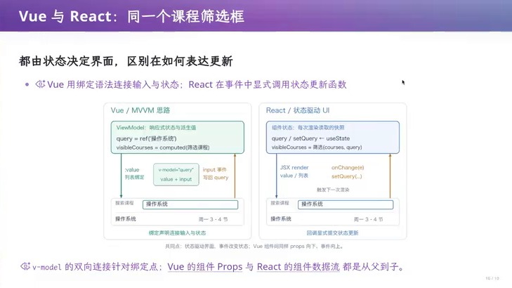


Vue 的绑定与响应式依赖追踪，和 React 的状态快照与显式更新，在编程体验上有明显区别；但它们都把「界面应该怎样依赖状态」放到了更显眼的位置。课程列表或筛选词变化之后，程序沿着已经表达的依赖得到新界面，而不必靠程序员记住一串零散的同步操作。

### 9.4 本章小结

界面自身也有状态，把它当成 Model 来建模，才能让「显示什么」由数据与状态的依赖关系决定，而不是由散落的同步代码决定。MVVM 与 React 只是两种不同的表达方式，共同点是把**派生关系显式化**。但这里处理的状态仍然是短生命周期的：一次请求、一屏界面。下一节把时间尺度拉长，看 MVC/CRUD 在哪里开始不够用。

---

## 十、MVC/CRUD 的边界：长流程、强规则与会计账本

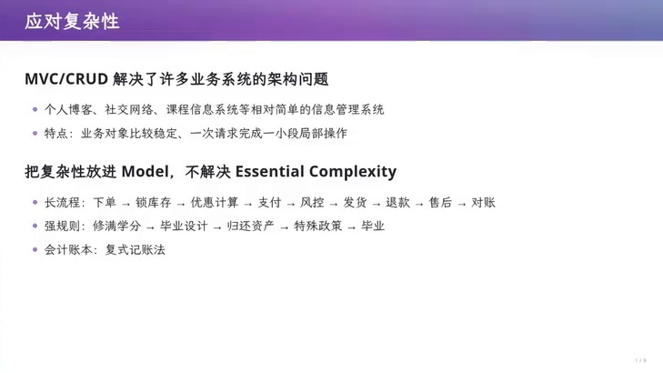


### 10.1 CRUD 适用的形状

MVC 和 CRUD 对许多信息管理功能非常有效，因为它们的前提条件成立：**业务对象比较稳定；一次请求完成一小段局部操作；页面展示已有信息，再提供新增、修改或删除入口**。个人博客、课程信息查询，以及社交网络中的许多基础功能，都属于这种形状。

### 10.2 一旦业务跨越很长时间

但业务一旦跨越很长的时间，情况就变了。电商的一笔订单可能经历下单、锁库存、优惠计算、支付、风控、发货、退款、售后和对账；任何一步失败都可能影响前后多个环节。教务系统也一样：修满学分之后，还有毕业设计、资产归还、特殊政策与批准记录。幻灯片给出的结论很直白：{把这些代码统一挪进一个叫 `Model` 的目录，并没有解决本质复杂性}。目录结构分担不了「一笔业务横跨九个月」这件事。

### 10.3 会计账本：一个把长期性推到极致的例子

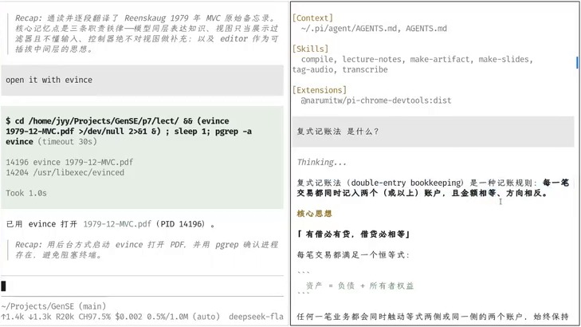

会计账本是特别值得研究的例子，因为它同时具备长流程、强规则和不可撤销的要求。复式记账要求同一笔业务通过相互对应的账户记录出来，它的核心约束是：

**借方金额合计 = 贷方金额合计**

其中各符号的含义是：

- 借方金额合计：同一笔业务中，记在借方各账户的金额之和；
- 贷方金额合计：同一笔业务中，记在贷方各账户的金额之和；
- 记账方向：「借」「贷」只表示记账方向，不能简单理解成日常语言里的借入与借出。

记账同时维护另一条恒等式：

**资产 = 负债 + 所有者权益**

其中：

- 资产：企业拥有或控制的资源，例如银行存款；
- 负债：企业对外承担的债务；
- 所有者权益：资产扣除负债后归属于所有者的部分。

例如一笔借款到账，银行存款增加，同时债务也增加；归还其中一部分本金，存款和债务相应减少。这些变化共同维持恒等式成立。

课程演示里给出的简化资产负债表可以把这个约束看得很清楚：资产一侧是现金 50、存货 80、固定资产 170；负债与权益一侧是应付账款 30、短期借款 70、所有者权益 200。两边的合计都是 300，而**「两边合计相等」这件事并不是算出来的巧合，而是复式记账要求每一次记账同时触动两侧所保证的**。

**注意：算得平不等于记得对**

借贷平衡是一个**可检查的约束**，但它不代表业务真实。把业务归错类、重复录入一笔金额相同的借贷记录，都可能仍然平衡。**原始凭证、业务含义与记账动作之间的对应关系，仍然需要核对**。

---

## 十一、Event Sourcing 与「LLM as a Compiler」

### 11.1 从原始凭证到可执行的分录

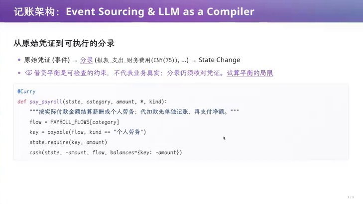

课堂中的记账工具采用「Event Sourcing 与 LLM as a Compiler」的思路：把原始凭证和发生的业务交给语言模型理解，翻译成受约束的记账动作，再由程序按规则执行状态变化。**模型在这里像一个编译器前端**，把人的材料翻译成系统可以检查和执行的表示。例如 `报表_支出_财务费用(CNY(75))` 表达的是一项具体记账动作，`CNY` 则把金额放进人民币的金额表示里。

下面这段实现片段依赖项目内的金额类型、分类表和账本操作，不能脱离这些定义单独运行，但它清楚地展示了「动作」如何在代码层被约束：

**代码：幻灯片给出的记账操作：先按业务类别确定应付款项并检查余额，再同时减少现金与应付余额**

```python
@Curry
def pay_payroll(state, category, amount, *, kind):
    """按实际付款金额结算薪酬或个人劳务；代扣款先单独记账，再支付净额。"""
    flow = PAYROLL_FLOWS[category]
    key = payable(flow, kind == "个人劳务")
    state.require(key, amount)
    cash(state, -amount, flow, balances={key: -amount})
```

这里先按业务类别确定应付款项，检查相应余额是否满足结算要求，再同时减少现金和对应的应付余额。代扣款应先通过独立动作记账，然后支付净额。这样，「确认费用」「形成应付」「实际支付」被区分开来，避免每次付款时又把费用重复算一遍。**语言模型负责提出符合材料的动作，账本代码负责这些动作的确定含义和约束**；编译出来的动作是否符合真实业务，仍然需要审查。

### 11.2 一个可以核对的数值例子

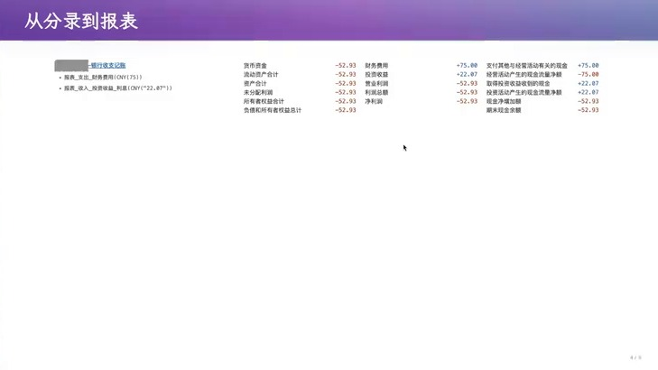

银行收支记录包含两笔动作：财务费用支出 75 元，投资收益中的利息收入 22.07 元。执行后，货币资金的净变化是

**22.07 - 75 = -52.93**

其中：

- 22.07：利息收入（投资收益），使货币资金增加；
- 75：财务费用支出，使货币资金减少；
- -52.93：货币资金的净变化，同时对应利润表上的费用与收益记录。

利润表上相应记录费用与收益，净利润减少 52.93 元，相关权益和现金流量项目也按该工具的规则得到结果。这里的关键设计意图是：**报表上的许多数字共同变化，但不希望让模型逐格填写这些数字**，而希望它们来自同一组动作及其计算规则。模型只负责把凭证翻译成动作，数字由规则算出来。

### 11.3 把过去、现在和未来分开

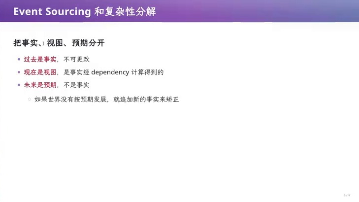

记账为什么麻烦？因为一个「当前状态」常常同时背负着过去、现在和未来：过去签订过合同，现在可能正在等待付款，未来还要交货、结算，也可能发生坏账。如果只盯着当前余额和一个状态字段，很多不同的历史会被压进同一种表示，很多尚未发生的预期又会与已经发生的事实混在一起。

事件溯源（Event Sourcing）提供了一种重新分解问题的方法：**保存已经发生的事件，再从事件计算需要的状态**。这里的事件是「发生了什么」，例如某笔支付已经完成、某项费用已经确认；它与「希望接下来付款」这样的命令或预期应当区分。当前状态由历史事实逐步处理得到，也可以为了查询效率保存计算结果。

**核心结论：过去、现在、未来的三种身份**

- **过去是事实**，不可更改：不靠悄悄抹掉历史来解释今天的状态；
- **现在是视图**，是事实经 dependency 计算得到的；
- **未来是预期**，不是事实；如果世界没有按预期发展，就**追加新的事实**来矫正。

过去不可更改还有一层很实际的用法：	extbf{遇到必须由人拍板的例外时，不要让人去手改数据库}。老师举的例子是，如果领导认为某位同学就是可以毕业，正确的做法是追加一条「override」的事实，让这条事实参与之后的计算，而不是把数据库里那个「能否毕业」的字段直接改成 1，让数据进入越来越难以解释的状态。

反过来，把事实与规则都保留下来，还带来了一个容易被忽略的能力：

**背景知识：账本还能用来推演未来**

如果当前状态停在「支付」这一步，而支付之后的规则是明确的，就可以从这个位置往前推：风控成功会到什么状态、风控失败会到什么状态。换句话说，有了账本就可以评估「我到底会不会破产、概率有多大」——只要对「应收账款里有多少收不回来」作出假设。这是好架构顺带带来的能力：

**已经发生的事实被结构化地保存下来之后，尚未发生的分支也可以在同一套规则上被推演**。

比如先前预计一笔应收款会收到，后来确认无法收回。这个结果不应使「曾经形成过应收」以及后续处理过程从历史中消失，新的业务事实应按相应规则改变当前的计算结果。同理，**已经支付又发生退款，与从未支付过，即使净现金变化相同，也不是同一段业务历史**。

**注意：重算能力的两个前提**

第一，要复现当时的结果，就必须知道当时使用的规则和外部输入——哪一版培养方案、某一天的汇率，而不能偷偷换成今天的数据。第二，**重放账本可以重新计算余额，却不能把已经完成的付款再执行一次**；对外部世界的动作，必须与内部状态的重建区分开来。

---

## 十二、数据依赖与 Source of Truth：把状态一致性问题变成计算正确性问题

### 12.1 教务系统：让毕业结论有一条可追溯的计算路径

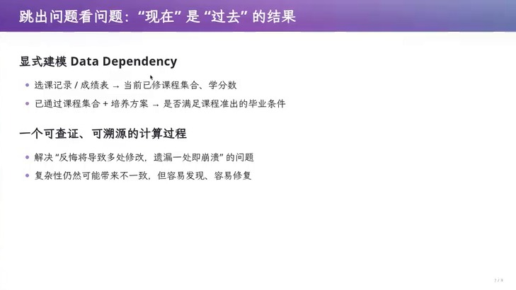

把同样的想法带回教务系统，就会看见一个熟悉的问题。数据库里可能同时存着成绩记录、已修课程列表、总学分、各类别学分和「是否满足毕业条件」。如果把这些都当作可以各自修改的独立事实，那么更正一门课的成绩时，就必须记得去修改后面的每一项；遗漏一处，系统里便同时存在几个互相矛盾的「现在」。

其实其中许多状态本来就是别的信息的结果：选课、成绩与认定记录决定当前通过了哪些课程；通过的课程再加上去重、替代和分类规则，决定各类学分；这些结果再结合适用的培养方案，决定课程准出条件是否满足。毕业设计、资产归还等其他要求，则应进入各自明确的判断——**课程条件满足，不能悄悄被当成所有毕业条件都已满足**。

老师用一个非常具体的例子说明「用数据库管理现在」为什么会出事。数据库管理的本来就是*现在*：这个学校现在有哪些课程、每个学生现在是什么状态。而现在的状态是*可变的*——一旦业务逻辑写错、或者规则本身被改动，

状态就很容易从一个对的状态走到一个错的状态；规则变更时还要为状态生成「补丁」，也就是数据库迁移，而这恰恰是非常危险的操作。

最典型的触发点是成绩更正。设想一位学生要求查卷：老师复查之后发现，当时看在他最后一题空着的情况下还给了 20 分；既然要查，这 20 分只能扣回，于是这门课从及格变成不及格。对数据库来说，这就是一次「不在原业务逻辑里」的修改，而它的后果是连锁的：

这门课从通过变为不通过 → 已修学分减少 → 学分影响能否毕业、能否准出 → 甚至影响选课资格。

**注意：数据库内部的不一致是「天生」的**

更麻烦的是，状态式数据库在这一刻已经自相矛盾了：这位学生当初是因为「计算机系统基础」通过才选上了「操作系统」这门课；现在「计算机系统基础」挂了，那他已经选上的「操作系统」还算不算数？老师用一句话概括这种困境：**这种依赖关系属于本质复杂性（我依赖你、你依赖我），但它被压进了一个「可变状态」的表示里，于是规则一变，系统就同时持有几个互相矛盾的「现在」**。

「可溯源」听起来抽象，落到教务系统里却很具体：

**背景知识：一个具体的溯源例子**

「计算机系统基础」这门课的学分是会变的（培养方案调整时可能被改动）。如果系统只保存一个总学分数字，那么当学分被下调之后，谁也说不清「这个学生的学分到底够不够毕业」。而在事件溯源的结构里，计算学分时会问：

**在这个时刻，「计算机系统基础」这门课的学分是几**？于是「什么时候通过了哪门课」这一事实，和「当时那门课值多少学分」这条规则被分开保存，结论因此可以复核。

经过批准的特例也要有自己的位置。某个学生获得了课程替代或条件豁免，应当保存批准对象、适用范围和依据，使后续计算可以使用它；否则一个没有来由的「审核通过」只是在隐藏复杂性，下一次重新审核时，系统仍然不知道为什么要通过。

### 12.2 SQL 的「Billion Dollar Mistake」

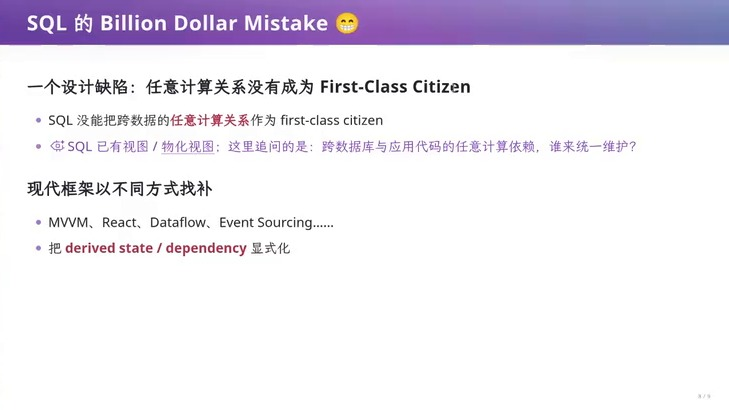

这个说法借用了 Tony Hoare 的自嘲：他称自己发明空指针（null）是一个「Billion Dollar Mistake」——因为空指针会让程序崩溃，而崩溃的时候火箭可能已经爆炸了。老师明确说，这里并不是要指控关系代数有设计缺陷：**「在那个时候，它当然是一个非常可扩展的、非常好的架构」**，问题只在于它管理数据时，

*没有把任意图灵可计算的计算关系作为一等公民管起来*。

这个缺口在教务系统里的形状非常具体：

**注意：「能否毕业」这个字段为什么是不一致的高发点**

数据库几乎都会在学生表里放一个「能否毕业」的 0/1 字段，因为必须能快速查询出来；而它恰恰是别的事实与规则算出来的结果。关系代数擅长建模关系与查询，却不擅长直接建模一段复杂计算，于是这个 0 和 1 就成了系统里最容易不一致的地方：

**它看起来是事实，实际上是一个可能过期、又没有来源的计算结果**。

老师在这里对 SQL 提出了一个带点挑衅的批评：**它没有把跨数据的任意计算关系充分作为一等公民来表达和维护**。所谓「一等公民」，是说这类关系应当成为可以直接声明、组合、检查和追踪的对象，而不只是散落在应用代码里的一些约定。SQL 当然能够表达查询，数据库也有视图、约束和物化视图；这里批评的焦点，是**跨过数据库、应用逻辑、缓存乃至界面的计算依赖**——一条基础记录变了，所有依赖它的结果由谁负责更新？怎样判断哪些结果已经失效？怎样追溯一个结果的来源？

从这个角度看，MVVM、React、Dataflow 和 Event Sourcing 都在用不同方式补上这类表达能力：Dataflow 把数据之间的计算关系组织为流动和依赖；前端框架让界面从状态派生；事件溯源让当前状态从历史事实派生。它们所处的层次和具体机制各不相同，但都在尝试把「这个结果依赖什么」显式化。

**注意：这是一条理解架构的视角，不是历史断言**

幻灯片上的表述很清楚：把这些框架放在一起看，是一种理解架构的视角，**并不是在断言它们都因 SQL 的某个缺陷而诞生**。同样，说 SQL 缺少某种一等公民，也不是说 SQL 不好用——它仍然是表达查询与约束的成功抽象。

### 12.3 设计原则：只保存事实，其余皆计算

**核心结论：Source of Truth**

**系统应保存足以重建其余信息的事实依据（source of truth），其他状态尽可能成为计算的结果。**

为了性能，可以保存汇总、索引和缓存，但应当清楚它们从哪里来、何时失效、怎样重建。一个业务决定如果必须由人作出，就把决定及其依据保存下来；**能够推导的东西，则尽量不要再引入一份独立的决定**。

于是复杂性并没有消失，而是换了性质：从「怎样保证许多份状态永远一致」转移到了「这段计算是否正确」。后一个问题往往更容易管理——给定输入可以重跑，可以写有意义的测试，可以审计计算步骤，可以分析依赖；发现旧规则有错误时，也有机会修正规则，在明确的适用范围和时间边界内重新计算，而不是对着一堆已经失去来源的数字逐个打补丁。

对生成式软件工程而言，这种转移尤其重要。让 AI 面对散落各处的隐含同步要求，它就需要反复猜测哪些地方必须一起改；把事实、规则和依赖表达清楚之后，**生成与检查才有了共同的对象**。代码越容易生产，我们越有理由认真选择这种表示：让系统中的每一个重要结果，都能回答「我是怎样算出来的」。


---


