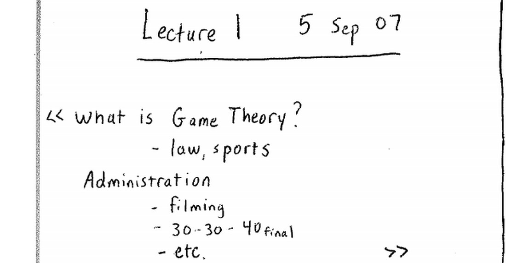
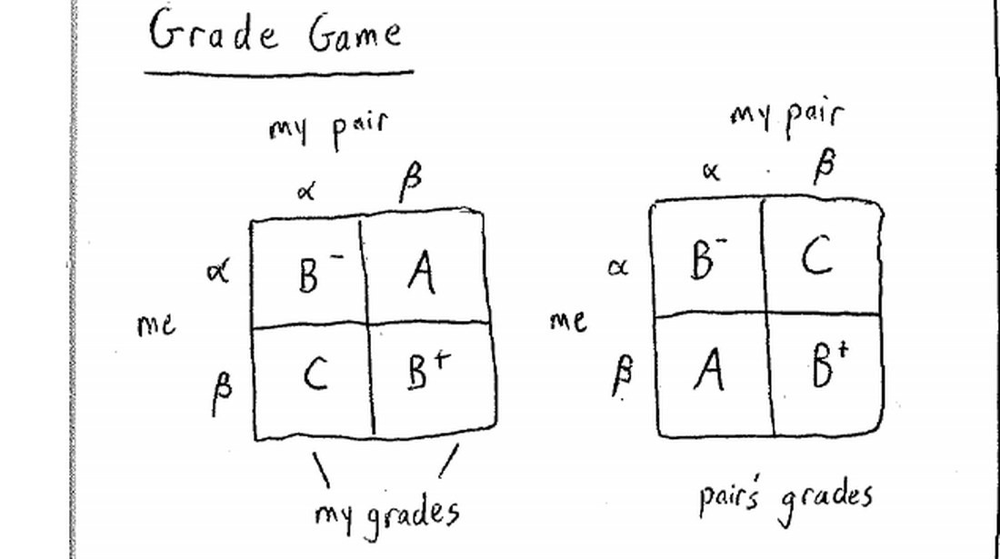
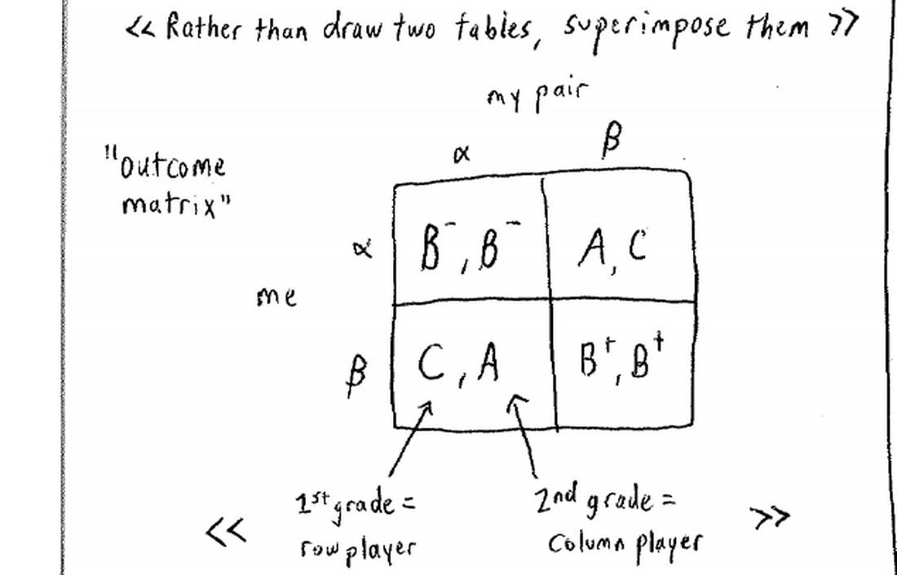
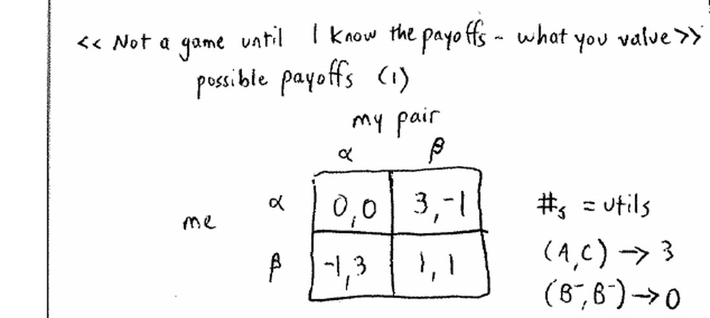
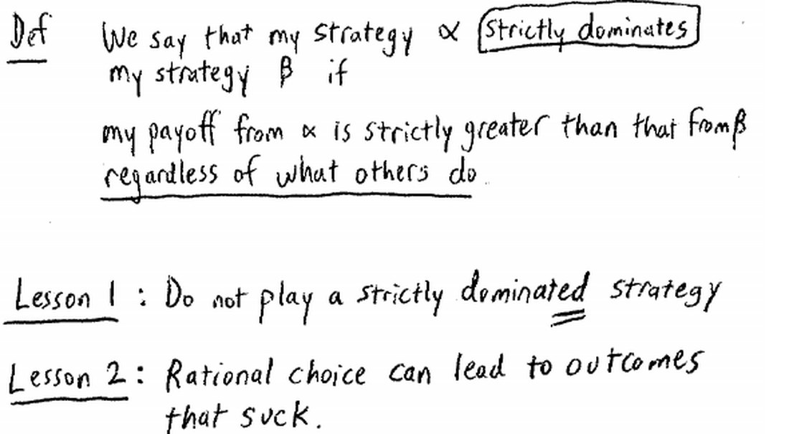
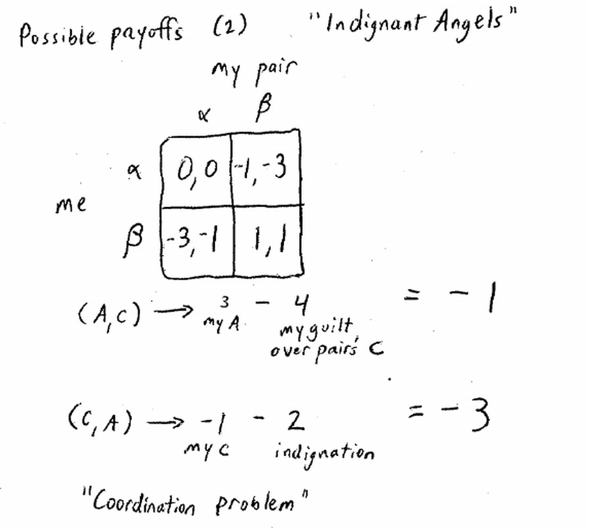
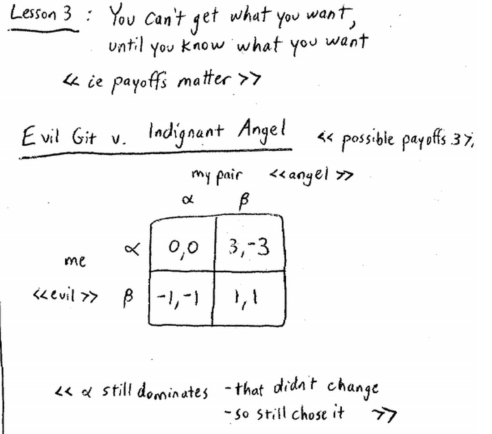
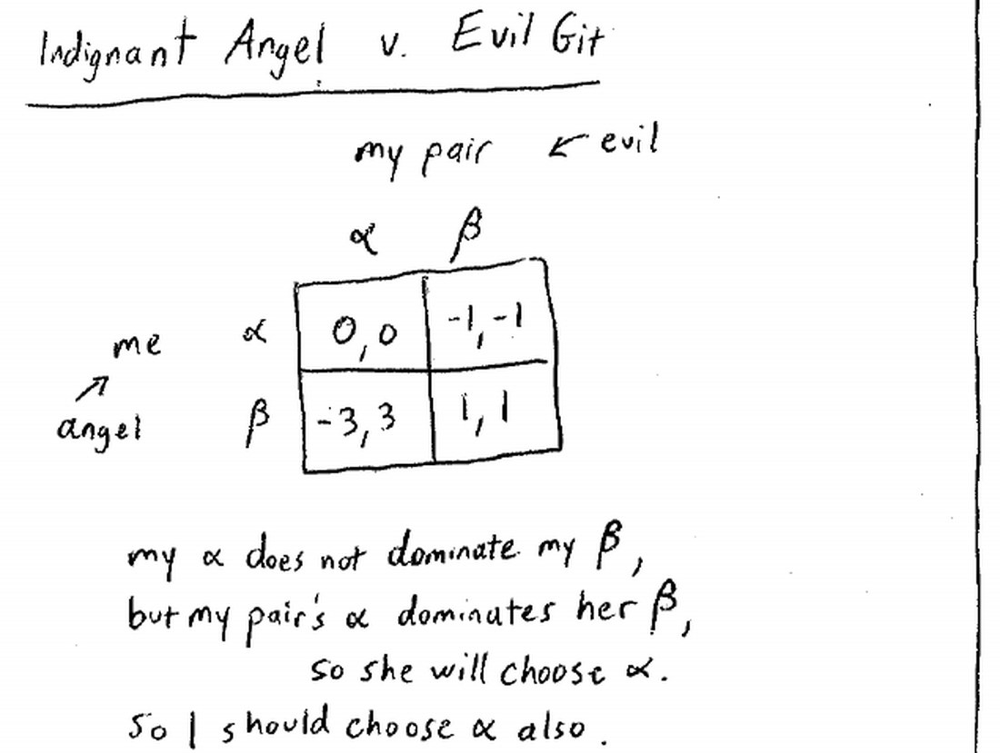
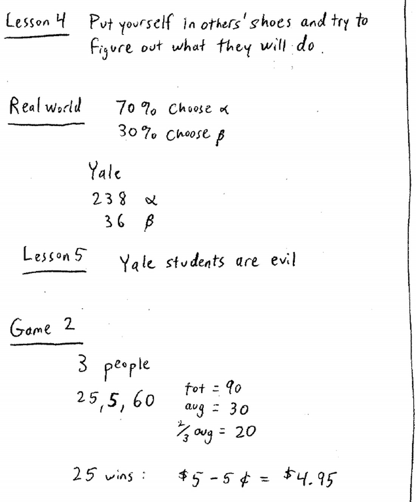

来源：耶鲁大学 ECON 159《博弈论》第一讲（Ben Polak，2007 年 9 月 5 日）· 视频 [BV1xY411Y7Wj P1](https://www.bilibili.com/video/BV1xY411Y7Wj/?p=1)

配套阅读：Dutta《Strategies and Games》第 1 章 §1–3；Watson《Strategy》第 1 章。

讲义与板书：本文插图取自 Open Yale Courses 官方板书讲义（[lecture-1 页面](https://oyc.yale.edu/economics/econ-159/lecture-1) · [blackboard01 PDF](https://oyc.yale.edu/sites/default/files/blackboard01_0_0.pdf)），引用遵循其 CC BY-NC-SA 3.0 许可。

---

**本讲导航。** 第一讲的任务不是教工具，而是把整门课的问题意识和"游戏规则"立起来。全讲由一个定义、两场博弈、五条结论构成：

| 环节 | 内容 | 对应小节 |
|---|---|---|
| 定义 | 什么是策略情境（strategic situation） | §一 |
| 游戏 1 | 成绩博弈：写 α 还是 β | §二 |
| 结论 1–2 | 不要玩严格劣势策略；理性选择可能带来糟糕结果 | §三、§四 |
| 结论 3–4 | 收益很重要；设身处地为别人着想 | §五 |
| 结论 5 | 真实的人未必按理论行动 | §六 |
| 游戏 2 | 猜 1–100 的 2/3 平均数（下讲展开） | §七 |

## 一、博弈论研究什么：策略情境

开场老师说得直接：**博弈论（Game Theory）是研究策略情境（strategic situation）的一套方法。**

所谓策略情境，就是**你的结果不仅取决于你自己的行动，还取决于他人的行动**。定义要卡在"相互影响"上：

> 策略情境：一个你的收益取决于他人行动、而不只是你自己行动的环境。

用经济学里的两类市场对照最清楚：

| 市场结构 | 厂商的行为方式 | 是否策略情境 |
|---|---|---|
| 完全竞争 | 价格接受者（price taker），无需关心某个竞争对手具体做什么 | 否 |
| 汽车工业等寡头 | 福特必须盯住通用、丰田、克莱斯勒在做什么 | 是 |

**WHY：** 为什么开课先要划这条边界？因为博弈论的全部工具——占优策略、纳什均衡、混合策略——只在"我的收益依赖你的选择"时才有意义。若对手的行为与我无关，决策就退化成一个人的最优化问题，用微积分即可，用不着博弈论。先分清"这是不是策略情境"，才知道什么时候该掏出这套工具。

博弈论的应用面远超经济学：政治学（本课可计政治学学分）、法律（老师打趣说你们中一半人会去法学院，这是很好的训练）、生物学（学期中会看到博弈论用于进化论）、体育，都是博弈论的战场。

课程信息：成绩 = 习题集 30% + 期中 30% + 期末 40%，期中在 10 月 17 日；主教材为 Dutta《Strategies and Games》，想要更严谨的可读 Joel Watson《Strategy》。老师明确不照本宣科，教材只当"安全网"，讲到哪里读哪一章。

## 二、第一场博弈：成绩博弈（Grade Game）

### 2.1 规则：写 Alpha 还是 Beta

第一次上课，老师就让全班玩一个游戏：在一张纸上写下 **α（Alpha）** 或 **β（Beta）**，当作"分数报价"；这些纸会被随机两两配对，配对的两人互相不知道对方是谁。评分规则是：

- 两人都写 α：各得 **B−**
- 两人都写 β：各得 **B+**
- 你写 α、搭档写 β：你得 **A**，搭档得 **C**
- 你写 β、搭档写 α：你得 **C**，搭档得 **A**

### 2.2 从结果矩阵到收益矩阵

先把"谁得了什么"写成两张按角色分开的**结果矩阵**，再叠加成一张**收益矩阵**。这是博弈论的标准记法，第一天就要习惯：行玩家是"我"，列玩家是"我的搭档"，每个格子里第一个数是行玩家的收益，第二个数是列玩家的收益。

这张"叠加"的动作看似只是省纸，其实是把博弈论的全部记法一次性交待清楚：**一张表必须同时说清两个人各自得到什么**，否则无法分析任何人"该怎么行动"。下面这张 outcome matrix 就是把上页两张表叠起来的结果，箭头标注了读表的约定——**格子里第一个数是行玩家的成绩，第二个数是列玩家的成绩**。

先把分数换成数字，这就是**效用/收益（payoff）**：A = 3，B+ = 1，B− = 0，C = −1。

| 我 ＼ 搭档 | α | β |
|---|---|---|
| **α** | 0, 0（B−, B−） | 3, −1（A, C） |
| **β** | −1, 3（C, A） | 1, 1（B+, B+） |

**WHY：** 为什么要把"分数"换成"数字"？因为博弈论不比较名次，它比较"人们在乎的东西"。分数只是外壳，真正进入分析的是每个人对结果的偏好排序。把偏好写成一个可比较的数（效用），"最优"才有严格定义。老师特别强调：**耶鲁的教授不能替你规定你的收益应该是什么**——博弈论不告诉你人生目标；但一旦知道你的目标，它就能告诉你该怎么行动。

顺带一个容易忽略的技术细节：这里的 0、−1、1、3 是**序数效用**而非基数效用。博弈论只要求"更大的数代表更偏好的结果"，并不要求 3 比 1 的"快乐程度"恰好是三倍。因此像"把 A 记成 3、把 B+ 记成 1"这样的具体数值，重要的只是它们的**相对大小**；只要不改变排序，换一组数不会改变答案。

### 2.3 收益是什么，决定了博弈是什么

课堂上出现了两类选 α 的答案，恰好说明收益的重要性：

- 第一类："我认为搭档会选 β，所以我选 α，能拿 A。"
- 第二类："**无论对方选什么，我选 α 都更好。**"

第二类理由是更强的，它直接引出第一个核心概念。

## 三、第一课：永远不要玩严格劣势策略

### 3.1 定义

**严格占优（strictly dominates）：** 如果策略 α 带来的收益，**无论对手怎么做**，都严格大于策略 β 带来的收益，就说 α 严格占优 β，而 β 是**严格劣势策略（strictly dominated strategy）**。板书把这句话写成三个条件式的短语：我的收益、从 α 得到、严格大于从 β 得到的、**regardless of what others do**。

用成绩博弈验证：对手选 α 时，我选 α 得 0、选 β 得 −1（α 更好）；对手选 β 时，我选 α 得 3、选 β 得 1（α 也更好）。两种情况下 α 都更好，所以 **α 严格占优 β**。

### 3.2 为什么不该玩严格劣势策略

> 我不玩严格劣势策略的理由是：如果我选择占优它的那个策略，那么不管对手做什么，我得到的收益都比原来更好。

这个理由听上去"太显然，不值得在课堂上讲"。老师于是故意抛出一个看似聪明的反论来摇晃它。

### 3.3 一个诱人的错误论证："我们都选 β 就好了"

有人说：如果我和搭档都按上面的推理去选 α，我们各得 0；但如果我们都改选 β，我们各得 1。1 > 0，所以我应该选 β。

这个论证错在两处：

1. **"神奇推理"谬误。** 它偷偷假设"我这么想，就能让对手也这么想"，仿佛我有超能力把想法传进别人脑子。可规则明说不能给对方看，我的推理并不能控制对手的选择。
2. **就算真能控制，也还该选 α。** 假如我有办法让全教室都选 β，那我更应该选 α——因为那时我得 3，而不是 1。

**这里埋下第二课：** 双方都理性地不玩劣势策略，结果却是各得 0；如果他们能"合作"都选 β，本可以各得 1。**理性的选择，可能导致糟糕的结果。**

## 四、第二课：理性的选择可能导致糟糕的结果

### 4.1 囚徒困境（Prisoner's Dilemma）

上面这个结构有个著名的名字：**囚徒困境**。

标准故事：两个嫌犯被分开关押、分别审问。都不告发对方，各坐 1 年；都告发对方，各坐 2 年；一人告发、另一人不告发，告发者立刻获释，被出卖者坐 5 年。

| 犯人 A ＼ 犯人 B | 沉默 | 告发 |
|---|---|---|
| **沉默** | 各 1 年 | A：5 年，B：0 年 |
| **告发** | A：0 年，B：5 年 | 各 2 年 |

不管对方是否告发，你告发都比沉默好——告发是严格占优策略。两人都照做，结果是各坐 2 年，比都不告发时的各 1 年更糟。这正是"个体理性 → 集体非理性"的母题，这类结果被称为**帕累托低效（Pareto inefficient）**。

把两件事区分开会更清楚：**占优策略分析回答"我该怎么做"，它不回答"我们本可以多好"。** 成绩博弈里 α 严格占优，所以每个人都该选 α——这个结论并不因为"都选 β 更好"而改变。帕累托比较的是**结果**，占优比较的是**策略**，两者评价的对象不同，所以可以同时成立而不矛盾。老师此处的用意正是：不要因为"集体结果不好"就怀疑占优推理本身。

### 4.2 现实中的囚徒困境

- **宿舍卫生。** 你希望室友打扫；对你最糟的是自己打扫而对方不打扫。于是"不打扫"在两种情况下都不差，结果学年结束时宿舍一团糟。这也是囚徒困境。
- **价格战。** 两家公司都想降价抢客，谁都不愿被对方降价抢先。于是双方都降价，行业利润被压低，消费者受益、厂商受损。
- **离婚与诉讼。** 双方都雇律师、都想占上风，最后把大量财富交给律师。
- 老师顺带吐槽：美剧《法律与秩序》几乎每集都在演囚徒困境。

### 4.3 社会怎样给囚徒困境打补丁

既然个体理性会滑向坏结果，现实中人们靠什么把它拉回来？

| 手段 | 作用机理 | 局限 |
|---|---|---|
| 合同 | 把"不降价"写成有约束力的协议，**改变收益** | 价格串通在许多国家违法，合同无法执行 |
| 重复博弈 | 今天合作、明天还见面，长期收益改变当期激励 | 需要关系足够长久、行为可被观察 |
| 沟通 | 协调彼此的预期 | 光"说说"没有强制力，承诺可以反悔 |
| 第三方强制执行 | 黑手党之类势力替法律缺位的地区执行契约 | 代价高、本身违法 |

关键区分：**合同不只是"沟通"，它改变了收益**——违约要赔偿，收益矩阵就变了，博弈的均衡也随之改变。这也解释了为什么黑手党能在法律执行力弱的地方繁荣：它实质上是在替法律执行合同。

## 五、第三课：收益很重要——义愤的天使与协调问题

老师随即换一组收益：游戏结构完全相同，但"人们在乎的东西"变了。

### 5.1 义愤的天使（Indignant Angels）

假设我得了 A、搭档得 C，本该高兴，但我因让对方吃亏而内疚，净收益变成 −1；反过来，若我得 C 而对方得 A，我既为成绩难过、又对搭档的"占便宜"感到愤慨，净收益是 −3。于是收益矩阵变成：

| 我 ＼ 搭档 | α | β |
|---|---|---|
| **α** | 0, 0 | −1, −3 |
| **β** | −3, −1 | 1, 1 |

（对角线不变：都选 α 仍各得 B− 记 0，都选 β 仍各得 B+ 记 1；变化的是对角线外的收益——得 A 者因内疚从 3 降到 −1，得 C 者因义愤从 −1 降到 −3。）

注意：在这组收益下，**α 不再占优 β**——对方选 α 时 α 更好（0 > −3），对方选 β 时 β 更好（1 > −1）。两个策略互不占优，第一步"剔除劣势策略"就失效了。这种博弈叫**协调问题（coordination problem）**，后面课程会专门讲。

**本节的教训（第三课）：收益很重要。** 同一套行动、同一套结果，只因为人们在乎的东西变了，答案就从"显然选 α"变成"说不清该选什么"。

老师借歌手 Joe Jackson 的歌词把它说成一句格言：

> "You can't get what you want till you know what you want."（不弄清自己想要什么，你就得不到它。）
>
> 作为逻辑命题，这句话是假的——想要的东西也可能凭空掉下来；但作为一种策略，**先弄清自己的目标再分析博弈，是好主意。**

### 5.2 设身处地为对手着想（第四课）

接着老师把两种人混搭。假设"我"是只在乎自己成绩的**邪恶之徒（evil git）**，而我知道搭档是**义愤的天使**。这时我的收益来自成绩矩阵，搭档的收益来自天使矩阵，合成一张新表：

| 我（邪恶）＼ 搭档（天使） | α | β |
|---|---|---|
| **α** | 0, 0 | 3, −3 |
| **β** | −1, −1 | 1, 1 |

答案仍然明确：**我该选 α，因为 α 依然严格占优 β。** 对方收益怎么变，都改变不了我自己收益的排序，我的占优策略不变。

反过来，假设"我"是天使、搭档是邪恶之徒：

| 我（天使）＼ 搭档（邪恶） | α | β |
|---|---|---|
| **α** | 0, 0 | −1, −1 |
| **β** | −3, 3 | 1, 1 |

这一次我**没有**占优策略（对方选 α 我该选 α，对方选 β 我该选 β）。但正确答案仍然是选 α，只是理由换了一条：

> 我的 α 不占优，可我去看对手——**她的 α 占优她的 β**，所以她一定会选 α。既然知道她会选 α，我选 α 得 0、选 β 得 −3，当然选 α。

**这就是第四课：战略思维的本质，是设身处地为别人着想。** 当自己没有明显的占优策略时，就去算对手的收益、预测对手会怎么行动，再据此做最优反应。老师提醒：现实比课堂更难，因为你常常连对手的收益都不知道——"算清自己的收益容易，算清别人的收益难"。

> 事情不全是关于你自己的——你得站到别人的角度去想，弄清他们在乎什么、会做什么，然后才能做出好的反应。

## 六、第五课：耶鲁学生是邪恶的——从实验看真实行为

第一场博弈里，占优策略分析说"人人都该选 α"。真实世界呢？大量实验显示，大约 **70% 的人选 α、30% 的人选 β**。这堂课现场统计是 238 人选 α、36 人选 β，选 β 的不到 15%。

为什么会有 30% 的人"玩劣势策略"？可能的解释：

- **道德动机：** 他们可能是好人，真心在乎搭档的成绩（就像神学院学生可能比商学院学生更在乎别人）。
- **误判为重复博弈：** 他们以为要反复和同一个人玩，于是把长期收益算进来，愿意用 β 维持合作。
- **就是犯错了：** 老师也坦承，最直白的解释是有些人算错了。

不管哪种解释，**第五课是：真实的人未必按理论预测行动。** 老师用一句半开玩笑的话概括——**"耶鲁的学生是邪恶的"**：你们都倾向选那个对自己最有利的 α。这提醒我们：分析博弈时既要懂理论上的占优与均衡，也要对真实人类的偏离有预期。

> 老师吐槽：博弈论里所谓"现实世界的实验"，其实就是亚利桑那大学的本科生。

**WHY：** 这一课为什么重要？因为博弈论的预测建立在"人是理性的"这个假设上。一旦真实行为系统性地偏离（比如 30% 的人选择劣势策略），建立在纯理性之上的方案就会失效。承认人会犯错、会有道德偏好，才能在现实设计中留出余量。

顺带一提，30% 这个比例在后续课程里会反复出现：它不是噪声，而是一种**稳定的、可预期的偏离**。整门课后半程要处理的"混合策略"与"进化稳定策略"，某种程度上都是在给这类偏离一个正式的位置，而不是把它当作学生的算术错误打发掉。

## 七、第二场博弈：猜 1–100 的 2/3 平均数

课程最后，老师布置了第二个游戏，作为下节课的主菜。

**规则：** 每人写下一个 1 到 100 之间的整数；算出全班所选数字的**平均数**；谁写下的数**最接近平均数的 2/3**，谁获胜。奖金是 5 美元，减去"所选数字与目标值之差"的便士数；平手则平分。

老师当场用三个人举例说明算法：若三人分别写 25、5、60，则总和 90、平均 30、平均数的 2/3 是 20；25 最接近 20，于是写 25 的人获胜，拿走 5 美元 − 0.05 美元 = **4.95 美元**。

**WHY（预告）：** 这个游戏为什么重要？它不是靠运气，而是一个可以被"层层递推"解出的博弈：如果所有人都随机选，平均数约 50，目标约 33；但如果你想到"别人也会想到 33"，目标就降到 22；如此反复，唯一稳定的答案是 **1**。这正是"我知道你知道我知道……"的无限推理，也是后续"迭代剔除严格劣势策略"和纳什均衡的起点。老师故意把它留到下节课，让全班先真实地玩一次，再看理论与实际行为的差距。

（注：本讲只讲规则与示例，逐层剔除的完整解法在下一讲。）

## 本节要点总结

1. **博弈论研究策略情境：** 你的收益不仅取决于自己，还取决于他人的行动；完全竞争不是策略情境，汽车工业是。
2. **博弈的要素在本讲显露：** 行动（α/β）、结果（各种分数组合）、收益（人们真正在乎的东西）；分析博弈前必须先知道收益。
3. **第一课：永远不要玩严格劣势策略。** 若存在无论对手怎么做都更好的策略，就没有理由选劣势策略。
4. **第二课：理性的选择可能导致糟糕的结果。** 成绩博弈与囚徒困境都是"个体理性 → 集体非理性"；现实中的宿舍卫生、价格战、诉讼皆是。注意占优分析评价的是策略，帕累托评价的是结果，两者不冲突。
5. **第三课：收益很重要。** 只把收益从"自私"换成"内疚 + 义愤"，同一个游戏就从占优策略博弈变成协调问题。
6. **第四课：设身处地为别人着想。** 没有占优策略时，去算对手的收益、预测其行动，再做最优反应。
7. **第五课：真实的人未必理性。** 约 30% 的人会玩劣势策略，"耶鲁学生是邪恶的"是对理论与现实差距的调侃。
8. **预告：猜数字博弈。** 写 1–100 中的一个数，最接近全班平均数 2/3 者获胜；其逐层推理的解法将在下一讲展开。

## 参考资料

**课程与视频**

- Open Yale Courses，ECON 159《Game Theory》课程主页：<https://oyc.yale.edu/economics/econ-159>
- 第一讲页面（含讲义与板书 PDF 下载）：<https://oyc.yale.edu/economics/econ-159/lecture-1>
- 官方板书讲义：<https://oyc.yale.edu/sites/default/files/blackboard01_0_0.pdf>
- 中文视频（本讲为 P1）：<https://www.bilibili.com/video/BV1xY411Y7Wj/?p=1>

**教材**

- Prajit K. Dutta, *Strategies and Games: Theory and Practice*, MIT Press, 1999, Ch. 1（本课主教材）。
- Joel Watson, *Strategy: An Introduction to Game Theory*, W. W. Norton（更形式化，可作第二本）。

**延伸阅读**

- 囚徒困境：<https://zh.wikipedia.org/wiki/囚徒困境>
- 帕累托效率：<https://zh.wikipedia.org/wiki/帕累托效率>
- 猜 2/3 平均数博弈（p-beauty contest，下一讲的主角）：<https://en.wikipedia.org/wiki/Guess_2/3_of_the_average>
