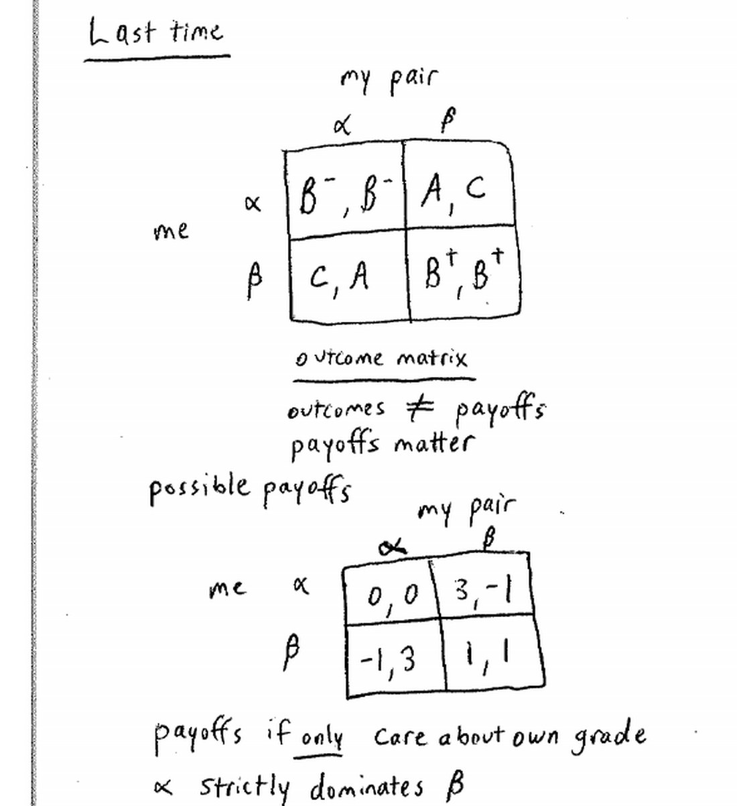
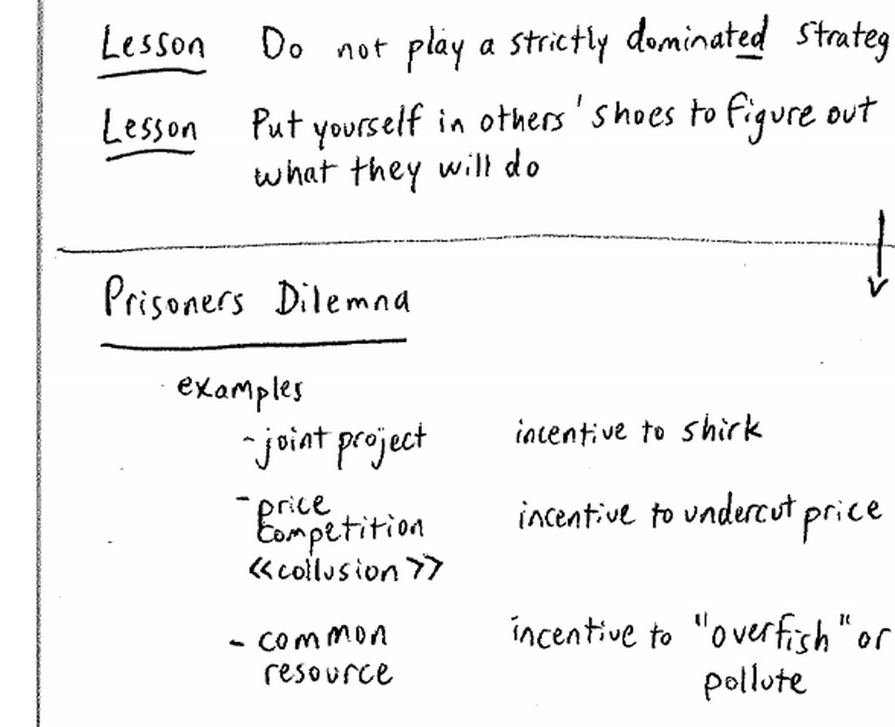
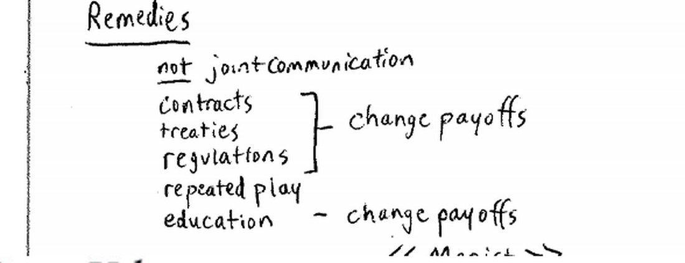
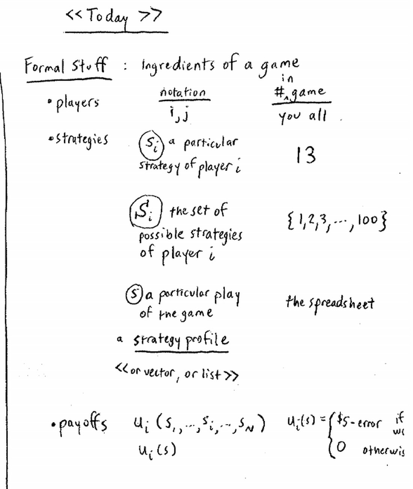
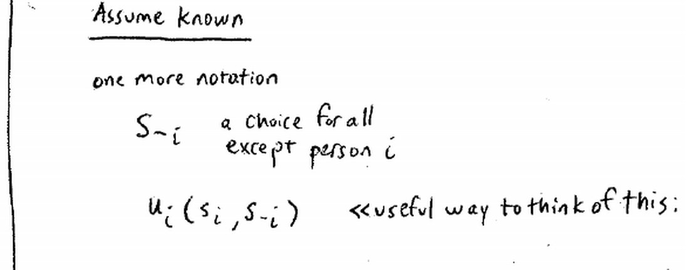
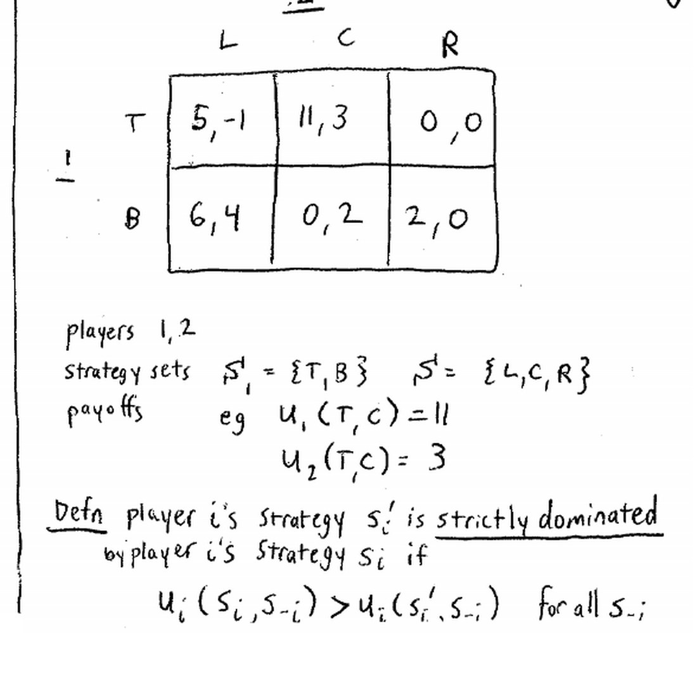
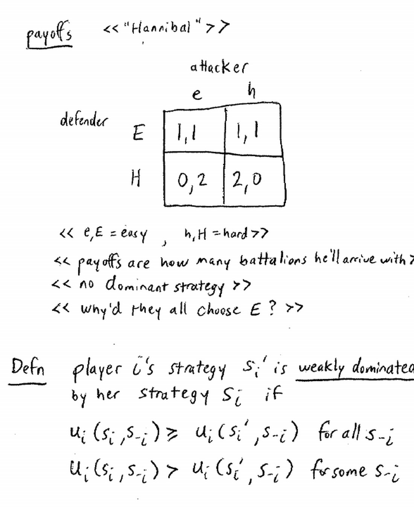
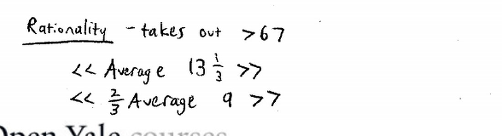
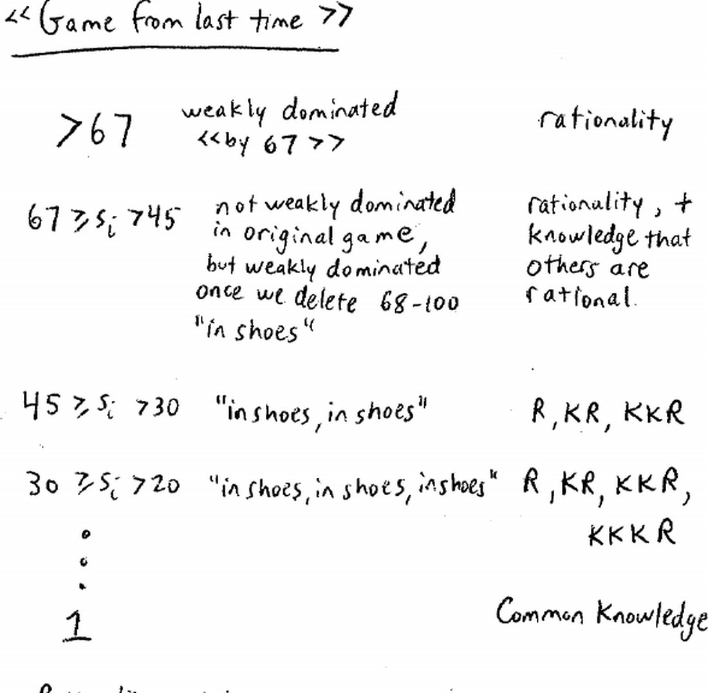
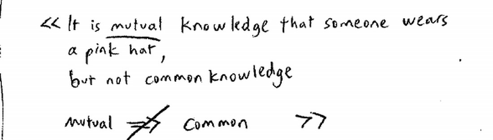

来源：耶鲁大学 ECON 159《博弈论》第二讲（Ben Polak，2007 年 9 月 10 日）· 视频 [BV1xY411Y7Wj P2](https://www.bilibili.com/video/BV1xY411Y7Wj/?p=2)

配套阅读：Dutta《Strategies and Games》第 2 章 §3、第 3–4 章、第 5 章（common knowledge）；Watson《Strategy》第 6–8 章；Dixit & Nalebuff《Thinking Strategically》第 3 章 §1–3。

讲义与板书：本文插图取自 Open Yale Courses 官方板书讲义（[lecture-2 页面](https://oyc.yale.edu/economics/econ-159/lecture-2) · [blackboard02 PDF](https://oyc.yale.edu/sites/default/files/blackboard02_0_0.pdf)），引用遵循其 CC BY-NC-SA 3.0 许可。

---

## 一、本讲主线：把两条教训用得更狠

上一讲从成绩博弈里得到两条教训：**不要玩严格劣势策略**，以及**要设身处地为别人着想**。本讲把这两条教训放进更复杂的场景反复使用，并第一次把"博弈"写成严格的数学对象。

**WHY：** 为什么要先形式化？因为口语里的"策略""结果"含义模糊，一旦出现几十个玩家、上百种策略（比如全班的猜数字游戏），就必须有一套统一的符号来指代"谁、能选什么、在乎什么"。形式化不是目的，而是让"换位思考"这种直觉能被一步步精确执行——你替对手想的那一刻，想的正是他的策略集和收益函数。

## 二、囚徒困境再补充：现实清单与打补丁的办法

### 2.1 更多现实例子

老师重申并补充了囚徒困境的实例：

| 场景 | 合作（好结果） | 背叛（占优策略） | 结果 |
|---|---|---|---|
| 合作项目／小组作业 | 都认真做 | 搭便车 | 产品质量差 |
| 价格竞争 | 都维持高价 | 都偷偷降价 | 价格被压到边际成本，行业利润受损 |
| 公共资源（大西洋渔业） | 都节制捕捞 | 都拼命捕 | 渔业资源枯竭 |
| 全球变暖／碳排放 | 都减排 | 都照常排放 | 气候恶化 |

**WHY：** 为什么这些场景都会滑向坏结果？因为它们共享同一个结构：每个人的"背叛"在别人任何选择下都更划算（严格占优），可当所有人都这么做，集体的处境比都合作时更差。公共资源尤其典型——鱼群和大气不属于任何人，"如果别人不节制，我今天更该多捕，因为明天可能就没了"。

### 2.2 光靠沟通不够，什么才真正管用

老师强调：**囚徒困境不是"沟通的失败"**。你可以和对手谈好都不降价、都减排，但只要回家还开着大排量车、偷偷降价，结果照旧。更糟的是，如果对方真的在减排或是努力干活，你搭便车的动力反而更强。

真正管用的办法都在做同一件事——**改变收益**：

| 手段 | 如何改变收益 |
|---|---|
| 合同／国家间条约 | 违约者要赔偿或受制裁，背叛不再划算 |
| 监管 | 外部权威对背叛行为罚款 |
| 重复博弈 | 今天的背叛会招致明天的报复，长期收益抵消短期诱惑 |
| 教育 | 改变人们"在乎的东西"本身，让合作本身带来正收益 |

## 三、博弈的正式定义

老师用二十分钟把博弈拆成四个部件。

### 3.1 玩家、策略、策略集

- **玩家（players）**：记作 i、j，一共 N 个。猜数字游戏里，全班每个人都是玩家。
- **策略（strategy）**：玩家 i 的一个具体选择，记作 s_i；例如猜数字游戏里的"选 13"。
- **策略集（strategy set）**：玩家 i 所有可选策略的集合，记作 S_i；猜数字游戏里 S_i = {1, 2, …, 100}。
- **策略剖面（strategy profile）**：每个玩家各出一个策略组成的清单，记作 s = (s_1, s_2, …, s_N)。课本里也叫策略向量、策略组合。你上次交上来的那一捆纸，就是一个具体的策略剖面。

### 3.2 收益函数与 s 的下标

- **收益（payoff）**：玩家 i 的收益记作 u_i(s)，它同时取决于**所有人的**选择，即 u_i(s_1, s_2, …, s_N)。猜数字游戏里，u_i(s) = 5 美元减去"所选数字与目标值之差"的便士数（如果你最接近 2/3 平均值），否则为 0。
- **s_{−i}**：表示"除玩家 i 之外所有人的选择"。有了它，收益可写成 u_i(s_i, s_{−i})，把"我自己的选择"和"别人的选择"分开看。本讲后面反复用到这种拆法。

**WHY：** 为什么收益必须是"所有人的函数"？因为这就是策略情境的定义——我的结果依赖于别人。把它写成 u_i(s_i, s_{−i})，是为了在分析时能固定住别人的选择、只比较我自己的两个策略，这正是"占优"要问的问题。

### 3.3 一个贯穿全课的假设

在接下来的十周里，我们假设：**每个人都知道其他人可以选哪些策略，也知道其他人的收益。** 老师在黑板上直言这并不现实，学期末会回来挑战它；但它已经足够支撑大量有价值的分析。

## 四、抽象例子：严格占优、弱占优与"从不是最优反应"

老师先给一个不对称的 2×3 博弈：玩家 1 选 上（U）或 下（D），玩家 2 选 左（L）、中（C）或 右（R）。收益矩阵如下：

| 玩家1 ＼ 玩家2 | L | C | R |
|---|---|---|---|
| **U** | 5, −1 | 11, 3 | 0, 0 |
| **D** | 6, 4 | 0, 2 | 2, 0 |

- **玩家 1 没有劣势策略**：对 L 时 D 更好（6 > 5），对 C 时 U 更好（11 > 0），哪个都不总是更好。
- **玩家 2 的 C 严格占优 R**：U 行 3 > 0，D 行 2 > 0。

学生 Thomas 说了一句正确但不完全对应定义的话："选 R 从来不是最好的选择。" 老师说：这确实成立，但"从不是最优反应"和"被占优"不是同一句话——

- **被占优**要求存在另一个策略，**在任何情况下都不比你差**；
- **从不是最优反应**只要求对每个对手策略，都存在某个更好的策略（但那个更好的策略可以随情况而变）。

本讲里 R 恰好两种性质都有；但概念上要分清。

### 4.1 严格占优与弱占优的定义

- **严格占优（strictly dominates）**：对玩家 i 的策略 s_i 与 s_i'，如果对**一切** s_{−i} 都有 u_i(s_i, s_{−i}) > u_i(s_i', s_{−i})，就说 s_i 严格占优 s_i'，而 s_i' 是**严格劣势策略**。
- **弱占优（weakly dominates）**：如果对一切 s_{−i} 都有 u_i(s_i, s_{−i}) ≥ u_i(s_i', s_{−i})，并且**至少对某一个** s_{−i} 严格大于，就说 s_i 弱占优 s_i'。

对严格劣势策略，第一课的结论是"绝不要玩"；对弱劣势策略，老师只说"你大概也不该玩"——它的地位更微妙，后面会看到它在迭代剔除里扮演关键角色。

## 五、汉尼拔博弈：设身处地预测对手

### 5.1 规则与收益

老师用一个历史情境把两条教训合在一起：公元前三世纪，汉尼拔要从两条通道中的一条入侵意大利半岛。你是防守方（罗马），**只能守住其中一条**。

- 走**易道**（沿海）：不损失兵力。
- 走**难道**（翻越阿尔卑斯山）：先损失 1 个营。
- 无论走哪条，只要撞上你的防守，再损失 1 个营。

汉尼拔初始有 2 个营。收益定义为：**汉尼拔** = 最终带入罗马的营数；**防守方** = 没能进入罗马的营数（既含翻山损失，也含被防守消灭的）。

| 汉尼拔 ＼ 罗马 | 守易道 | 守难道 |
|---|---|---|
| **走易道** | 1, 1 | 2, 0 |
| **走难道** | 1, 1 | 0, 2 |

### 5.2 求解：先替汉尼拔想

课堂上多数人凭直觉选择"守易道"。老师问：为什么？别急着答，先做两步分析。

1. **站在汉尼拔的角度看他的收益。** 若你守易道，他走易道或难道都得 1；若你守难道，他走易道得 2、走难道得 0。于是"走易道"在两种情况下分别得 1 和 2，"走难道"得 1 和 0——**走易道弱占优走难道**。
2. **因此汉尼拔不会走难道**（他大概也不会玩弱劣势策略），他会走易道。既然知道他会走易道，你就该**守易道**。

这就是"换位思考"的完整执行：不是猜对手"大概会怎样"，而是算出他的收益、排除他不会选的策略，再对自己做最优反应。防守方自己是**没有占优策略**的——你只想和对手走同一条道（匹配）。

> 老师补充了历史结局：汉尼拔偏偏翻过了阿尔卑斯山，把这一课"搞砸了"。

**WHY：** 为什么这个例子比成绩博弈更进一层？成绩博弈里我选 α 靠自己就能决定，根本不需要猜对手；汉尼拔博弈里我没有占优策略，必须依赖"对手不会玩弱劣势策略"这一推断。博弈论的预测力，就从"只看自己"升级到了"看对手、并对对手的理性下注"。

## 六、猜数字博弈：迭代剔除劣势策略

### 6.1 现场数据与推理层次

复习规则：每人写 1–100 的整数，最接近全班平均数 2/3 者获奖。现场出现了好几层推理：

- 选 33：假设大家随机选，平均约 50，50 的 2/3 ≈ 33。
- 选 22：假设别人也会想到 33，于是平均值约 33，2/3 ≈ 22。
- 越往下推，数字越小。

但 33 和 22 都不是最终答案。老师指出第一层推理的漏洞：**房间里的人不是随机数生成器**，他们想赢，不会真的随机选。

**本班结果：** 平均数为 13⅓，2/3 约为 9，所以**赢家是选了 9 的那些人**；巧合的是，本班的**中位数答案也正好是 9**（老师强调这是巧合）。作为逐年对照：

| 年份 | 班级平均 | 说明 |
|---|---|---|
| 2003 | 18.5 | 前几年的水平 |
| 2004 | 21.5 | 更高 |
| 2005 | 23 | 老师说"那届学生彼此完全不信任" |
| 2007（本届） | 13⅓ | 老师口中"我们进步了" |

### 6.2 第一片：剔除大于 67（只用第一课）

不管别人怎么选，平均数最高也只是 100（人人都选 100），于是目标值最高也就是 100 的 2/3 ≈ 66⅔。因此选 68–100 的人**永远赢不了**：

- 策略 67 **弱占优** 68–100（在最坏的情况下至少一样好，通常更好）。
- 按第一课，这些是劣势策略，**没有人应该选**。本班有 4 人选了 >67。

剔除 68–100 后，可选范围缩到 1–67。

### 6.3 第二片：剔除 46–67（需要换位思考）

现在的最高可能选择是 67，于是最高目标值是 67 的 2/3 ≈ 44⅔。所以 46–67 也被劣策略（45）弱占优。

注意这里和第一片的区别：46–67 **在原博弈里并不是劣势策略**（如果所有人都选 100，67 反而是赢的）。它们是在"**大家都不选劣势策略**"之后才变成劣势的。这一步要求你设身处地为同学着想：既然他们不会选 68–100，那么 46–67 也就不该选。

老师提醒：选 46–67 的人未必自己"笨"，更可能是**他们觉得班上其他人笨**——这个区别在下一节会变成核心。

### 6.4 一路剔到 1（需要理性的"常识"）

同样的推理可以不断重复。老师把它形象地称为"在鞋子里，再在鞋子里，再再在鞋子里"（"in shoes, in shoes, in shoes"），再往下就该"发明袜子"了：

| 轮次 | 剔除范围 | 依赖的推理层级 | 需要的"鞋子"数 |
|---|---|---|---|
| 1 | 68–100 | 理性（自己不受劣策略） | rationality |
| 2 | 46–67 | 我知道别人理性 | in shoes |
| 3 | 31–45 | 我知道别人知道别人理性 | in shoes, in shoes |
| 4 | 21–30 | 我知道别人知道别人知道别人理性 | in shoes ×3 |
| … | … | …… | …… |
| 最后 | 只剩 1 | 理性是"常识" | common knowledge |

只有把这种"我知道你知道我知道……"的链条无限延伸下去，**1 才是唯一幸存的策略**。这种反复删除的过程叫**迭代剔除劣势策略（iterated elimination of dominated strategies）**。

**WHY：** 为什么答案会是 1 而不是 9？因为 1 来自纯理论：如果理性是所有人的常识，每个人就都只能选 1。而实际班级平均 13⅓、赢家选 9，恰恰说明"理性是常识"这个假设在现实中不成立。博弈论给出的是逻辑终点，现实数据给出的是起点与终点之间的真实位置——两者都对，差别在于你用哪套假设。

### 6.5 再玩一次：知识本身改变了博弈

老师让全班把游戏**重玩一次**（这次不许交流，但大家已经听过分析）。举手统计显示，几乎所有人都把数字往下调，老师估计**新平均大约 3–4，甚至更低**。

**为什么同样的收益、同样的规则，结果却变了？** 因为重玩改变的不是规则，而是**知识**：讨论之后，不仅你自己更懂怎么玩，你也知道别人更懂、别人知道你知道、你知道别人知道你知道……这种"对彼此水平的认识"整体上移，直接改变了行为。

> 由此得出本讲最重要的补充：需要设身处地想的，不只是别人的**收益**，还有别人**玩这个游戏有多老练**，以及他们认为**你有多老练**。

老师把它落到商业场景：**公司与公司**竞争时，可以放心假设对手是老练的博弈者、并且知道你是；但**公司与顾客**打交道时（他举了非优质贷款的销售为例），这个假设就不那么安全了。这说明"对手有多老练"不是学术细节，而是决定策略能不能搬到现实的关键参数。

## 七、理性的层级与"常识"

### 7.1 需要多少层"我知道你知道"

要一路剔到 1，单说"我是理性的"远远不够。需要的是：

- 我是理性的；
- 我知道别人是理性的；
- 我知道别人知道别人是理性的；
- ……

这个无限序列在哲学里有个专门的词：**常识（common knowledge）**（对应 Dutta 第 5 章）。

> 常识 = 我知道 X，你知道 X，你知道我知道 X，我知道你知道 X，我知道你知道我知道 X……无限下去。

### 7.2 粉帽子实验：相互知道不等于常识

老师请两位助教 Alice 和 Kay 上台，各戴一顶帽子；两人能看见对方的帽子、看不见自己的。他问全班："房间里至少有一顶粉帽子，这是常识吗？"

- Alice 看得到 Kay 的帽子，所以 Alice 知道"房间里至少有一顶粉帽子"；Kay 同理。
- 但 Alice **看不见自己的帽子**，无法排除自己戴的是蓝帽子。如果自己戴蓝帽子，那么 Kay 看到的可能只是一顶蓝帽子——于是 Alice 不知道 Kay 是否知道"房间里有粉帽子"。
- 所以"房间里有粉帽子"是**相互知道（mutual knowledge）**，却不是**常识（common knowledge）**。

**WHY：** 这个小实验为什么值得占课堂五分钟？因为迭代剔除能不能走到 1，完全取决于"理性是常识"这一条强假设。现实里人们常常只停留在"我知道你理性"甚至"我猜你理性"的第一、二层。老师的演示提醒：共同知识是一个很微妙、比直觉更严格的概念，而博弈论的很多强结论都建立在它之上。

## 本节要点总结

1. **囚徒困境无处不在**：合作项目、价格战、公共资源、碳排放；光靠沟通无法解决，真正管用的是**改变收益**——合同、条约、监管、重复博弈、教育。
2. **博弈的形式定义**：玩家、策略 s_i 与策略集 S_i、策略剖面 s、收益函数 u_i(s)；用 s_{−i} 表示"除我之外所有人的选择"。
3. **贯穿全课的假设**：所有人知道彼此的策略集与收益（学期末再挑战它）。
4. **两种占优**：严格占优（处处更好）与弱占优（处处不差、至少一处更好）；"被占优"强于"从不是最优反应"。
5. **汉尼拔博弈**：自己没有占优策略时，通过算出对手的弱劣势策略来预测其行动，再匹配——这是换位思考的可操作版本。
6. **猜数字的迭代剔除**：>67 → 46–67 → 31–45 → …… → 1；第一片只用理性，越往后越需要"我知道你知道……"。
7. **理性是常识**才能推出 1；本班平均 13⅓、中位数与赢家都是 9，说明现实中这条假设不成立。
8. **重玩一次结果骤降**：需要设身处地想的不仅是别人的收益，还有别人的老练程度、以及他们对你的判断。
9. **相互知道不等于常识**：粉帽子实验说明 common knowledge 比直觉更严格。

## 参考资料

**课程与视频**

- Open Yale Courses，ECON 159《Game Theory》课程主页：<https://oyc.yale.edu/economics/econ-159>
- 第二讲页面（含官方英文讲稿与板书 PDF）：<https://oyc.yale.edu/economics/econ-159/lecture-2>
- 官方板书讲义：<https://oyc.yale.edu/sites/default/files/blackboard02_0_0.pdf>
- 中文视频（本讲为 P2）：<https://www.bilibili.com/video/BV1xY411Y7Wj/?p=2>

**教材**

- Prajit K. Dutta, *Strategies and Games: Theory and Practice*, MIT Press, 1999, Ch. 2 §3、Ch. 3–4，以及 Ch. 5（common knowledge）。
- Avinash Dixit & Barry Nalebuff, *Thinking Strategically*, Ch. 3 §1–3.

**延伸阅读**

- 共同知识（common knowledge）：<https://plato.stanford.edu/entries/common-knowledge/>
- 猜 2/3 平均数博弈（p-beauty contest）：<https://en.wikipedia.org/wiki/Guess_2/3_of_the_average>
- 迭代剔除劣势策略：<https://en.wikipedia.org/wiki/Rationalizability>
