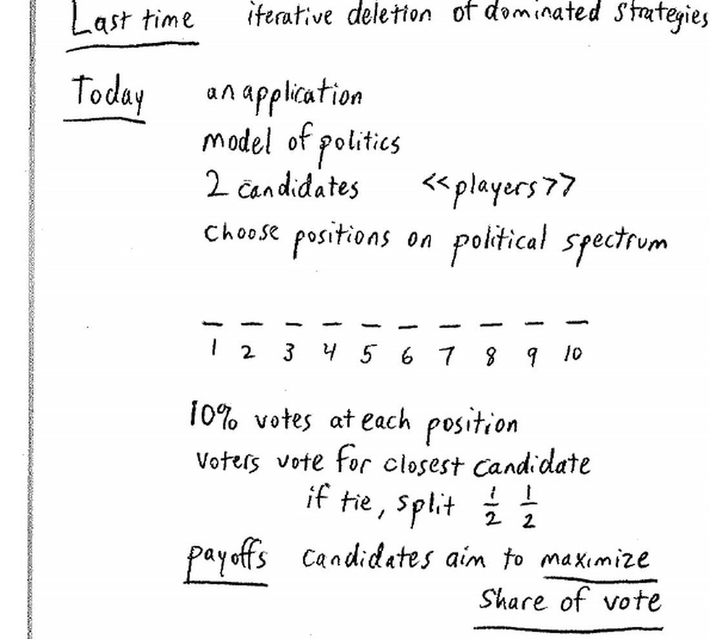
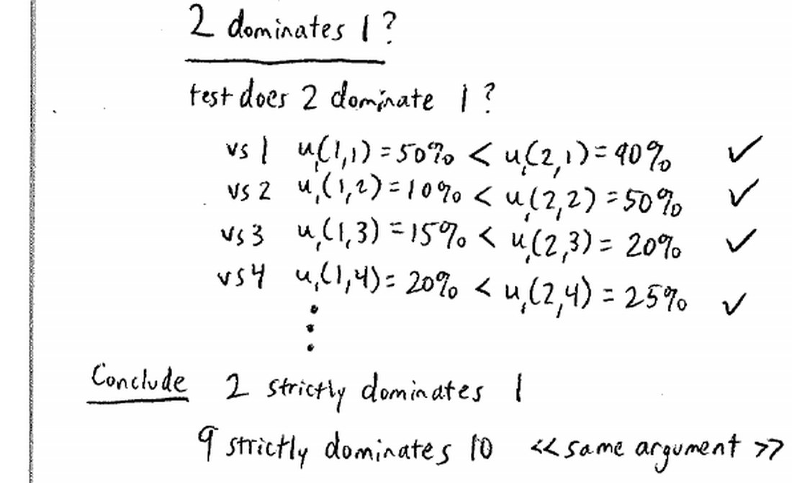
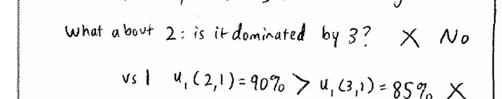
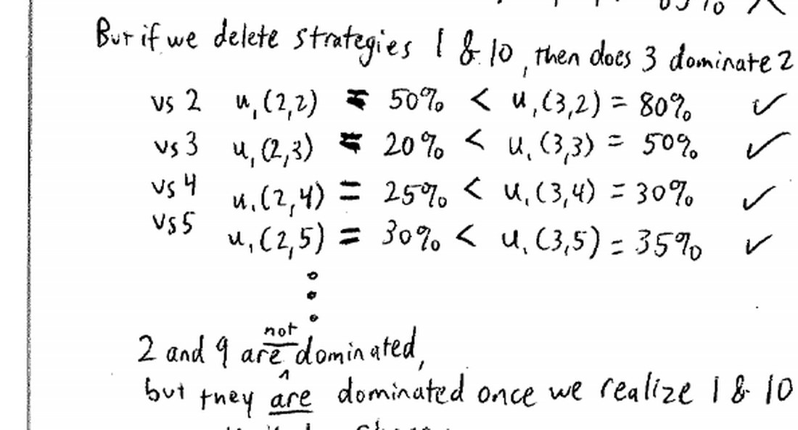
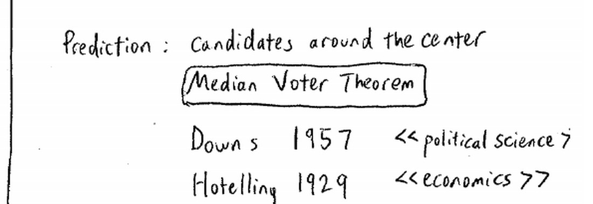
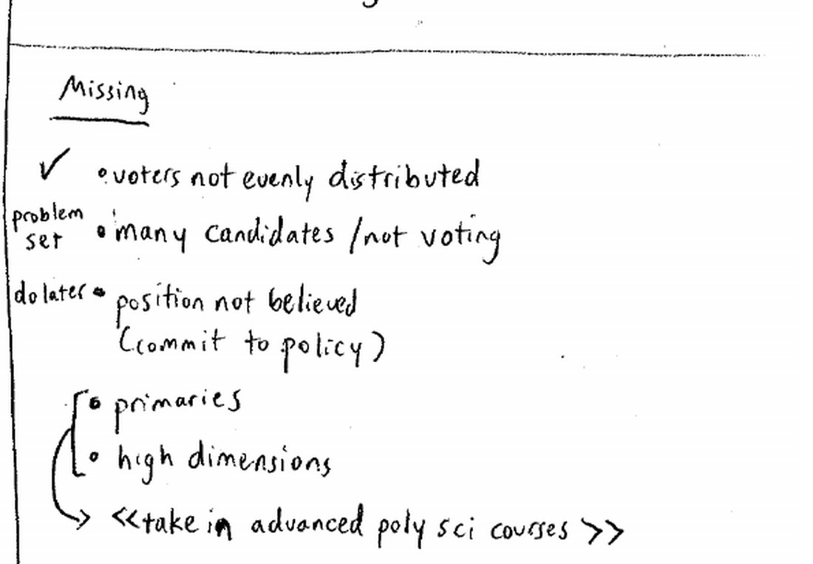
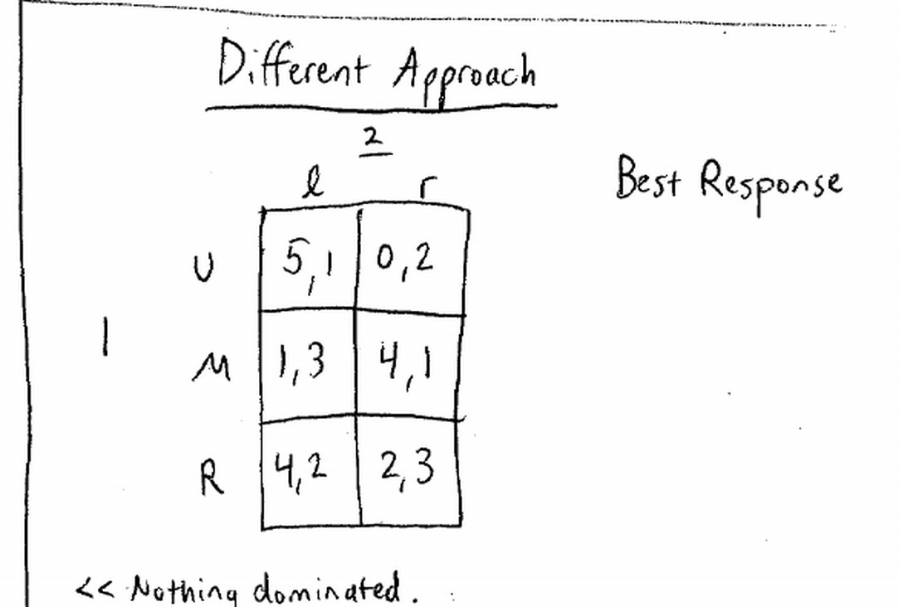
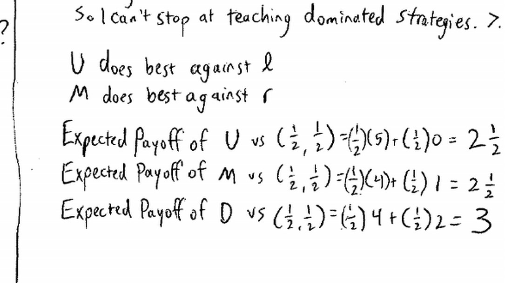
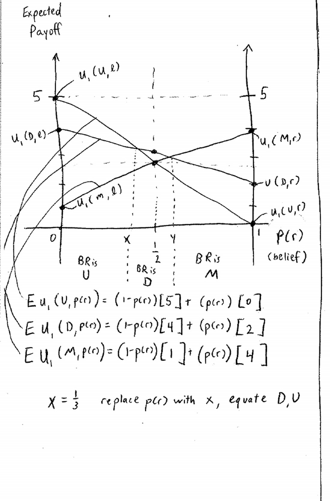

来源：耶鲁大学 ECON 159《博弈论》第三讲（Ben Polak，2007 年 9 月 12 日）· 视频 [BV1xY411Y7Wj P3](https://www.bilibili.com/video/BV1xY411Y7Wj/?p=3)

配套阅读：Dutta《Strategies and Games》第 2 章 §3、第 3–4 章；Watson《Strategy》第 6–8 章；Dixit & Nalebuff《Thinking Strategically》第 3 章 §1–3。

讲义与板书：本文插图取自 Open Yale Courses 官方板书讲义（[lecture-3 页面](https://oyc.yale.edu/economics/econ-159/lecture-3) · [blackboard03 PDF](https://oyc.yale.edu/sites/default/files/blackboard03_0_0.pdf)），引用遵循其 CC BY-NC-SA 3.0 许可。

---

## 一、本讲主线

上一讲用迭代剔除把猜数字游戏一路剔到 1。本讲把同一把刀用在一个政治选举模型上，得到政治学里最著名的结论之一——**中位选民定理（Median Voter Theorem）**；然后认真检讨这个经典模型与现实的差距；最后引入一个新工具**最佳对策（best response）**，为下一讲的纳什均衡铺路。

**WHY：** 为什么同一个"迭代剔除"值得反复用？因为它是最不需要假设的工具：它只要求每个人理性、且知道别人理性。中位选民定理正好展示了它的威力——不需要知道候选人具体怎么想，只要逐轮剔除"没人会选"的极端立场，就逼出了唯一剩下的中间立场。而它的失效之处（候选人无法承诺等）又自然引出下一步：当迭代剔除走不动时，我们需要"给定信念选最优"的最佳对策。

## 二、选举模型：两个候选人选择政治立场

### 2.1 模型设定

老师设计如下博弈：

- **玩家**：两个候选人。
- **策略**：各自在一条政治光谱上选一个立场，光谱共 **10 个位置**，1 是最左翼，10 是最右翼。
- **选民分布**：每个位置上各有 **10% 的选民**，即选民均匀分布在 1–10。
- **投票规则**：选民投给**离自己最近**的候选人；若两人立场到某位置的距离相同，则该位置的选民**对半分**。
- **收益**：候选人最大化自己的**得票份额**。

**WHY：** 为什么不假设候选人"只求胜选"？因为只求胜选时，赢 51% 和赢 90% 没有区别，模型会失去很多信息。假设"最大化得票份额"更有解释力：得票率高意味着民意授权（mandate），在初选里还意味着下一站的势头。这也顺带说明：**收益怎么设定，模型就长什么样**。

### 2.2 第一步：为什么 2 严格占优 1

先问"有没有劣势策略"。答案：位置 1 和 10 都是。以 2 对 1 为例，逐个对手位置算得票率：

| 对手选择 | 我选 1 的得票率 | 我选 2 的得票率 |
|---|---|---|
| 1 | 50% | 90% |
| 2 | 10% | 50% |
| 3 | 15% | 20% |
| 4 | 20% | 25% |
| 5 及以上 | … | 始终比选 1 多 5% |

除了对手也选 1 或 2 的"奇怪"情形，**选 2 总是比选 1 多拿 5%**；而在所有情形下选 2 都不比选 1 差（前两行也更好）。所以 **2 严格占优 1**，1 是严格劣势策略。对称地，**9 严格占优 10**。

注意区分两个说法：**"2 占优 1"不等于"2 打败 1"**。占优说的是"无论对手站哪，选 2 的得票率都更高"；而"2 打败 1"只在两人正面相遇时才有意义。

### 2.3 迭代剔除到底：中位选民定理

剔掉 1 和 10 之后，再看 2：此时 3 是否占优 2？

- 对 2：选 2 得 50%，选 3 得 80%；
- 对 3：选 2 得 20%，选 3 得 50%；
- 对 4：选 2 得 25%，选 3 得 30%；
- 对 5：选 2 得 30%，选 3 得 35%；
- 更高位置同理，3 总比 2 多 5%。

所以在删除 1、10 之后，**3 占优 2**。注意 2 在原博弈里**并不是**劣势策略（对手若选 1，选 2 反而得 90%）；它是**在剔除劣势策略之后才变成劣势的**。

如此反复：

| 轮次 | 剔除 | 依据 |
|---|---|---|
| 第 1 轮 | 1 与 10 | 2 占优 1，9 占优 10 |
| 第 2 轮 | 2 与 9 | 3 占优 2，8 占优 9 |
| 第 3 轮 | 3 与 8 | 4 占优 3，7 占优 8 |
| 第 4 轮 | 4 与 7 | 5 占优 4，6 占优 7 |
| 结果 | 只剩 **5 和 6** | 两者互不占优，平局 |

**预测：两个候选人都会挤向中间，最终都站在 5 或 6 附近。** 由于中间位置的选民（5、6，共 20%）成了决定胜负的人，这个结论被称为**中位选民定理**。

**WHY：** 中位选民为什么有这么大权力？因为在"投给最近者"的规则下，谁占据中间，谁就能把中间选民连同自己一侧的全部选票收入囊中；偏离中间会立刻把中间选民让给对手。逐轮剔除只是把这个直觉推到了逻辑终点：任何偏离中位的立场，都能被更靠中间的一步打败。

### 2.4 同一个模型的两个名字

- 政治学：**Anthony Downs** 1957 年提出，称"中位选民定理"。
- 经济学：**Hotelling** 1929 年用它解释**产品定位**——加油站、便利店为什么总挤在同一个路口，而不是均匀铺开？因为它们也在争夺"离自己最近"的顾客，挤在一起可以避免被对手从位置上抢走客源。

> 老师说：政治学把这叫"同时发现"，不过 1929 年毕竟更早一点。

## 三、模型与现实：哪些批评会动摇结论

老师让学生挑毛病，并逐条回应：

| 批评 | 是否改变结论 |
|---|---|
| 选民并不均匀分布（真实是钟形） | **不改变**：把 10% 均匀换成钟形分布，结论仍旧 |
| 不同群体的投票率不同 | 重要，但本课不展开 |
| 初选与大选不同（美国选举是连环小选举） | 重要，但本课不展开 |
| 选民看"品格"或多维议题，而非单一左右轴 | 重要（多维议题），本课不展开 |
| 可能有两个以上候选人（还有"不投票"这个选项） | 会改变结果，**放到习题集 PS1 里研究** |
| 候选人无法承诺立场，说的话未必可信 | **重要**，下面详述 |

**最后一条是本讲的精华。** 模型默认候选人"说站 5 就真的站 5"，但现实中候选人可能有过去记录（track record），你未必相信他。例子：

- 小布什自称"富有同情心的保守派"（compassionate conservative），试图显得温和；
- 希拉里·克林顿、马萨诸塞州前州长等人在初选中调整姿态，但选民记得他们的既往记录；
- 英国工党在 80、90 年代一次次宣称"我们已经是中间派了"，选民不信；直到托尼·布莱尔 1997 年**直接把当时保守党政府未来五年的财政计划拿来当作自己的计划**——用"照抄"实现了对中间立场的**可信承诺（commitment）**，这才赢得大选。

**WHY：** 为什么"承诺"是模型的死穴？因为中位选民定理依赖"立场可选且可被相信"。一旦候选人无法把自己绑在中位（或选民不相信），选民就只能从其他维度（品格、历史记录）判断，模型就退化。老师也预告：学期后面会专门讲一个"政治家不能选择立场、而选民事先知道其立场"的模型。

## 四、新工具：最佳对策（best response）

### 4.1 一个 3×2 的例子

迭代剔除的刀在这里砍不动了。老师换一个例子：

| 我 ＼ 对手 | Left | Right |
|---|---|---|
| **Up** | 5 | 0 |
| **Middle** | 1 | 4 |
| **Down** | 4 | 2 |

- 若确信对手选 **Left**，我该选 **Up**（5 > 1 > 4）；
- 若确信对手选 **Right**，我该选 **Middle**（4 > 2 > 0）。

但课堂上多数人选 **Down**。为什么？因为它**避开最坏的 0**，而且在"不知道对手选哪边"时更稳妥。这就引出一个新问题：**在不确定对手会怎么做时，怎么选才是最优？**

### 4.2 用信念算期望收益

把"对对手会怎么做的判断"称为**信念（belief）**。

**信念 A：左右各一半（½, ½）**

| 我的选择 | 期望收益 |
|---|---|
| Up | ½×5 + ½×0 = 2.5 |
| Middle | ½×1 + ½×4 = 2.5 |
| Down | ½×4 + ½×2 = **3** |

此时 Down 才是最优——它不只是"安全"，而是真正最大化期望收益。

**信念 B：认为对手选 Left 的概率是 Right 的两倍（2/3, 1/3）**

| 我的选择 | 期望收益 |
|---|---|
| Up | (2/3)×5 + (1/3)×0 = 10/3 |
| Middle | (2/3)×1 + (1/3)×4 = 2 |
| Down | (2/3)×4 + (1/3)×2 = 10/3 |

此时 Up 与 Down 并列最优。

### 4.3 最佳对策函数：一张图看尽所有信念

一般地，设 **p = 我认为对手选 Right 的概率**（则选 Left 的概率是 1−p），三个策略的期望收益都是 p 的直线：

| 策略 | 期望收益 |
|---|---|
| E[Up] | 5(1−p) + 0·p = 5 − 5p |
| E[Middle] | 1(1−p) + 4p = 1 + 3p |
| E[Down] | 4(1−p) + 2p = 4 − 2p |

三条直线两两相交，得到两个分界点：

- **X = 1/3**：Up 与 Down 的交点（此时 Up = Down = 10/3 > Middle = 2）；
- **Y = 3/5**：Down 与 Middle 的交点（此时 Down = Middle > Up）。

于是**最佳对策**随信念分段变化：

| 我认为对手选 Right 的概率 p | 最佳对策 |
|---|---|
| p < 1/3 | Up |
| 1/3 < p < 3/5 | Down |
| p > 3/5 | Middle |

**这就是"最佳对策"：给定你对对手行为的信念，能最大化你期望收益的那个策略。** 图中哪条线最高，最佳对策就是哪条线对应的策略。

**WHY：** 为什么要把三种信念的计算画成一张图？因为它是从"占优/剔除"走向"纳什均衡"的桥梁。占优策略是"不管信念如何都最优"，而现实中大多数策略只在**某些信念下**才最优。一旦我们承认策略依赖信念，下一步就顺理成章：什么样的信念，会在双方都做最佳对策时彼此印证、形成稳定状态？那正是纳什均衡要回答的问题。

## 五、预告：下一讲是最重要的博弈

老师预告：下一讲要用"最佳对策"分析"世界上最重要的博弈"——**足球点球（penalty kick）**，看这套工具如何指导射门与扑救。

## 本节要点总结

1. **选举模型**：两候选人在 1–10 的光谱上选立场，选民均匀分布、投给最近者、平局对半分，候选人的收益是得票份额。
2. **第一轮剔除**：2 严格占优 1、9 严格占优 10——"占优"指无论对手站哪都更好，不等于"正面打败"。
3. **迭代剔除**：1/10 → 2/9 → 3/8 → 4/7，最后只剩 5 和 6，即候选人挤向中间。
4. **中位选民定理**：中间选民决定选举与政策；政治学由 Downs（1957）提出，经济学的对应是 Hotelling（1929）的产品定位与加油站扎堆。
5. **模型的现实检验**：选民分布不均不改变结论；投票率、初选、多维议题、多候选人（PS1）各有影响；**候选人无法可信承诺立场**是最致命的假设。
6. **最佳对策**：给定对对手行为的信念，最大化期望收益的策略。
7. **3×2 例子的最佳对策**：对 Left 选 Up，对 Right 选 Middle；信念 (½,½) 时选 Down 最优；把信念写成 p 后，p<1/3 选 Up、1/3<p<3/5 选 Down、p>3/5 选 Middle。
8. **下一讲**：用最佳对策分析足球点球，并由此引出纳什均衡。

## 参考资料

**课程与视频**

- Open Yale Courses，ECON 159《Game Theory》课程主页：<https://oyc.yale.edu/economics/econ-159>
- 第三讲页面（含官方英文讲稿、习题集 PS1 与板书 PDF）：<https://oyc.yale.edu/economics/econ-159/lecture-3>
- 官方板书讲义：<https://oyc.yale.edu/sites/default/files/blackboard03_0_0.pdf>
- 习题集 1（多候选人扩展）：<https://oyc.yale.edu/sites/default/files/problemset1_1_0.pdf>
- 中文视频（本讲为 P3）：<https://www.bilibili.com/video/BV1xY411Y7Wj/?p=3>

**教材**

- Prajit K. Dutta, *Strategies and Games: Theory and Practice*, MIT Press, 1999, Ch. 2 §3、Ch. 3–4。
- Joel Watson, *Strategy: An Introduction to Game Theory*, Ch. 6–8。

**延伸阅读**

- 中位选民定理：<https://en.wikipedia.org/wiki/Median_voter_theorem>
- Hotelling 空间竞争模型：<https://en.wikipedia.org/wiki/Hotelling%27s_game>
- 最佳对策：<https://en.wikipedia.org/wiki/Best_response>
