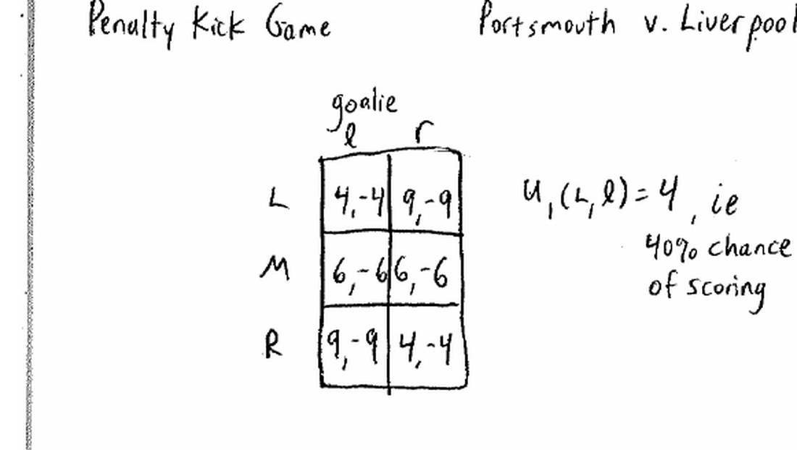
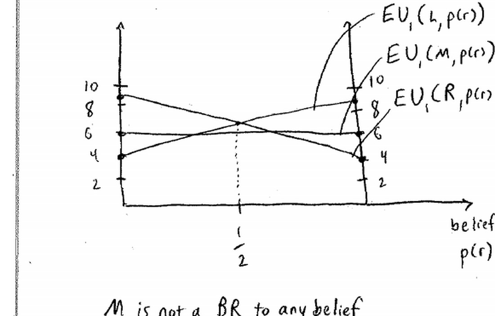
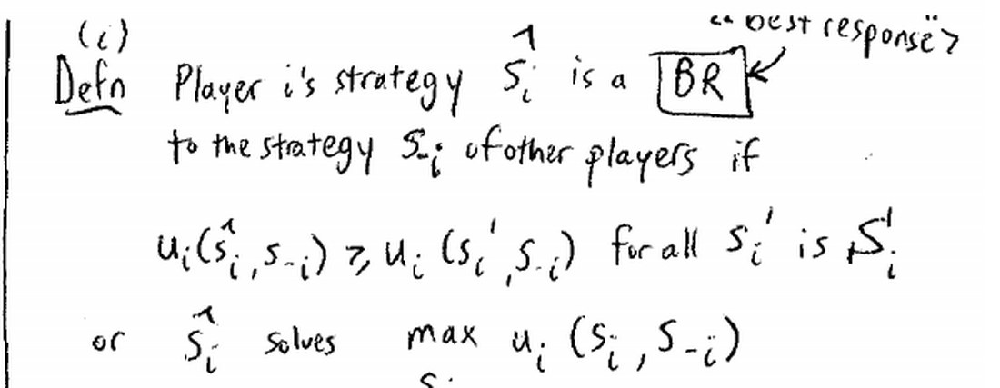
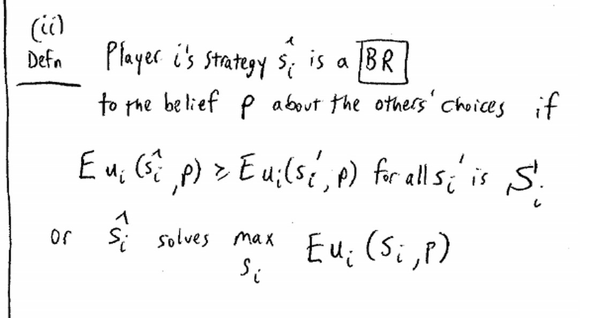
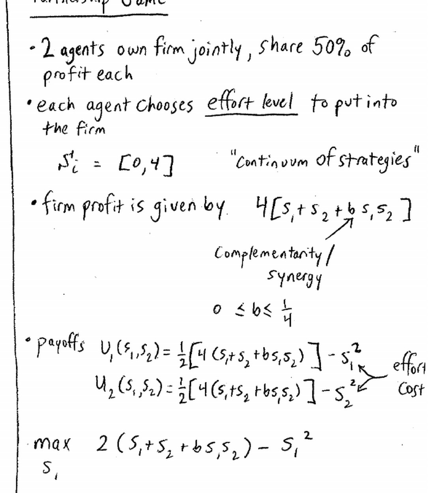
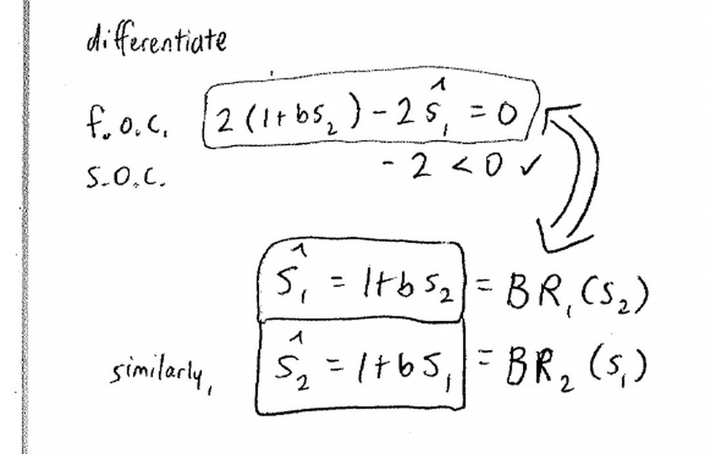
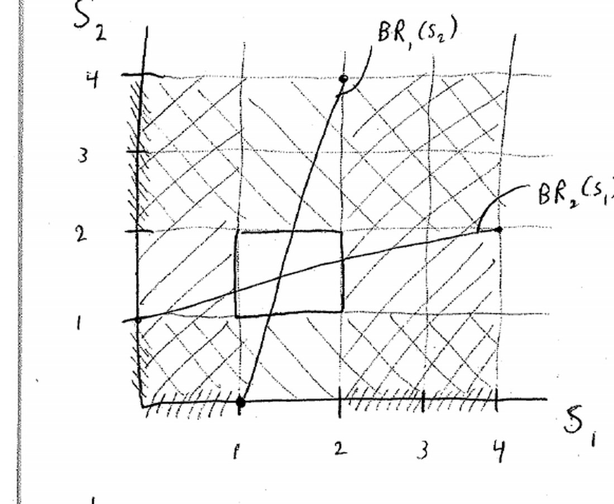
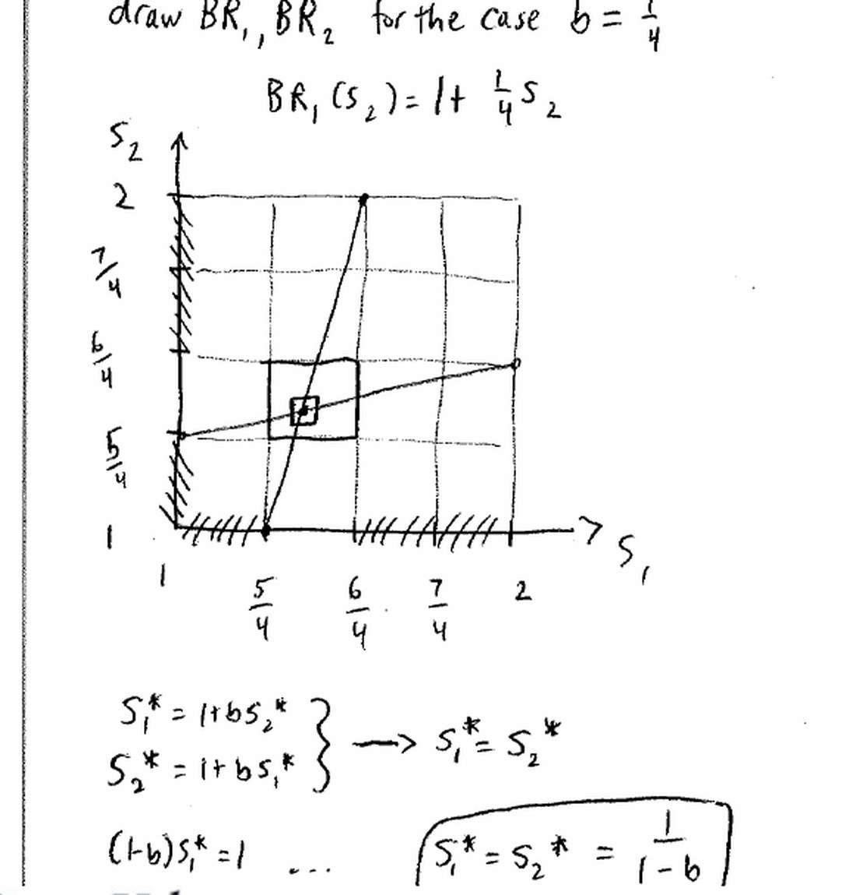

来源：耶鲁大学 ECON 159《博弈论》第四讲（Ben Polak，2007 年 9 月 17 日）· 视频 [BV1xY411Y7Wj P4](https://www.bilibili.com/video/BV1xY411Y7Wj/?p=4)

配套阅读：Dutta《Strategies and Games》第 5 章；Watson《Strategy》第 6–9 章；Dixit & Nalebuff《Thinking Strategically》第 3 章 §4–6。

讲义与板书：本文插图取自 Open Yale Courses 官方板书讲义（[lecture-4 页面](https://oyc.yale.edu/economics/econ-159/lecture-4) · [blackboard04 PDF](https://oyc.yale.edu/sites/default/files/blackboard04_0_0.pdf)），引用遵循其 CC BY-NC-SA 3.0 许可。

---

## 一、本讲主线

上一讲引入"给定信念选最优"的**最佳对策**。本讲先用"世界上最重要的博弈"——**足球点球**——把最佳对策推到一条更强的原则：**不要选择对任何信念都不是最佳对策的策略**；然后把最佳对策写成严格定义；最后用一个**合伙制企业**的例子，引出全课最重要的概念——**纳什均衡（Nash Equilibrium）**。

**WHY：** 为什么点球值得当"最重要的博弈"讲？因为它天生没有占优策略、也没有劣势策略，迭代剔除第一周就卡住了。正因如此，它逼我们发明新工具：既然每个策略只在"某些信念"下才最优，那就反过来——**凡是任何信念下都不最优的策略，直接淘汰**。这条原则比"剔除劣势策略"更宽，能把点球里的"射中间"剔掉，也为后面的纳什均衡铺路。

## 二、点球博弈：为什么不该射中间

### 2.1 设定与收益

- **射门者**可选：左（L）、中（M）、右（R）。
- **守门员**可选：扑左（l）、扑右（r）。（"原地不动"这一选项老师明说"先忽略，后面再谈"。）
- **收益**：射门者的收益 = 进球概率；守门员收益 = 其相反数（零和）。

| 射门者 ＼ 守门员 | 扑左 l | 扑右 r |
|---|---|---|
| **射左 L** | 4, −4 | 9, −9 |
| **射中 M** | 6, −6 | 6, −6 |
| **射右 R** | 9, −9 | 4, −4 |

数字 4 表示 40% 的进球概率，其余类推。

先看有没有占优/劣势策略：**没有**。若守门员扑左，射右最好（9）、射中最次；若守门员扑右，射左最好。三个策略彼此不占优。

### 2.2 用信念算期望收益

设 **p = 我认为守门员扑右的概率**（则扑左概率为 1−p），三条期望收益线为：

| 策略 | 期望收益 |
|---|---|
| E[L] | 4(1−p) + 9p = 4 + 5p |
| E[M] | 6(1−p) + 6p = **6** |
| E[R] | 9(1−p) + 4p = 9 − 5p |

关键观察：**E[M] 恒等于 6，是一条水平线**，而 E[L] 与 E[R] 在 p = 1/2 处相交于 6.5。因此无论 p 取何值，两条斜线中总有一条高于 6：

| 我认为守门员扑右的概率 p | 最佳对策 |
|---|---|
| p < 1/2 | 射右 R |
| p > 1/2 | 射左 L |

**"射中间"对任何信念都不是最佳对策。** 这就是本讲的第一条、也是更一般的一课：

> **不要选择对任何信念都不是最佳对策的策略。**（Don't choose a strategy that is never a best response to any belief.）

注意这里的"任何信念"不只是"守门员一定扑左"或"一定扑右"这两种极端，而是**包括其间所有概率**，比如"左右各一半"。

### 2.3 真实数据与两道修正

老师给出 Chiappori、Levitt 与 Groseclose 在 *AER* 上的真实数据（已按球员惯用脚方向校正，"natural" 指右脚球员的自然方向）：

| 射门者 ＼ 守门员 | 扑自然侧 | 扑反侧 |
|---|---|---|
| **射自然侧** | 63.6% | 94.4% |
| **射反侧** | 89.3% | 43.7% |

数据证实两点：一是射向自然侧确实略占便宜；二是数值并不对称，但**不影响"中间从不是最佳对策"的结论**（同样的分析照做）。

但有两个重要修正：

1. **速度 vs 精度。** 你除了选方向，还要决定"大力抽射"还是"追求角度"。如果你能踢得又快又不准，射左右两侧更容易打飞（进球率下降），而大力射中间反而更难被扑（进球率上升）。在收益图上，这会把两条斜线往下压，从而**在中间"挤"出一块区域——此时射中间可能是最优**。所以"绝不射中间"不是铁律。
2. **守门员可能原地不动。** 本模型忽略了这个选项（留到习题）。

> 真实轶事：老师支持的朴茨茅斯对助教支持的利物浦，比赛中朴茨茅斯获得点球，球员**射向中间被扑出**——正好违反这条原则。老师还补了一句：除非你是德国人。

## 三、把"最佳对策"形式化

### 3.1 对某个策略的最佳对策

玩家 i 的策略 ŝ_i 是其他玩家策略 s_{−i} 的**最佳对策（best response, BR）**，如果

> u_i(ŝ_i, s_{−i}) ≥ u_i(s_i', s_{−i})，对所有 s_i' ∈ S_i 成立。

等价地，ŝ_i 是最大化问题的解：ŝ_i ∈ argmax_{s_i} u_i(s_i, s_{−i})。

注意与旧定义的差别：过去"对所有"限定的是**别人的策略**，这里"对所有"限定的是**我自己的其他可选策略**——我选 ŝ_i，比我选任何别的都（弱）更好。

### 3.2 对信念的最佳对策

玩家 i 的策略 ŝ_i 是**信念 P** 的最佳对策，如果

> E u_i(ŝ_i, P) ≥ E u_i(s_i', P)，对所有 s_i' ∈ S_i 成立。

其中期望就是对信念 P 取期望。例如在点球里：

> E u_i(L, P) = p(l)·u_i(L, l) + p(r)·u_i(L, r)

**WHY：** 为什么要把"最佳对策"分成"对策略"和"对信念"两个定义？因为现实里我们很少确定对手会怎么做。对策略的定义用于"对手确定出招"的场合（如上一讲的汉尼拔）；对信念的定义用于"对手有概率分布"的场合（如点球的混合打法、下面的合伙制企业）。两者形式几乎一样，只是后者多了一层期望。把"信念"显式写出来，才能回答老板那句"你当时为什么这么做"。

## 四、合伙制博弈：从最佳对策到纳什均衡

### 4.1 模型设定

- **玩家**：两个合伙人，共同拥有一家企业，**利润五五分成**。
- **策略**：各自选择投入的努力 S_i，连续区间 S_i = [0, 4]。
- **企业利润**：利润 = 4·[S₁ + S₂ + b·S₁·S₂]，其中 0 ≤ b ≤ 1/4。
- **收益**：各拿一半利润，再减去自己努力的成本：

> u₁(S₁, S₂) = ½·4·[S₁ + S₂ + b S₁ S₂] − S₁² = 2(S₁ + S₂ + b S₁ S₂) − S₁²

u₂ 对称。

**b·S₁·S₂ 是"互补性/协同（synergy）"项**：如果产出只是 S₁ + S₂，两人就没必要合作；正因为一起干有额外收益，团队才有意义。

### 4.2 求最佳对策

固定 S₂，对 S₁ 最大化 u₁：

- 一阶条件（FOC）：2(1 + b S₂) − 2S₁ = 0
- 二阶条件（SOC）：−2 < 0 ✓（确认是最大值）
- 所以 **Ŝ₁ = 1 + b·S₂ = BR₁(S₂)**

由对称性，**Ŝ₂ = 1 + b·S₁ = BR₂(S₁)**。

### 4.3 迭代删除"从不是最佳对策"的策略

把两条最佳对策线画在 (S₁, S₂) 平面上：

- S₂ 最低为 0 ⇒ BR₁ 最低为 **1**；S₂ 最高为 4 ⇒ BR₁ 最高为 **2**。
- 所以 S₁ < 1 或 S₁ > 2 的策略**从不是最佳对策**，删掉。对玩家 2 同理。
- 删完后剩一个小方块；再看方块内，有些策略当初是"对某个已被删掉的选择"的最佳对策，现在也失去意义，继续删。
- 如此**一层套一层**（图上用阴影格表示被删的区域），不断缩小。

这正是上一讲"迭代剔除劣势策略"的升级版：**迭代删除"从不是最佳对策"的策略**。它比"剔除劣势策略"更强——点球里"射中间"不是劣势策略，却能在这里被删掉。

### 4.4 纳什均衡

两条最佳对策线相交之处就是**纳什均衡**。取 b = 1/4 画图后求交点：令 S₁* = S₂* = S*（交点在对角线上），代入 S* = 1 + b·S*：

> **(1 − b)·S* = 1  ⟹  S\* = 1 / (1 − b)**

b = 1/4 时，S\* = 4/3。

**纳什均衡的含义：** 在这个点上，**每个人都正在对对方的策略做出最佳对策**——没有人有动机单方面偏离。

- 若玩家 1 选 S₁*，玩家 2 的最优就是 S₂*；反之亦然。
- 另一种说法：**没有一方愿意挪动**（neither player has an incentive to deviate）。

**回看猜数字博弈：** 它的纳什均衡是"所有人都选 1"。验证：若人人都选 1，平均数就是 1，目标值是 2/3，而数字不能低于 1，所以每个人的最佳对策都是选 1。现实中大家一开始没选 1，但**反复玩下去，选择逐渐向 1 收敛**——这正是纳什均衡好看的地方：真实博弈有时会向它靠拢（当然并非总是如此）。

**WHY：** 为什么"两条线相交"就值得命名、还成为全课核心？因为交点同时满足两个条件：它是每个人的最佳对策，又恰好是别人策略的最佳对策——**相互印证、自我维持**。占优策略不需要猜别人，纳什均衡需要：它把"信念"和"行动"扣成一个闭环。后面从期中考试起的大量内容，都是在不同博弈里找这个交点（或说明它不存在/不唯一）。

### 4.5 效率诊断：努力为什么太低

老师问：这个努力水平是"刚好"还是"太低"？答案是**低于有效水平**（可在习题中证明）。

**原因不是协同，而是外部性（externality）。** 在边际上：

- 我多付出的一单位努力，**全部成本由我承担**（成本项 S_i²）；
- 但它带来的利润要**五五分成，我只拿到一半**。

于是我的私人边际收益只有社会边际收益的一半，努力自然不足。这也解释了为什么利润分成制、共同作业、任何"搭伙项目"都容易投入不够。注意：即使把协同项 b 设为 0，这个问题依然存在——它源于分成，而非协同。

**b 变化会怎样？** b 是协同程度。降低 b：

- BR₁（陡线）变得更陡，BR₂（缓线）变得更平，两线像**剪刀**一样张开；
- 交点向左下移动，**努力水平大幅下降**——而且我知道你会少努力，于是我也少努力，层层叠减。

## 本节要点总结

1. **点球博弈**：射门者选 L/M/R，守门员扑 l/r，收益是进球概率（守门员取负）；没有占优或劣势策略。
2. **射中间从不是最佳对策**：E[M] 恒为 6，E[L]=4+5p、E[R]=9−5p 总有一条不低于 6.5；p<1/2 射右，p>1/2 射左。
3. **一般原则**：不要选择对任何信念都不是最佳对策的策略；"任何信念"包含所有混合概率，不只是纯策略。
4. **现实修正**：真实数据（63.6/94.4/89.3/43.7）不改变结论；但"又快又不准"会让射中间变得可行，守门员原地不动也是遗漏选项。
5. **最佳对策的两个定义**：对某个策略（u_i(ŝ_i,s_{−i}) 对所有 s_i' 最大）与对信念（期望收益最大）。
6. **合伙制博弈**：利润 = 4(S₁+S₂+bS₁S₂)，收益 = ½利润 − S_i²；最佳对策 Ŝ_i = 1 + b·S_j；迭代删除"从不是最佳对策"的策略。
7. **纳什均衡**：两条最佳对策线的交点 S\* = 1/(1−b)（b=1/4 时为 4/3），双方都在对彼此做最佳对策，无人愿意单方面偏离；猜数字博弈的纳什均衡是人人选 1。
8. **外部性**：边际上我承担全部努力成本、却只拿一半收益，导致努力低于有效水平；降低协同 b 会通过"剪刀效应"让努力进一步下降。

## 参考资料

**课程与视频**

- Open Yale Courses，ECON 159《Game Theory》课程主页：<https://oyc.yale.edu/economics/econ-159>
- 第四讲页面（含官方英文讲稿与板书 PDF）：<https://oyc.yale.edu/economics/econ-159/lecture-4>
- 官方板书讲义：<https://oyc.yale.edu/sites/default/files/blackboard04_0_0.pdf>
- 中文视频（本讲为 P4）：<https://www.bilibili.com/video/BV1xY411Y7Wj/?p=4>

**教材与论文**

- Prajit K. Dutta, *Strategies and Games: Theory and Practice*, MIT Press, 1999, Ch. 5。
- P.-A. Chiappori, S. Levitt & T. Groseclose, "Testing Mixed-Strategy Equilibria When Players Are Heterogeneous: The Case of Penalty Kicks in Soccer", *American Economic Review*, 92(4), 2002, pp. 1138–1151. DOI: [10.1257/00028280260344678](https://doi.org/10.1257/00028280260344678)

**延伸阅读**

- 纳什均衡：<https://en.wikipedia.org/wiki/Nash_equilibrium>
- 外部性：<https://en.wikipedia.org/wiki/Externality>
- 最佳对策：<https://en.wikipedia.org/wiki/Best_response>
