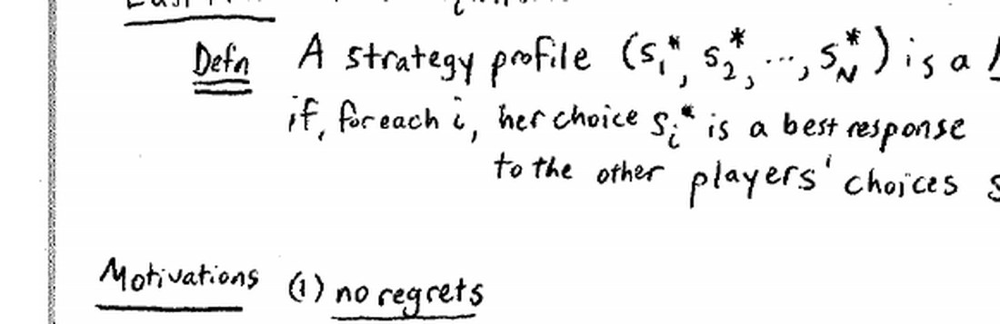
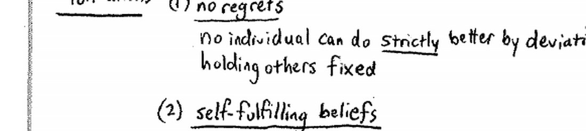
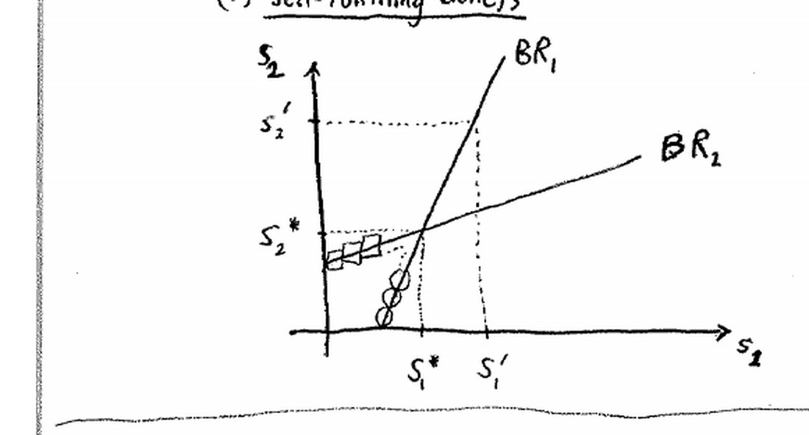
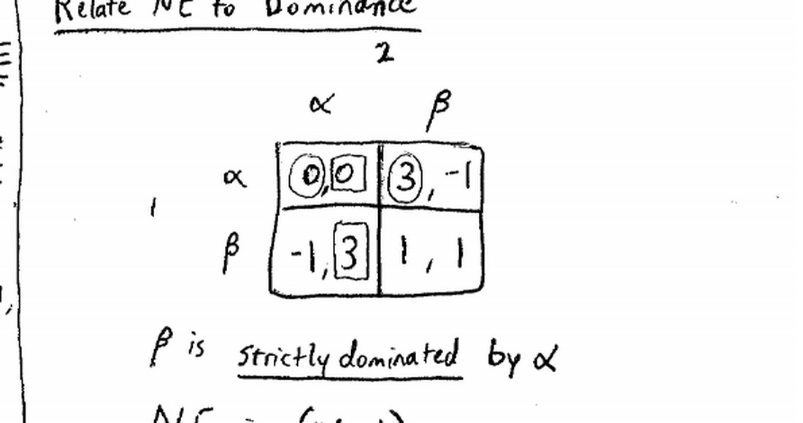
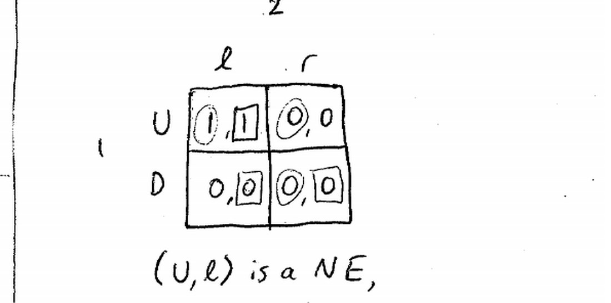
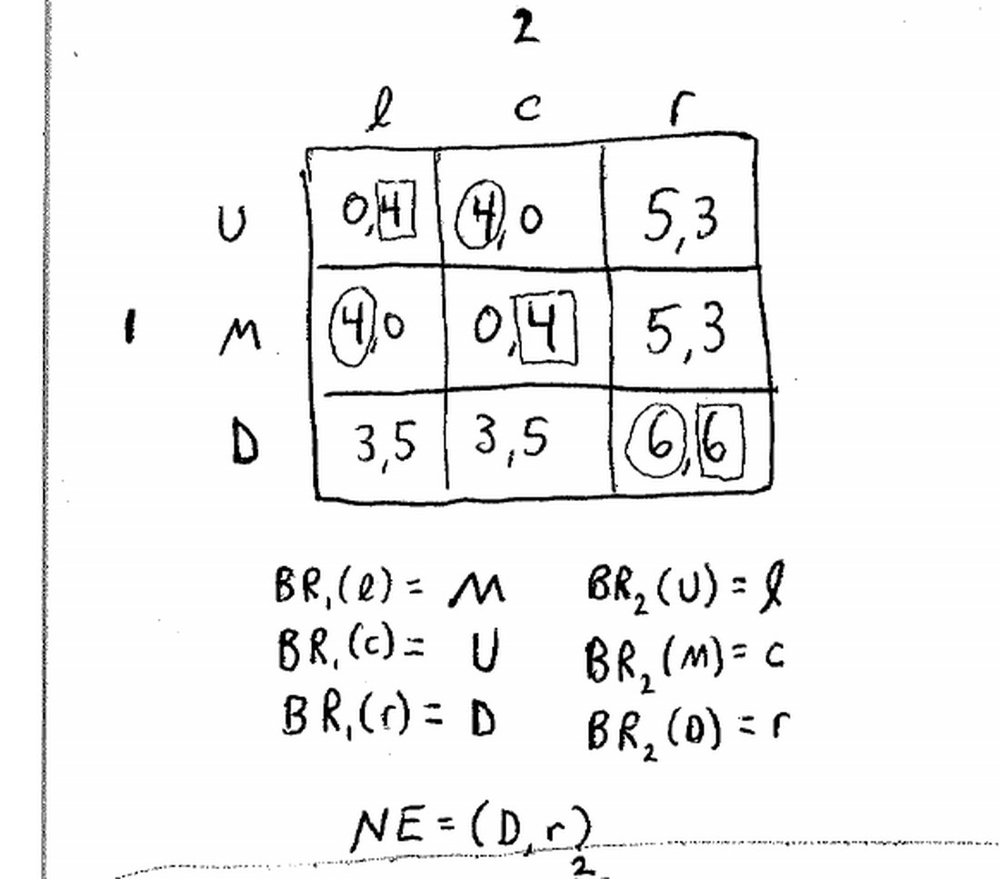
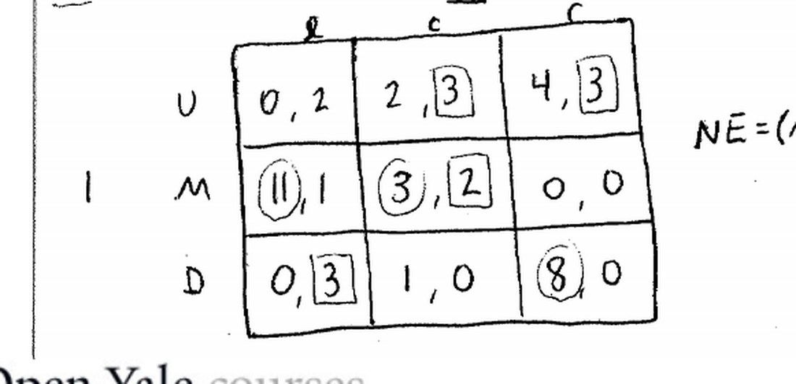
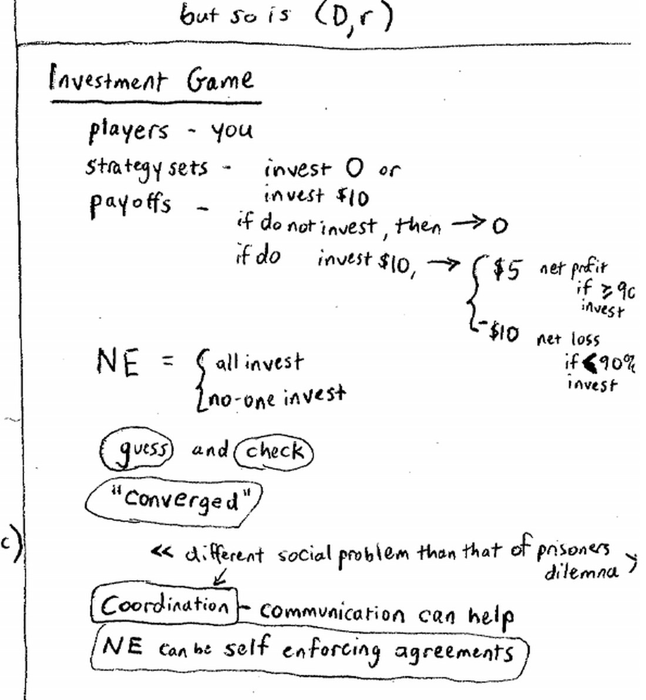

来源：耶鲁大学 ECON 159《博弈论》第五讲（Ben Polak，2007 年 9 月 19 日）· 视频 [BV1xY411Y7Wj P5](https://www.bilibili.com/video/BV1xY411Y7Wj/?p=5)

配套阅读：Dutta《Strategies and Games》第 5 章；Watson《Strategy》第 6–9 章；Dixit & Nalebuff《Thinking Strategically》第 3 章 §4–6。

讲义与板书：本文插图取自 Open Yale Courses 官方板书讲义（[lecture-5 页面](https://oyc.yale.edu/economics/econ-159/lecture-5) · [blackboard05 PDF](https://oyc.yale.edu/sites/default/files/blackboard05_0_0.pdf)），引用遵循其 CC BY-NC-SA 3.0 许可。

---

## 一、本讲主线

上一讲在合伙制博弈里"发现"了纳什均衡。本讲把它写成正式定义，给出两个"为什么要在意它"的理由，练习在简单博弈里找均衡，然后玩一个全班参与的**投资博弈**，说明社会可能协调失败、或协调到一个**坏均衡**（坏风气、银行挤兑），最后指出：**协调问题与囚徒困境不同，光靠沟通就可能把人拉到好均衡上**。

## 二、纳什均衡的正式定义

**定义：** 策略剖面 (s₁*, s₂*, …, s_N*) 是一个**纳什均衡（Nash Equilibrium, NE）**，当且仅当对每个玩家 i，她的选择 s_i* 都是其他玩家选择 s_{−i}* 的**最佳对策**。

也就是说：**每个人都正在对其他人做最佳对策。**

### 2.1 两个动机：为什么在意纳什均衡

老师只给了两个动机（不是三个）：

| 动机 | 含义 |
|---|---|
| **（1）没有后悔（no regrets）** | 事后知道了别人的选择再回头看，没有人能通过单方面改变而**严格**变好。注意是"严格"——弱均衡里可能有"改了也无所谓"的平局。 |
| **（2）自我实现的信念（self-fulfilling beliefs）** | 如果每人都相信别人会按某个 NE 行动，那么每人真的会按它行动：信念本身把均衡"造"了出来。 |

有关"现实会不会收敛到 NE"，老师在后面用两个例子反复提到，但没有把它列为定义级的动机，而更像一种**观察**：猜数字博弈反复玩会向 1 收敛，下面投资博弈会向下滑到"都不投资"。老师称后者为 **self-fulfilling prediction**（自我实现的预言）。

**注意：** 人们并不必然玩纳什均衡。猜数字博弈的 NE 是人人选 1，但第一次玩时全班平均约 13；一个"完全理性"的玩家也可能因为一串自我循环的信念而选错（见 3.3）。NE 是预测工具，不是"理性 ⇒ 必然 NE"的定理。

### 2.2 纳什均衡与占优的关系

先回到囚徒困境：

| | α | β |
|---|---|---|
| **α** | 0, 0 | 3, −1 |
| **β** | −1, 3 | 1, 1 |

α 严格占优 β，NE 是 (α, α)——与"剔除严格劣势策略"的结论一致。

**定理：严格劣势策略绝不会出现在任何纳什均衡中。** 证明：严格劣势策略对任何对手选择都不是最佳对策（占优它的那个总是更好），自然也就不可能是 NE 里的最佳对策。

**但弱劣势策略可以出现在 NE 中。** 反例：

| | l | r |
|---|---|---|
| **U** | 1, 1 | 0, 0 |
| **D** | 0, 0 | 0, 0 |

- **D 被 U 弱占优，r 被 l 弱占优**；
- 却有两个 NE：**(U, l)** 和 **(D, r)**。

因为在 (D, r) 处，谁单方面改变都只是从 0 变成 0，**没有严格动机偏离**。这提醒我们：弱占优不是像严格占优那样"稳固"的概念。

## 三、怎么找纳什均衡：两个 3×3 例子

老师用两个小博弈演示"先求每个人的最佳对策，再看它们在哪里互相吻合"。

### 3.1 例子一

| 玩家1 ＼ 玩家2 | l | c | r |
|---|---|---|---|
| **U** | 0, 4 | 4, 0 | 5, 3 |
| **M** | 4, 0 | 0, 4 | 5, 3 |
| **D** | 3, 5 | 3, 5 | 6, 6 |

最佳对策：BR₁(l)=M、BR₁(c)=U、BR₁(r)=D；BR₂(U)=l、BR₂(M)=c、BR₂(D)=r。

交点：**NE = (D, r)**。在 (D, r) 处玩家 1 对 r 的最优是 D，玩家 2 对 D 的最优是 r。

注意：**每个策略都是"对某个选择的最佳对策"**（U 对 c、M 对 l、D 对 r；l 对 U、c 对 M、r 对 D）。所以在这里用"剔除劣势策略"或"剔除从不是最佳对策的策略"**一无所获**；纳什均衡能给出更精确的预测。

### 3.2 例子二

| 玩家1 ＼ 玩家2 | l | c | r |
|---|---|---|---|
| **U** | 0, 2 | 2, 3 | 4, 3 |
| **M** | 11, 1 | 3, 2 | 0, 0 |
| **D** | 0, 3 | 1, 0 | 8, 0 |

最佳对策：BR₁(l)=M、BR₁(c)=M、BR₁(r)=D；BR₂(U)=c 或 r（**平局**）、BR₂(M)=c、BR₂(D)=l。

交点：**NE = (M, c)**。这里两人收益都不高（3, 2），玩家 1 本想要 11 或 8，但给定玩家 2 选 c，他能拿到的最好就是 3，**没有后悔**。

**注意：最佳对策不一定唯一**——BR₂(U) 在 c 和 r 之间平局（都得 3）。这不影响 NE 的判定，但做题时要逐个检查。

### 3.3 有理性不等于纳什均衡

老师在例子一里演示了一串"循环信念"：玩家 1 可以理性地选 M，因为他认为玩家 2 会选 l；他认为玩家 2 会选 l，因为玩家 2 认为他会选 U；他认为玩家 2 认为他会选 U，因为玩家 2 认为他认为玩家 2 会选 c……**每一环都能自圆其说，却没有一个"固定点"**。

**WHY：** 为什么这段绕口令重要？因为它说明：**理性、甚至理性的相互知识，都不足以推出纳什均衡。** 迭代剔除到"从不是最佳对策的策略"已经是理性论证的极限；NE 需要额外的东西——一个让所有人的信念与行动互相印证的**固定点**。这也解释了为什么"人们必然玩 NE"是错的。

## 四、投资博弈：多玩家、少策略

### 4.1 规则

这是本讲的重头戏，全班一起玩：

- **玩家**：全班每个人。
- **策略**：投资 **\$0** 或 **\$10**。
- **收益**：
  - 不投资 → **\$0**（"不入虎穴，焉得虎子"）；
  - 投资 \$10：
    - 若 **≥90%** 的同学投资 → 毛收益 \$15，净赚 **+\$5**；
    - 若 **<90%** 投资 → 本金全亏，净收益 **−\$10**。
- **禁止交流**，不许打手势、使眼色。

### 4.2 两个纳什均衡（一好一坏）

| 纳什均衡 | 是否稳定 | 好坏 |
|---|---|---|
| **所有人都投资** | 每人的最佳对策都是投资 | **好**，对每个人都严格更好（帕累托占优） |
| **所有人都不投资** | 每人都不愿单方面改变 | **坏**，钱全留在桌上没人拿 |

坏均衡**被好均衡帕累托占优**（每个人都严格更好），可现实却可能停在坏均衡上。

### 4.3 现场实验：为什么滑向坏均衡

- 全班第一次玩，大约**五五开**——已经低于 90% 的门槛；
- 投资者发现亏了，于是下一轮改投"不投资"；
- 反复三轮，行为迅速**收敛到坏均衡**；
- 老师推测：**如果一开始就有 93% 的人投资**，那些没投资的人会后悔，可能反向收敛到好均衡。**起点（门槛附近的历史）很关键。**

这又是"**自我实现的预言**"：只要人人都认为别人不会投资，人人就都不投资；反之亦然。老师把它类比为**熊市 vs 牛市**的信念差异。

### 4.4 这不是囚徒困境，而是协调博弈

| | 囚徒困境 | 投资博弈 |
|---|---|---|
| 不合作策略 | 永远是最佳对策（严格占优） | **不**占优 |
| 别人都合作时 | 仍应背叛 | 投资成为最佳对策 |
| 问题本质 | 个体理性导致集体受损 | 人们**想协调但协调失败** |

所以这是**协调博弈（coordination game）**：大家都希望协调到"投资"，但没人敢先动。它的补救方式是沟通（见第六节）。

### 4.5 怎么找多玩家博弈的 NE：猜与验

玩家很多、每人策略很少时，穷举所有组合不现实。老师的实用方法：

> **先猜一个候选剖面，再检验是否有人愿意单方面偏离（guess and check）。**

猜很难（可能漏掉藏在石头下的均衡），但**检验很容易**——只要确认"没人想动"即可。投资博弈正是这样猜出"全投资"和"全不投资"两个均衡的。板书也把这两个词写在了 NE 旁边：**(guess) and (check)**、**(converged)**。

## 五、协调问题无处不在

协调博弈的普遍结构是：**只有别人都选 A 时我才想选 A；否则我不想选 A**。现实中随处可见：

| 领域 | 协调点 | 坏结果 |
|---|---|---|
| 校园聚会 | 去哪儿、去不去 | 没人去，冷冷清清；或各自乱转 |
| 酒吧/见面地点 | 戏剧学院学生去一家、经济系学生去另一家 | 找不到人 |
| 线上社区/约会网站 | 大家用同一个站 | 站点分散，谁都找不到人 |
| 报纸/电视节目 | 大家都看同一份/同一档（如美国偶像） | 协调到很烂的内容 |
| 时尚 | 英国当年的喇叭裤、中西部审美 | 协调到难看的"坏风气" |
| 技术标准/网络外部性 | 都用同一种软件（如微软）、同一个高清电视标准 | 锁定在较差的标准 |
| 政治"跟风" | 初选都投同一人；赢了艾奥瓦/新罕布什尔就一路赢 | 选出不合适的候选人 |
| 股票交易所 | 都想在同一交易所上市（流动性、共享固定成本） | 垄断或锁定较差交易所 |
| **银行挤兑** | 大家都把存款留在银行 | 大家都去取钱 → 银行倒闭 |

### 5.1 银行挤兑：两个均衡

- **好均衡**：大家相信银行，存款留在银行；银行把大部分钱放贷收利息，人人受益。
- **坏均衡**：信心崩塌，大家排队取款；银行 vault 里的现金不够兑付，于是倒闭。

老师讲课时（2007 年 9 月）英国**北岩银行（Northern Rock）**正在发生真实挤兑，储户在伦敦街头排长队，英格兰银行出面干预以恢复信心。这正是**从好均衡跳到坏均衡**——而且它不是教科书推演，是当时正在发生的新闻。

电影《生活多美好》（*It's a Wonderful Life*）里也有一场挤兑，但没有倒闭。为什么？因为**吉米·斯图尔特**站出来演讲：他说（用博弈论的话）"这个游戏有两个均衡，一个坏、一个好，好均衡对大家都更好，所以我们选择把钱留在银行"。储户被说服，留在好均衡。老师借这个例子引出下一节。

**WHY：** 为什么银行挤兑是协调博弈而不是囚徒困境？因为"去取钱"并不是永远最优：如果大家都留着，我也应该留着；如果大家都取，我才必须去取。危险恰恰在于——**好均衡很脆弱，一个信念的转折就能把整个系统推向坏均衡**。这也是为什么存款保险、央行最后贷款人这类制度有价值：它们改变收益，让坏均衡不再有吸引力。

## 六、协调问题 vs 囚徒困境：沟通的作用

老师让 Patrick 用**五秒钟**说服全班投资。结果：第四次玩时，**绝大多数人（可能约 90%）都投资了**。Patrick 没有出钱、没有行贿、没有签合同、也没有威胁——他只是指出"投了更好"。

对比剖析：

| | 囚徒困境 | 协调问题 |
|---|---|---|
| Patrick 说"大家都选 β 更划算" | 说了也没用，大家照样选 α | 说了就有效，大家改选投资 |
| 原因 | β 是**严格劣势策略**，说服你玩劣势策略违背你的利益 | 他劝你玩的是**另一个纳什均衡**，对你有利 |
| 补救 | 需要合同、侧支付、监管——**改变收益** | **光靠沟通**就够了 |

**关键结论：**

> 在协调问题里，与囚徒困境不同，**仅仅沟通就能起作用**。沟通能说服彼此去玩那个更好的纳什均衡，而纳什均衡可以是一份**自我执行的协议（self-enforcing agreement）**——不需要合同、不需要行贿、不需要威胁，因为按它行动本来就符合每个人的利益。

## 本节要点总结

1. **纳什均衡定义**：策略剖面中，每个人的策略都是其他人策略的最佳对策。
2. **两个动机**：没有后悔（no regrets）、自我实现的信念（self-fulfilling beliefs）；"现实会收敛"是老师反复提到的观察，但不属于定义级动机。
3. **与占优的关系**：严格劣势策略绝不会出现在 NE 中；弱劣势策略可以（2×2 反例有两个 NE）。
4. **找 NE 的方法**：先求每人针对每种情况的最佳对策，再看哪里互相吻合；多玩家时用"猜与验"。最佳对策可能不唯一（有平局）。
5. **理性不足以保证 NE**：循环信念可以让每个选择都自圆其说却没有固定点。
6. **投资博弈**：投资 \$10、≥90% 才有 +\$5、否则 −\$10；两个 NE——全投资（好、帕累托占优）与全不投资（坏）；现场从五五开滑向坏均衡，起点很关键。
7. **协调博弈 vs 囚徒困境**：前者不合作策略不占优，人们想协调却可能失败；后者不合作是严格占优。
8. **协调问题普遍存在**：聚会、见面地点、网站、媒体、时尚、技术标准、政治跟风、交易所、**银行挤兑**（北岩银行、《生活多美好》）。
9. **沟通能救协调问题**：Patrick 五秒演讲把全班拉到好均衡；NE 可以是自我执行的协议，而囚徒困境必须改变收益。

## 参考资料

**课程与视频**

- Open Yale Courses，ECON 159《Game Theory》课程主页：<https://oyc.yale.edu/economics/econ-159>
- 第五讲页面（含官方英文讲稿、习题集 PS2 与板书 PDF）：<https://oyc.yale.edu/economics/econ-159/lecture-5>
- 官方板书讲义：<https://oyc.yale.edu/sites/default/files/blackboard05_0_0.pdf>
- 习题集 2：<https://oyc.yale.edu/sites/default/files/problemset2_1_0.pdf>
- 中文视频（本讲为 P5）：<https://www.bilibili.com/video/BV1xY411Y7Wj/?p=5>

**教材**

- Prajit K. Dutta, *Strategies and Games: Theory and Practice*, MIT Press, 1999, Ch. 5。
- Joel Watson, *Strategy: An Introduction to Game Theory*, Ch. 6–9。

**延伸阅读**

- 纳什均衡：<https://en.wikipedia.org/wiki/Nash_equilibrium>
- 协调博弈：<https://en.wikipedia.org/wiki/Coordination_game>
- 银行挤兑与 Diamond–Dybvig 模型：<https://en.wikipedia.org/wiki/Diamond%E2%80%93Dybvig_model>
- 北岩银行挤兑事件（2007）：<https://en.wikipedia.org/wiki/Northern_Rock>
