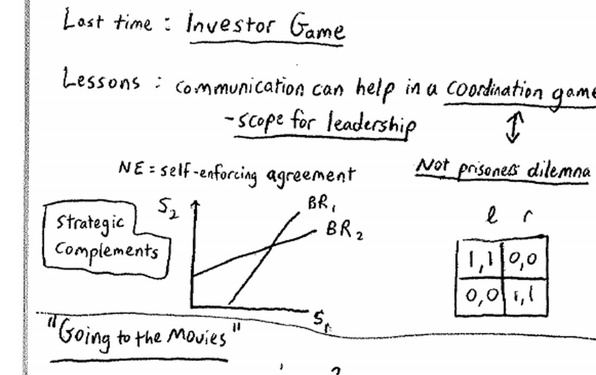
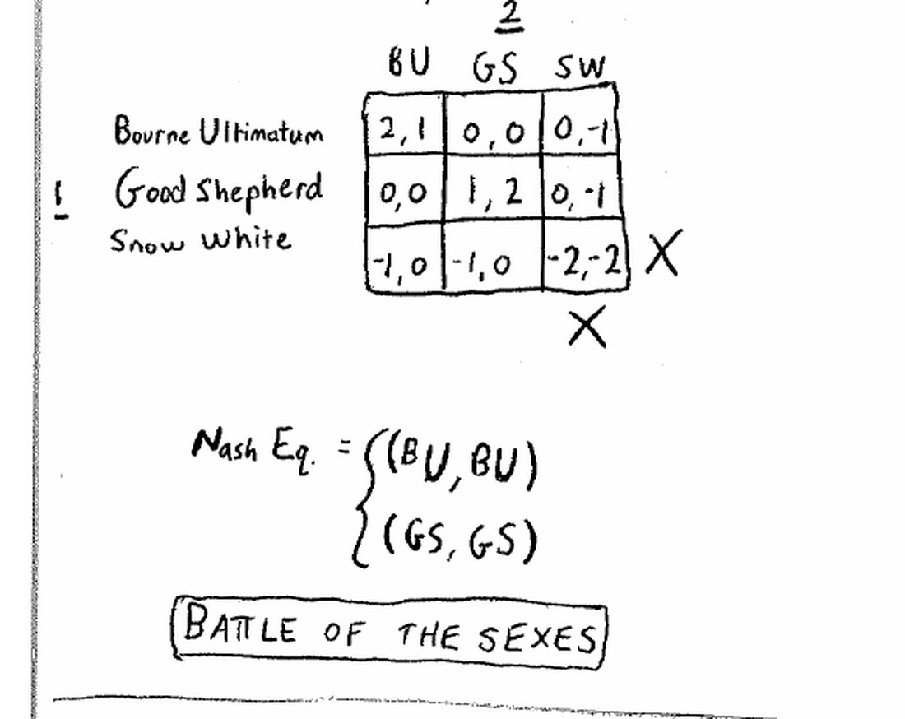
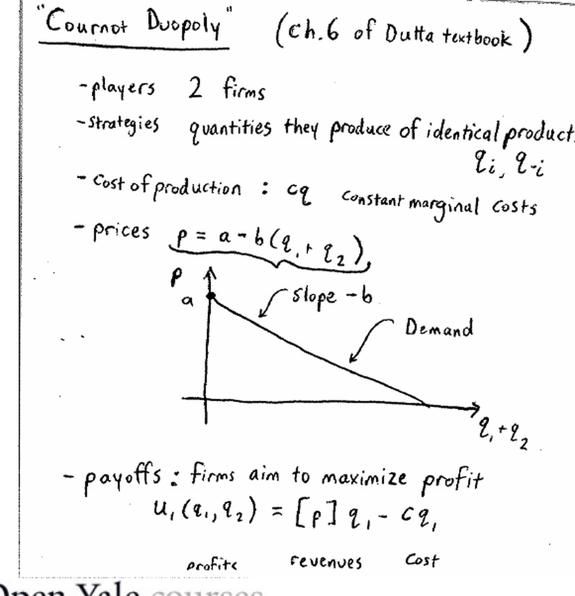
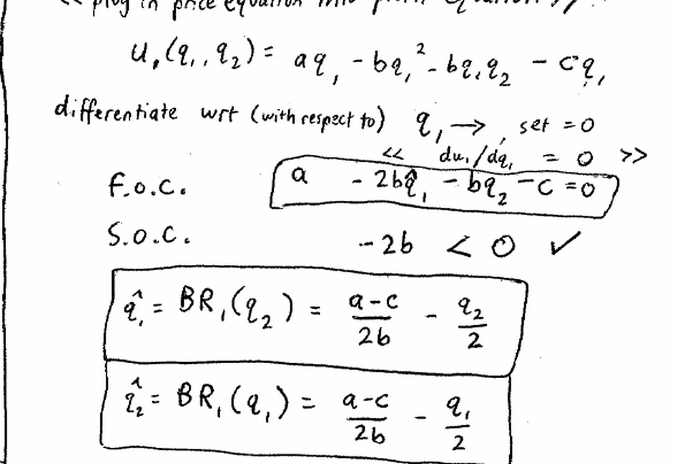
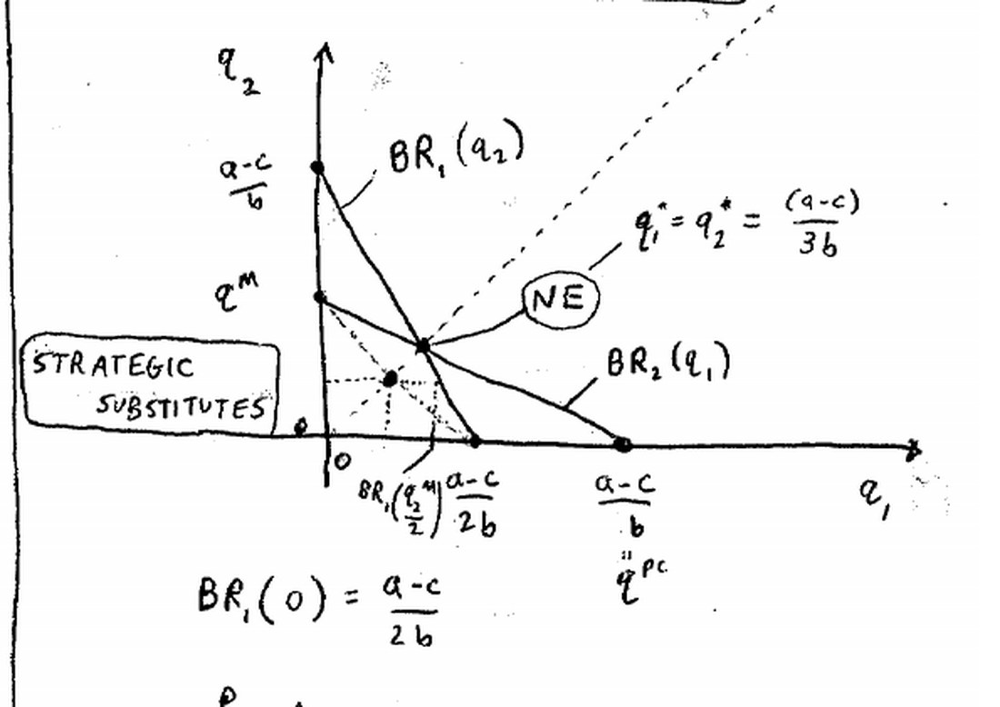
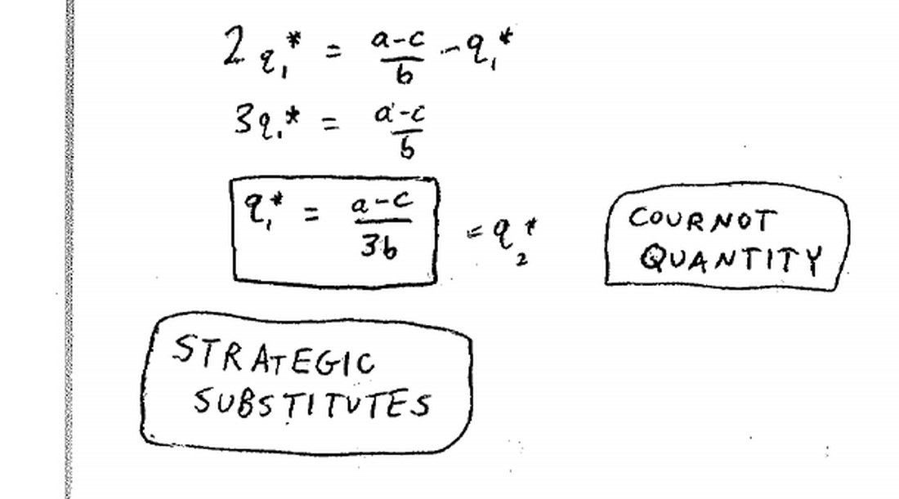
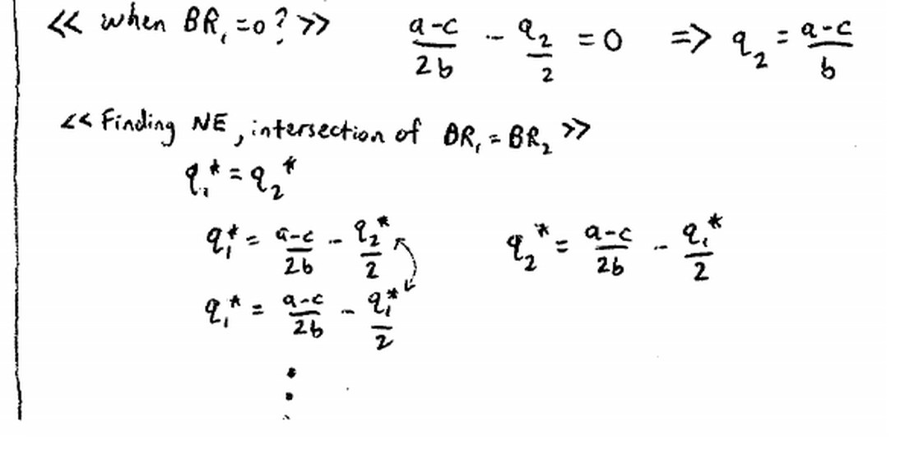
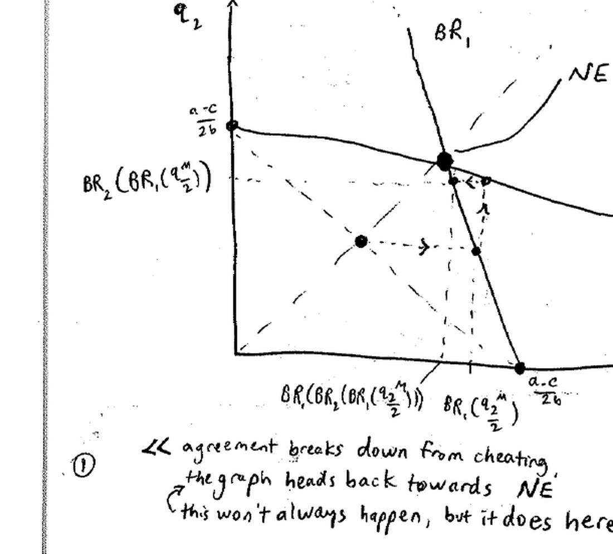
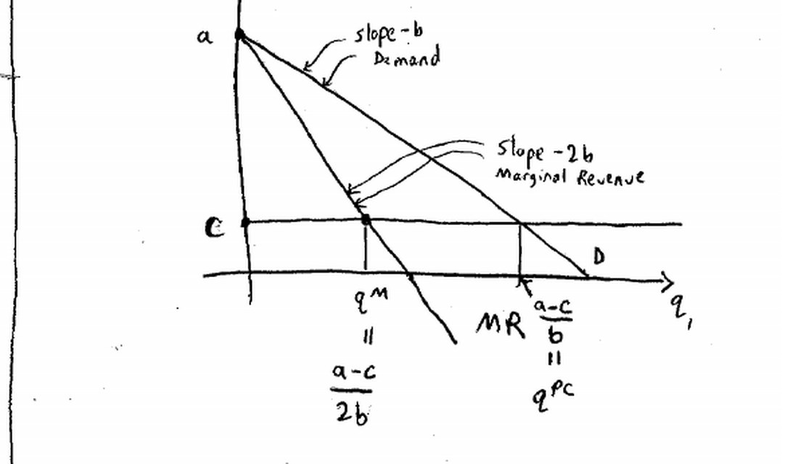
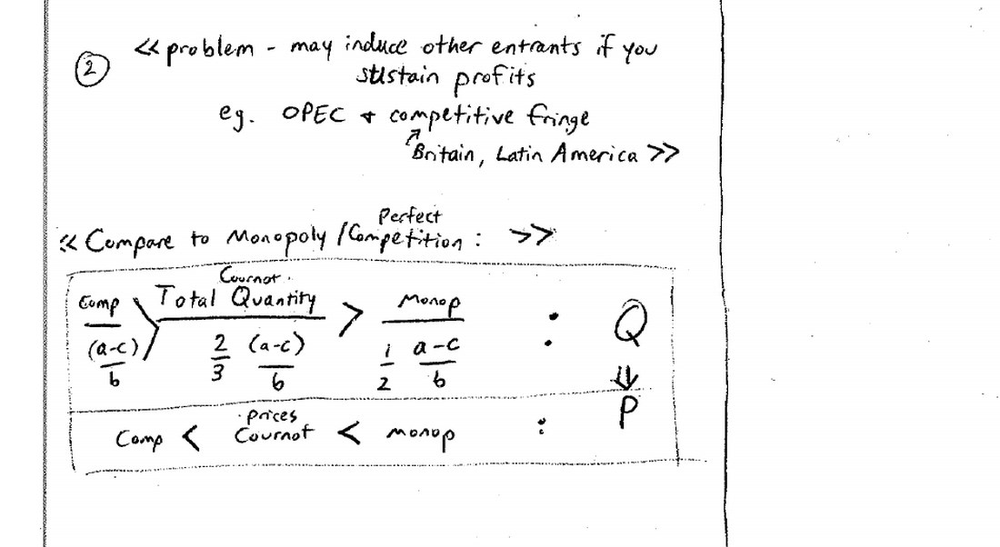

来源：耶鲁大学 ECON 159《博弈论》第六讲（Ben Polak，2007 年 9 月 24 日）· 视频 [BV1xY411Y7Wj P6](https://www.bilibili.com/video/BV1xY411Y7Wj/?p=6)

配套阅读：Dutta《Strategies and Games》第 6–7 章（古诺模型见第 6 章）；Watson《Strategy》第 10 章；Dixit & Nalebuff《Thinking Strategically》第 9 章 §5。

讲义与板书：本文插图取自 Open Yale Courses 官方板书讲义（[lecture-6 页面](https://oyc.yale.edu/economics/econ-159/lecture-6) · [blackboard06 PDF](https://oyc.yale.edu/sites/default/files/blackboard06_0_0.pdf)），引用遵循其 CC BY-NC-SA 3.0 许可。

---

## 一、本讲主线

上一讲的协调博弈里，所有人对"哪个均衡更好"意见一致。本讲先看一个**有利益冲突的协调博弈**——约会看电影（Battle of the Sexes）；再花大半节课分析博弈论史上最经典的模型之一——**古诺双头垄断（Cournot Duopoly）**，它是第一个"玩家很少、策略却是连续量"的博弈，也第一次让我们能比较**垄断、寡头、完全竞争**三种市场的福利。

**WHY：** 为什么这两件事放在一起？它们回答同一类问题："当大家的利益既有一致、又有冲突时，均衡在哪里？"约会博弈告诉我们协调可能因"谁来让步"而失败；古诺模型则把均衡、偏离激励、福利串成一条完整的分析链，是后面所有寡头与产业组织博弈的模板。

## 二、约会博弈：Battle of the Sexes

### 2.1 先回顾"纯协调"与策略互补

- 上讲的**投资博弈**：每个人都希望均衡是"都投资"，意见完全一致——这是**纯协调博弈**。
- 判断一个博弈是否"策略互补"，看最佳对策线的斜率：**别人做得越多，我越想做**，最佳对策线向上倾斜，就叫**策略互补（strategic complements）**。合伙制博弈与投资博弈都是。

老师还举了一个极简协调博弈：

| | l | r |
|---|---|---|
| **U** | 1, 1 | 0, 0 |
| **D** | 0, 0 | 1, 1 |

它有两个纯协调均衡 (U,l) 和 (D,r)，大家只想"协调上"，至于协调到哪一个无所谓。**这种博弈是领导力发挥作用的地方**——只要有人说一句"我们就去这里"，协调就能完成。老师特别提到：回看几年前的**卡特里娜飓风**善后，就能体会协调失败可以糟到什么程度。

### 2.2 看电影博弈

一对情侣约好去看电影却没约好看哪一部。影院有三部片：

- **BU** =《谍影重重 3》（*The Bourne Ultimatum*，动作片，女方最爱）
- **GS** =《牧羊人》（*Good Shepherd*，剧情片，男方最爱）
- **SW** =《白雪公主》（两人都不想在约会时看）

收益矩阵：

| 她 ＼ 他 | BU | GS | SW |
|---|---|---|---|
| **BU** | 2, 1 | 0, 0 | 0, −1 |
| **GS** | 0, 0 | 1, 2 | 0, −1 |
| **SW** | −1, 0 | −1, 0 | −2, −2 |

解读：

- **SW 对两人都是劣势策略**（万一协调到它，还要在咖啡馆被逼着聊它），先剔除；
- 剩下两个均衡：**(BU, BU)** 和 **(GS, GS)**；
- 但**她更喜欢 (BU, BU)（她得 2）**，**他更喜欢 (GS, GS)（他得 2）**——两人对"协调到哪个均衡"存在**利益冲突**。

### 2.3 沟通能帮忙，但不再是万能药

- 在"纯协调"里，随便谁喊一句就能协调（上讲的 Patrick）。
- 在这里，沟通仍能起作用：现实中她直接说"我要去 BU"，一下就把协调点定下来了。
- 但沟通也可能**谈崩**：如果双方都坚持自己偏好的均衡，就可能暂时无解。老师用当天**通用汽车与汽车工人工会的罢工谈判**作例子：大家都认为"达成协议"好过"罢工"，可因为健康与养老金上的利益冲突，仍可能谈不成。

**这就是 Battle of the Sexes（性别战）**：它是协调博弈，但不同人对协调点有不同偏好。它告诉我们——**沟通本身不是免费的午餐，协调点还需要有人让步**。

**WHY：** 为什么这个游戏重要？它把"协调"从"纯技术问题"变成"分配问题"。纯协调博弈靠领导力即可；Battle of the Sexes 还需要**谈判、让步、承诺**。现实中的劳资谈判、联盟组建、标准之争，大多带有这种"都想合作、但对合作方案有分歧"的结构。

## 三、古诺双头垄断：Cournot Duopoly

### 3.1 模型设定

| 要素 | 设定 |
|---|---|
| 玩家 | 两家企业（生产完全同质的产品） |
| 策略 | 各自的产量 q₁、q₂（连续量，不是离散选项） |
| 成本 | 总成本 = c·qᵢ（**常数边际成本 c**） |
| 价格 | p = a − b(q₁ + q₂)，a > c，b > 0 |
| 收益 | 利润 = 收入 − 成本 = p·qᵢ − c·qᵢ |

需求曲线 p = a − b(q₁+q₂) 向下倾斜（斜率 −b）：两家总产量越大，市场价格越低。

把 p 代入利润，用 Firm 1 展开：

> u₁(q₁, q₂) = [a − b(q₁ + q₂)]·q₁ − c·q₁ = a q₁ − b q₁² − b q₁ q₂ − c q₁

### 3.2 求最佳对策

固定 q₂，对 q₁ 最大化 u₁：

- 一阶条件（FOC）：**a − 2b q₁ − b q₂ − c = 0**
- 二阶条件（SOC）：−2b < 0 ✓
- 解得 **q̂₁ = BR₁(q₂) = (a − c)/(2b) − q₂/2**

由对称性 **q̂₂ = BR₂(q₁) = (a − c)/(2b) − q₁/2**。

两个端点有清晰的经济含义：

- 若对手不生产（q₂ = 0），BR₁(0) = (a − c)/(2b) = **垄断产量 q^M**——对手缺席时我就是垄断者；
- 若对手产量达到 q₂ = (a − c)/b，则 BR₁ = 0——此时价格已被压到成本 c，我再生产只会亏本，索性不生产；这个 q₂ 正是**完全竞争产量 q^PC**。

因此 BR₁ 是从 (q₂=0, q₁=q^M) 线性降到 (q₂=q^PC, q₁=0) 的**向下倾斜直线**。

**关键区别：古诺博弈的最佳对策线向下倾斜**——对手产量越多，我的最优产量越少。这与合伙制/投资博弈相反，叫**策略替代（strategic substitutes）**。

### 3.3 纳什均衡

两条最佳对策线的交点就是纳什均衡。由对称性 q₁* = q₂* = q*，代入：

q* = (a − c)/(2b) − q*/2 → 2q* = (a − c)/b − q* → 3q* = (a − c)/b → **q* = (a − c)/(3b)**

这就是**古诺产量（Cournot quantity）**，落在垄断产量 (a − c)/(2b) 与竞争产量 (a − c)/b 之间。

历史：古诺在 1838 年就解出了这个结果，比纳什均衡的概念早了约一百年。

### 3.4 卡特尔为何难以维持

既然两家都想多赚钱，为什么不联手把总产量压到垄断水平 q^M、各生产 q^M/2？

1. **偏离激励。** 若对方真的只产 q^M/2，我的最佳对策不是 q^M/2，而是"对 q^M/2 的最佳对策"——比 q^M/2 多得多。对方预见到我会多产，于是他也多产……**最佳对策的相互调整会把产量一路拖回古诺均衡**（除非有法院或黑手党强制执行，而限制产量的合同本身违法）。
2. **法律禁止。** 签订"限制产量"的合同是违法的。
3. **新进入者。** 若卡特尔把价格维持在成本之上，行业里就会长出一个**竞争性边缘（competitive fringe）**。20 世纪初美国的纸、橡胶、钢铁、铁路卡特尔都很快被新进入者侵蚀；更现代的例子是 OPEC——它成立后，英国（北海）、拉美各国、俄罗斯的石油迅速增产。

**WHY：** 为什么"相互做最佳对策"会把卡特尔拖垮？因为古诺博弈是**策略替代**：你减产会诱使我增产。这正好和协调博弈相反——协调博弈里策略互补，互相跟风会把大家推向同一个均衡；而策略替代下，任何试图合作的减产都会被对方的增产吃掉，于是唯一稳定的落点就是各自的古诺产量。

### 3.5 福利比较：垄断 vs 古诺 vs 完全竞争

先看垄断者的选择：垄断者面对同一条需求曲线，但边际收益曲线斜率是需求的两倍（−2b），令 MR = MC 得 q^M = (a − c)/(2b)，对应最高价格。

| 市场结构 | 总产量 | 价格 | 生产者利润 | 消费者剩余 |
|---|---|---|---|---|
| 垄断 | q^M = (a − c)/(2b) | 最高 | 最高 | 最低 |
| 古诺双头 | 2(a − c)/(3b) | 居中 | 居中 | 居中 |
| 完全竞争 | q^PC = (a − c)/b | = c（最低） | 0 | 最高 |

数量顺序：**q^M < 古诺总产量 < q^PC**（即 (a−c)/(2b) < 2(a−c)/(3b) < (a−c)/b），价格与利润顺序相反。也就是说，古诺均衡对**生产者**比竞争好、比垄断差；对**消费者**比垄断好、比竞争差。

## 本节要点总结

1. 纯协调 vs 有冲突的协调：投资博弈里人人偏好同一均衡；*Battle of the Sexes* 里双方各有偏爱。
2. 看电影博弈：SW 对两人都是劣势策略；两个 NE 是 (BU,BU) 与 (GS,GS)，她爱前者、他爱后者；沟通有帮助，但可能因利益冲突而谈崩。
3. 策略互补：别人做得越多我越想做（合伙制、投资，最佳对策线向上）；策略替代：别人生产越多我越少生产（古诺，最佳对策线向下）。
4. 古诺模型：p = a − b(q₁+q₂)，成本 cq；FOC a − 2bq₁ − bq₂ − c = 0；BR 向下倾斜。
5. BR 的两个端点：q₂=0 时是垄断产量 (a−c)/(2b)；BR=0 时对手产量是竞争产量 (a−c)/b。
6. 古诺纳什均衡：q₁* = q₂* = (a−c)/(3b)（Cournot, 1838）。
7. 卡特尔难维持：偏离激励 + 合同违法 + 竞争性边缘进入；最佳对策调整会把人拖回古诺。
8. 福利：q^M < 古诺 < q^PC，价格与利润反向；古诺居中。垄断的 MR 斜率为 −2b，据此解出 q^M。

## 参考资料

**课程与视频**

- Open Yale Courses，ECON 159《Game Theory》课程主页：<https://oyc.yale.edu/economics/econ-159>
- 第六讲页面（含官方英文讲稿与板书 PDF）：<https://oyc.yale.edu/economics/econ-159/lecture-6>
- 官方板书讲义：<https://oyc.yale.edu/sites/default/files/blackboard06_0_0.pdf>
- 中文视频（本讲为 P6）：<https://www.bilibili.com/video/BV1xY411Y7Wj/?p=6>

**教材**

- Prajit K. Dutta, *Strategies and Games: Theory and Practice*, MIT Press, 1999, Ch. 6（古诺模型）与 Ch. 7。
- Joel Watson, *Strategy: An Introduction to Game Theory*, Ch. 10。

**延伸阅读**

- 古诺竞争：<https://en.wikipedia.org/wiki/Cournot_competition>
- 性别战（Battle of the Sexes）：<https://en.wikipedia.org/wiki/Battle_of_the_sexes_(game_theory)>
- 策略互补与策略替代：<https://en.wikipedia.org/wiki/Strategic_complements>
- OPEC 与竞争性边缘：<https://en.wikipedia.org/wiki/OPEC>
