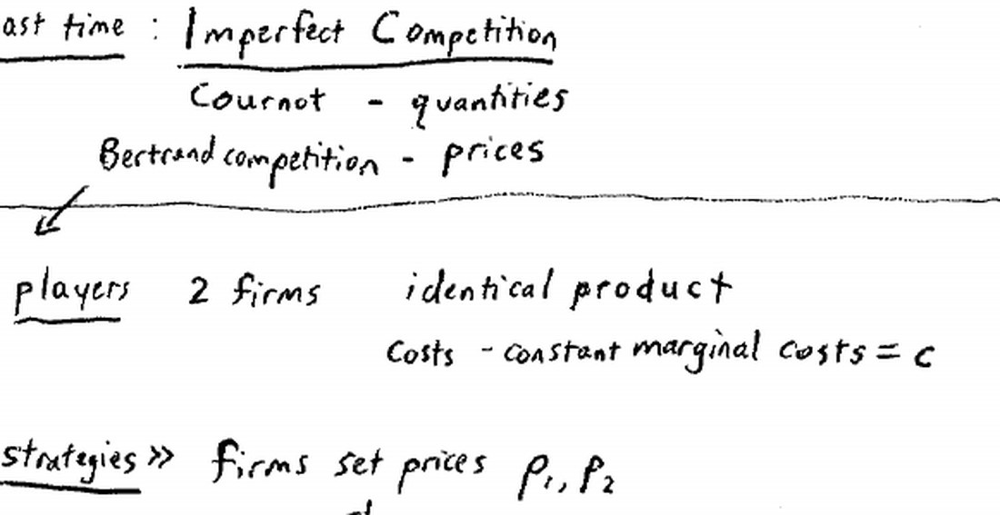
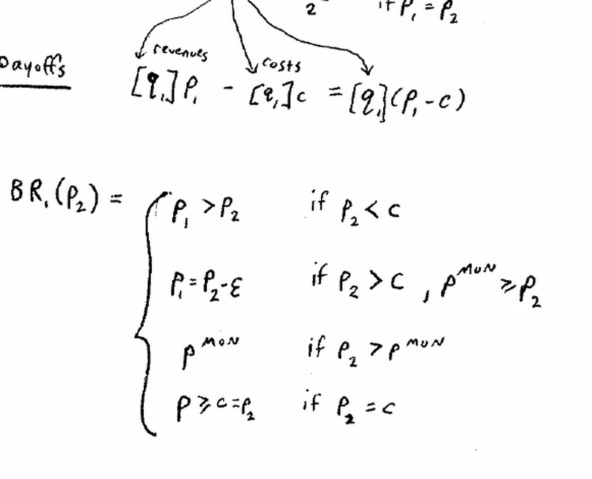
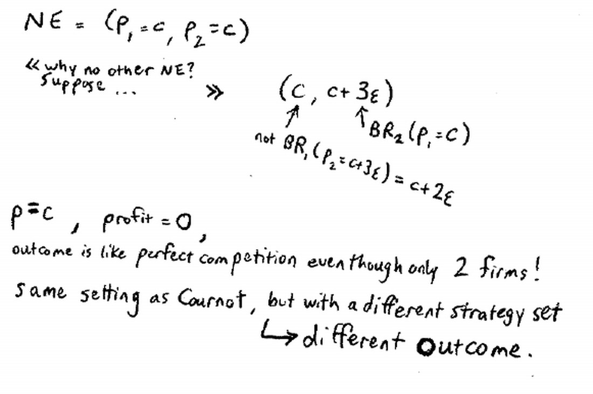
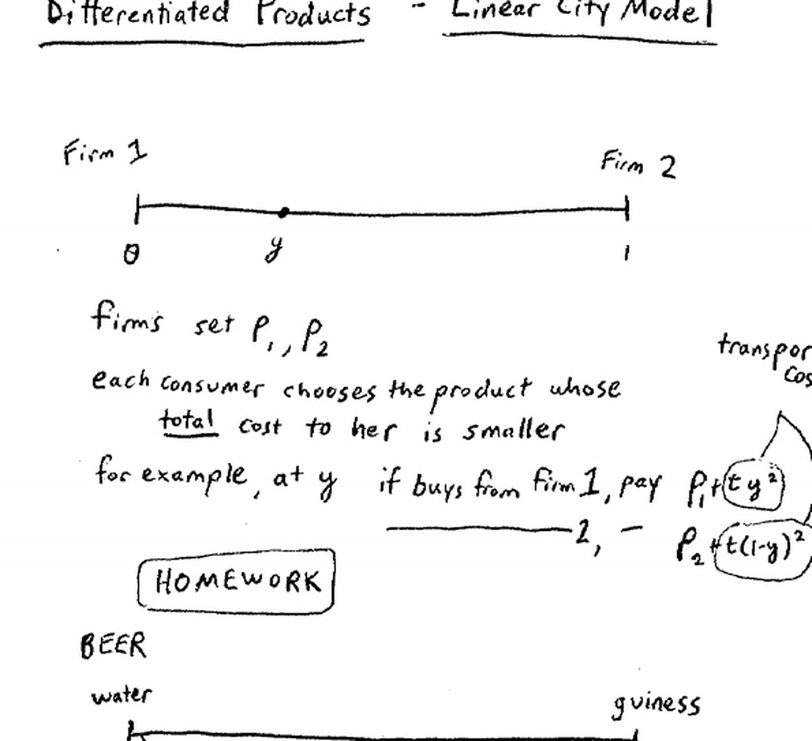
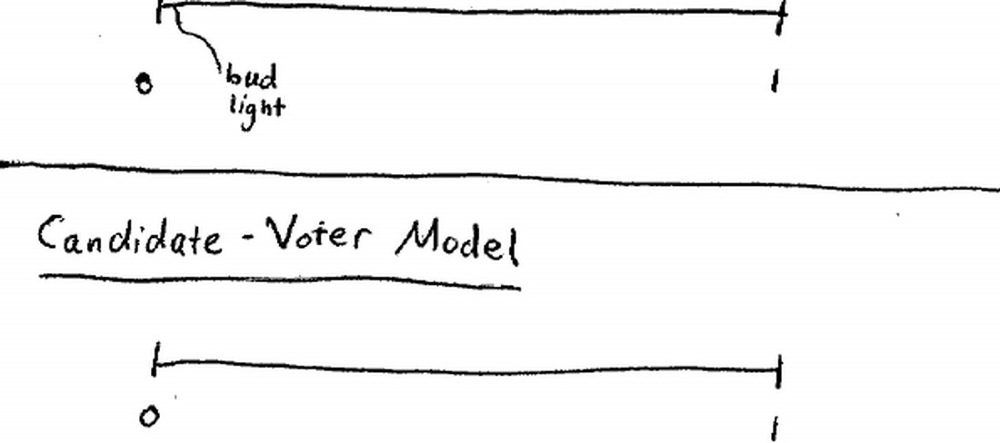
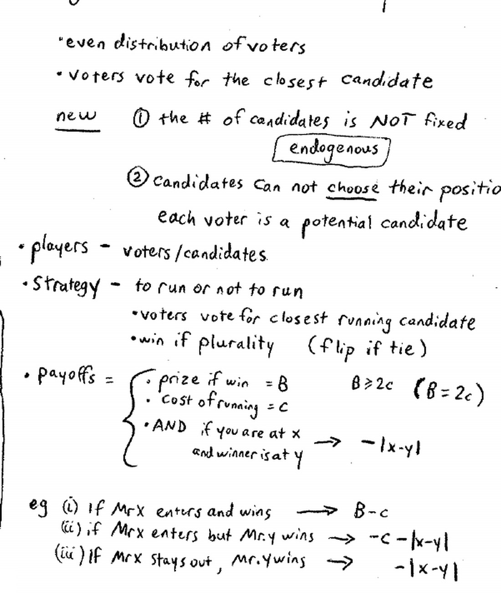
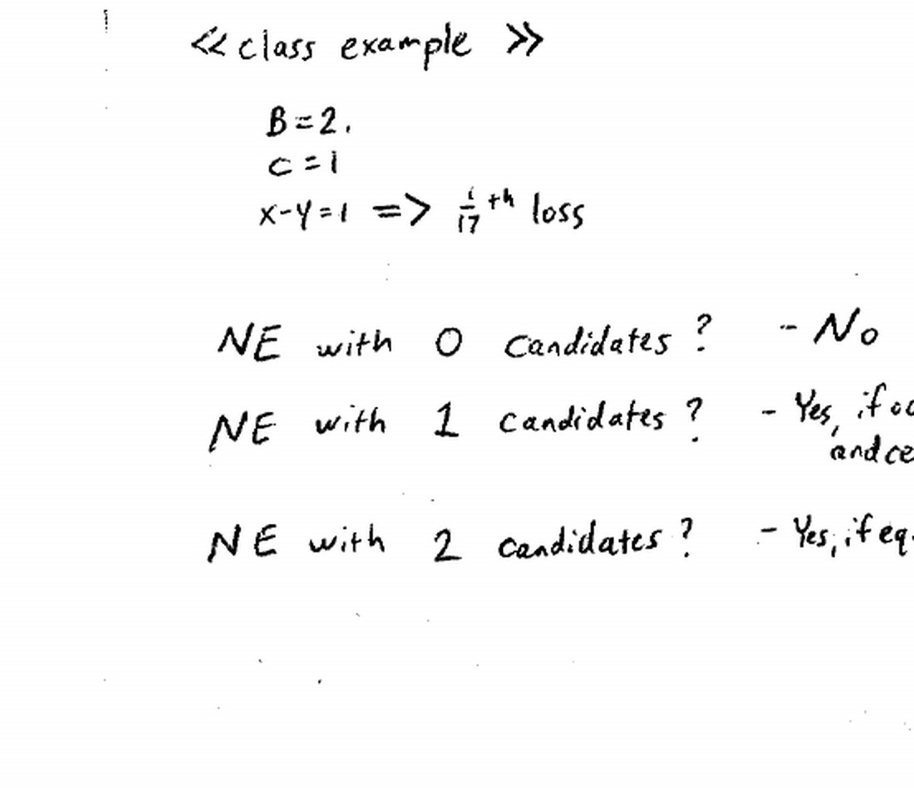

来源：耶鲁大学 ECON 159《博弈论》第七讲（Ben Polak，2007 年 9 月 26 日）· 视频 [BV1xY411Y7Wj P7](https://www.bilibili.com/video/BV1xY411Y7Wj/?p=7)

配套阅读：Dutta《Strategies and Games》第 6–7 章；Watson《Strategy》第 10 章；Dixit & Nalebuff《Thinking Strategically》第 9 章 §5。

讲义与板书：本文插图取自 Open Yale Courses 官方板书讲义（[lecture-7 页面](https://oyc.yale.edu/economics/econ-159/lecture-7) · [blackboard07 PDF](https://oyc.yale.edu/sites/default/files/blackboard07_0_0.pdf)），引用遵循其 CC BY-NC-SA 3.0 许可。

---

## 一、本讲主线

上一讲的古诺模型里，企业**定产量**、市场定价格，均衡落在垄断与完全竞争之间。本讲换一个策略集：企业**定价格**、市场定数量——这就是**伯川德竞争（Bertrand competition）**，结果却戏剧性地变成**完全竞争**。为了修补这个过于极端的结论，老师引入**差异化产品与线性城市模型**（作为作业）；最后回到政治，研究一个**候选人人数内生、且不能自选立场**的候选人-选民模型。

**WHY：** 为什么同一个市场、只改一下"企业定什么"，结果就天差地别？这既是本讲最吸引人的结论，也是最令人不安的地方：**博弈的结果高度依赖你如何设定策略集**。学会这一点，既能在建模时保持警惕，也解释了为什么后来要用"产品差异化"把现实重新注入模型。

## 二、伯川德竞争：价格战

### 2.1 模型设定

| 要素 | 设定 |
|---|---|
| 玩家 | 两家企业，生产**完全同质**的产品（如可乐与百事） |
| 策略 | 各自定价 p₁、p₂，取值范围 0 ≤ pᵢ ≤ 1 |
| 成本 | 常数边际成本 c |
| 需求 | 总需求 Q(p) = 1 − p，其中 **p 是两者中较低的价格** |

Firm 1 的销量（需求）分三种情况：

| 情形 | Firm 1 的销量 q₁ |
|---|---|
| p₁ < p₂（我更便宜） | 1 − p₁（独吞整个市场） |
| p₁ > p₂（我更贵） | 0 |
| p₁ = p₂（同价） | (1 − p₁)/2（平分） |

收益就是利润：**u₁ = q₁·(p₁ − c)**。

**注意：** 这个收益函数是**不连续的**（价格刚好低一点点，销量就从 0 跳到整个市场），所以**求导没用**，只能分情况讨论最佳对策。

### 2.2 求最佳对策 BR₁(p₂)

分四种情形：

| 对手价格 p₂ | Firm 1 的最佳对策 |
|---|---|
| p₂ < c（对手低于成本） | 定一个 **p₁ > p₂**——干脆"退市"，避免亏本 |
| c < p₂ ≤ p^MON | **p₁ = p₂ − ε**（比对手便宜一点点），但不能低于 c |
| p₂ > p^MON | **p₁ = p^MON**（垄断价）——对手定得比垄断价还高，我直接降到垄断价独享市场 |
| p₂ = c | 任意 **p₁ ≥ c**（反正都赚不到钱，只要不低于成本） |

其中 p^MON 是**垄断价格**。可以顺手算出：选定 p 最大化 (1−p)(p−c)，由 FOC 得 **p^MON = (1+c)/2**。

### 2.3 唯一的纳什均衡：价格 = 边际成本

最佳对策虽然复杂，均衡却只有一个：

> **NE = (p₁ = c, p₂ = c)**

验证：若对手定价 c，我定价 c 是合法的最佳对策（≥c 都行）；反之亦然。

**为什么没有别的均衡？** 以 (c, c+3ε) 为例：对手定价 c 时，Firm 2 定价 c+3ε 确实是它的一个最佳对策（≥c 都行）。但此时 Firm 1 并非最佳对策——它可以改定 c+2ε，抢走整个市场而仍然赚钱。所以 (c, c+3ε) 不是均衡。

均衡含义：**价格 = 边际成本、利润 = 0、消费者剩余最大化**——即便市场上**只有两家**企业，结果也**和完全竞争一模一样**。

### 2.4 令人不安的对比

| | 古诺（定产量） | 伯川德（定价格） |
|---|---|---|
| 均衡价格 | 介于垄断与竞争之间 | = 边际成本（= 竞争价） |
| 均衡利润 | 正（居中） | 0 |
| 市场结果 | 居中 | 完全竞争 |

同样的市场、同样的成本与需求，**只把策略集从"产量"换成"价格"，就从"居中"跳到"完全竞争"**。老师说这让人无法安心：如果现实结果对"建模者的思想实验"如此敏感，我们凭什么相信模型？

**出路是往模型里加回一点现实**——下节的产品差异化。

## 三、差异化产品与线性城市模型（作业）

### 3.1 模型设定

假设一条笔直的公路（长 1）穿过城市，**Firm 1 在 0 端，Firm 2 在 1 端**，消费者均匀分布在路上。

- 两家企业照旧**定价格** p₁、p₂，常数边际成本。
- **每个消费者只买一件**，选择**总成本更低**的那家。
- 位于 y 的消费者：
  - 买 Firm 1 的总成本 = **p₁ + t·y²**
  - 买 Firm 2 的总成本 = **p₂ + t·(1−y)²**

这里 t 是**运输成本**（走路来回的代价），且是**二次的**（距离的平方）。

### 3.2 "差异化"的更一般解释

运输成本不止能解释"走路距离"，它还能代表**产品与消费者理想点的差距**：

- 把这条线看成**啤酒口味轴**：一端是水（Poland Spring），另一端是吉尼斯（Guinness），Bud Light 等落在靠水的一侧；
- 位于 y 的消费者如果买了"不合口味"的酒，除了付价格，还要承受"喝起来不爽"的负效用——这就是他的运输成本。

所以这个模型能刻画大量"同类但不同质"的市场。

### 3.3 作业任务

老师在课堂只给出模型，求解留给 Problem Set 3：自己写出两家企业的需求、求最佳对策、解出纳什均衡，再与古诺均衡比较。

**预期：** 一旦产品不再完全同质，伯川德式的"你死我活价格战"就不再能一口吞下整个市场，均衡价格会**回到垄断与完全竞争之间**——即向古诺的结果靠拢。

**WHY：** 为什么产品差异化能救回"居中"的结果？因为同质时，只要便宜一分钱就能独吞市场，双方被逼到 c；差异化后，各自拥有一批"就近"的忠实顾客，降价只能抢到边缘顾客，抢市场的收益变小而成本照付，于是价格停在成本之上。**市场势力来自"消费者不那么容易转向"**——这正与上一讲"策略替代"下的古诺逻辑在精神上一致。

## 四、候选人-选民模型

### 4.1 模型设定

老师把前几周的选举模型（Downs-Hoteling）改两处，得到**候选人-选民模型（Candidate-Voter Model）**：

- 一条 [0,1] 的政治光谱，左 0 右 1；**选民均匀分布**，投给**最近的候选人**；得票最多者胜（平局掷硬币）。
- **新变化一：候选人数不是固定的**，而是**内生的（endogenous）**。
- **新变化二：候选人不能自选立场**——你事先就知道他是左是右（有既往记录），所以他没法宣称自己"其实很中间"。
- **每个选民都是潜在候选人**。

策略只剩一个真正的决定——**参选还是不参选**（投票本身没难度，反正投给最近的）。

收益：

| 情形 | 收益 |
|---|---|
| 参选且获胜 | B − C |
| 参选但别人获胜 | −C − \|x − y\| |
| 不参选、别人获胜 | −\|x − y\| |

其中：B = 胜选奖金，C = 参选成本，B ≥ 2C（课堂取 B = 2C）；如果获胜者在 y、而你在 x，你还要承受 −|x − y| 的"政策不合意"负效用。

**课堂实例**：把一排坐满，B = 2 美元，C = 1 美元；每个位置的政治距离记 1/17 美元（约 5 美分），这一排共 17 位选民（奇数，便于避免平局）。

### 4.2 找均衡：人数内生时怎么分析

课堂上逐一检验不同入场格局：

| 候选人人数 | 是否可能是 NE | 理由 |
|---|---|---|
| **0 人** | 否 | 任何一个人参选都会赢（B − C > 0），严格变好 |
| **1 人（正中位）** | **是**（选民数为奇数时） | 别人参选只会输、不改变结果；中位候选人独自胜出——又见中位选民定理 |
| **2 人（分居中心两侧、相距两格）** | **是** | 下面详述：三类偏离都不划算 |
| **2 人重合在正中位** | 否 | 这正是 Downs 模型的预测，但在这里**不成立**：两侧任意一人参选就能靠"一侧全票 + 另一侧分票"取胜 |

**"两人重合在正中位"为什么失败：** 假设 Beatrice 与 Robert 都站在正中（政治上一模一样，这正是 Downs-Hoteling 的预测）。此时只要 Claire Elise 从右侧站出来，她就能**拿走全部右翼选票（从极右到温和右）**，而 Beatrice 与 Robert 去分割左翼选票——右翼全票打败左翼的一半，所以她赢。**"两个一模一样的中位候选人"不是均衡。**

**"分居中心两侧、相距两格"为什么是均衡：** 取 Jean（中心偏左）与 Claire Elise（中心偏右）两人参选，Beatrice 恰好是没参选的那个中心选民。需要排除三类偏离：

1. **外侧有人加入**（如右翼的 Stacy）：她既赢不了，还会**把胜利拱手让给更左的 Jean**——因为她抢走右翼选票、与 Claire Elise 分票，而 Jean 拿走全部左翼选票。这是"双重糟糕"，所以没人愿意从外面加入。
2. **中间有人加入**（Beatrice 自己参选）：她只会输，所以她不会参选。
3. **在场者退出**（回到 Claire Elise）：若她留在场上，她以 1/2 概率获胜，B/2 − C 恰好被 B = 2C 抵消（一笔"平账"）；而她与获胜者的**期望距离是 1 格**（一半概率是自己，距离 0；一半概率是 Jean，距离 2）。若她退出，Jean 稳赢，**期望距离变成 2 格**。保留奖金与成本不变，退出只会让结果更远离自己——所以她留下。

三类偏离都不划算，因此这是一个纳什均衡。

**WHY：** 为什么把"候选人不能自选立场"加进来，就推翻了"两个人都站中间"？因为在 Downs 模型里位置是**可自由挪动且不需要承诺**的；而这里位置是**固定且公开**的，两个完全一样的中位候选人不构成稳定状态——**外面只要多一个人参选，就会像分票一样把胜利让给另一边**。这个模型说明：均衡的形状取决于"进入是否自由"和"位置是否可承诺"，而不只是选民的分布。

**留给下一讲的问题：** 如果参选的是**极左与极右两人**（Sudipta 站在最左端，另一位站在最右端），那是不是均衡？老师让全班回去想——下周继续，并要由此求出**所有**均衡。

## 本节要点总结

1. **伯川德竞争**：企业定价格、产品同质、常数边际成本 c、需求 Q = 1 − p（p 取较低价）。
2. **需求分段**：更便宜者独吞市场，更贵者销量为 0，同价则平分；收益 qᵢ(pᵢ − c)，函数不连续、算不了导。
3. **最佳对策分段**：对手低于成本 → 退市；对手在成本与垄断价之间 → 便宜 ε 抢市场；对手高于垄断价 → 定垄断价 p^MON = (1+c)/2；对手等于成本 → 任意不低于成本。
4. **唯一纳什均衡 p = c**：利润为 0，两家企业却达到了完全竞争的结果。
5. **不安之处**：同一市场只把"定产量"换成"定价格"，结果就从"居中"跳到"完全竞争"——模型对策略集高度敏感。
6. **差异化产品/线性城市**：两端各一家、消费者沿路分布、总成本 = 价格 + t·距离²；作业要求解 NE 并与古诺比较，预期回到"居中"。
7. **候选人-选民模型**：人数内生 + 候选人不能自选立场 + 每个选民都是潜在候选人；策略是"参选/不参选"；收益 = 胜选 B − 参选 C − 与获胜者的距离。
8. **均衡图景**：0 人不是；1 人中位是（选民数为奇数）；2 人分居中心两侧相距两格是（三类偏离都不划算）；2 人重合在中位不是（关键区别）；极左极右两人是否为均衡留到下讲。

## 参考资料

**课程与视频**

- Open Yale Courses，ECON 159《Game Theory》课程主页：<https://oyc.yale.edu/economics/econ-159>
- 第七讲页面（含官方英文讲稿、习题集 PS3 与板书 PDF）：<https://oyc.yale.edu/economics/econ-159/lecture-7>
- 官方板书讲义：<https://oyc.yale.edu/sites/default/files/blackboard07_0_0.pdf>
- 线性城市模型的补充讲义：<https://oyc.yale.edu/sites/default/files/linear_city_text_0.pdf>
- 习题集 3：<https://oyc.yale.edu/sites/default/files/problemset3_0_0.pdf>
- 中文视频（本讲为 P7）：<https://www.bilibili.com/video/BV1xY411Y7Wj/?p=7>

**教材**

- Prajit K. Dutta, *Strategies and Games: Theory and Practice*, MIT Press, 1999, Ch. 6–7。
- Joel Watson, *Strategy: An Introduction to Game Theory*, Ch. 10。

**延伸阅读**

- 伯川德竞争：<https://en.wikipedia.org/wiki/Bertrand_competition>
- 线性城市模型 / Hotelling 空间竞争：<https://en.wikipedia.org/wiki/Hotelling%27s_game>
- 进入博弈与内生候选人：<https://en.wikipedia.org/wiki/Entry_deterrence>
- 古诺竞争（对比）：<https://en.wikipedia.org/wiki/Cournot_competition>
